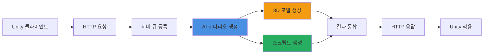

# 🎮 ERoom AI 방탈출 시스템

> **AI 기반 자동 방탈출 게임 생성 시스템**  
> Unity6와 Claude AI를 활용한 혁신적인 방탈출 게임 맵 솔루션



## 🚀 **5-8분 만에 방탈출 게임 생성**

테마, 키워드, 난이도만 입력하면 AI가 완전한 게임을 자동 생성합니다


---

## 🎯 프로젝트 개요

ERoom은 **Anthropic**사의 **Claude Sonnet 4**와 **Meshy.AI**를 활용하여 방탈출 맵을 자동으로 생성하는 혁신적인 시스템입니다. 복잡한 게임 개발 과정 대신, 누구나 쉽게 창의적인 방탈출 게임을 만들 수 있습니다.

### ✨ 핵심 기능

| 기능                   | 설명                                                                  |
|----------------------|---------------------------------------------------------------------|
| **🤖 AI 시나리오 생성**    | Claude Sonnet 4가 테마와 난이도에 맞는 독창적인 퍼즐과 스토리와 게임 로직이 포함된 C# 스크립트 자동 생성 |
| **🎨 3D 모델 자동 생성**   | Meshy AI를 통한 게임 오브젝트 3D 모델 실시간 생성                                   |
| **💻 Unity 스크립트 생성** | 게임 로직이 포함된 C# 스크립트 자동 생성                                            |
| **⚡ 실시간 처리**         | 비동기 큐 시스템으로 안정적인 요청 처리                                              |
| **🔐 보안 API**        | HTTP 통신 기반 내부 API로 안전한 시스템 연동                                       |
| **🎯 난이도 선택**        | Easy, Normal, Hard 세 가지 난이도 옵션 제공                                   |

---

## 🌟 왜 ERoom인가?

### 🎯 **기존 방식의 한계**

> * 방탈출 게임 하나를 만드는데 **3-6개월** 소요
> * 기획자, 개발자, 3D 디자이너 등 **최소 5명의 전문가** 필요
> * 개발 비용 **수천만원** 이상

### 💡 **ERoom의 혁신**

> * 방탈출 게임 생성 시간: **3-6개월 → 5-8분** (99.9% 단축)
> * 필요 인력: **전문가 팀 → 일반 사용자 1명** (접근성 혁신)
> * 개발 비용: **수천만원 → API 사용료** (99% 절감)

---

## 🔄 시스템 워크플로우



---

## 🏗️ 서버 아키텍처

### 📡 **내부 HTTP 통신 시스템**

ERoom 서버는 Unity 클라이언트와 HTTP 통신으로 연동되어 방탈출 게임 생성 과정을 처리합니다.

#### 🔧 **서버 구성 요소**

> * **Undertow HTTP 서버**: 고성능 NIO 기반 웹 서버 (포트 8080)
> * **비동기 큐 시스템**: 다중 AI 요청의 안정적인 순차 처리 (최대 동시 처리: 1)
> * **AI 통합 모듈**: Claude와 Meshy API 연동
> * **인증 시스템**: API Key 기반 보안 통신
> * **검증 시스템**: 요청 및 응답 데이터 검증

#### ⚡ **처리 흐름**

1. **요청 수신**: Unity에서 HTTP POST로 게임 생성 요청
2. **큐 등록**: 비동기 큐에 요청 추가 및 고유 ID (ruid) 반환
3. **AI 처리**:
    - Claude Sonnet 4로 시나리오 생성 (60초)
    - Unity6 C# 스크립트 생성 (20초)
    - Meshy AI로 3D 모델 병렬 생성 (5-7분)
4. **결과 통합**: 생성된 콘텐츠를 Unity 호환 형태로 패키징
5. **응답 전달**: HTTP GET으로 결과 조회 및 Unity 적용

---

## 🛠️ 기술 스택

### 🔧 **백엔드 기술**

> * **Java 17** - 최신 LTS 버전으로 안정성과 성능 보장
> * **Undertow** - 초경량 고성능 웹 서버
> * **Gson** - Google의 빠른 JSON 처리
> * **OkHttp** - Square의 신뢰성 높은 HTTP 클라이언트
> * **CompletableFuture** - 비동기 병렬 처리

### 🤖 **AI & 게임 기술**

> * **Anthropic Claude** - Claude Sonnet 4 (claude-sonnet-4-20250514) 모델로 창의적 콘텐츠 생성
> * **Meshy AI** - Text-to-3D 모델 생성 (v2 API, meshy-4 모델)
> * **Unity6** - 최신 게임 엔진 (Input System 필수)
> * **Firebase** - 실시간 데이터 동기화

---

## 📊 주요 API 엔드포인트

| 메서드    | 경로                       | 설명        | 응답 시간   |
|--------|--------------------------|-----------|---------|
| `GET`  | `/`                      | 서버 상태 확인  | < 10ms  |
| `GET`  | `/health`                | 상세 헬스체크   | < 20ms  |
| `POST` | `/room/create`           | 방탈출 생성 요청 | < 100ms |
| `GET`  | `/room/result?ruid={id}` | 생성 결과 조회  | < 50ms  |
| `GET`  | `/queue/status`          | 큐 상태 확인   | < 20ms  |

---

## 📈 성능 & 특징



### ⚡ **놀라운 성능**

* **처리 시간**: 평균 5-8분
    - 시나리오 생성: 60초
    - 스크립트 생성: 20초
    - 3D 모델 생성: 5-7분 (병렬 처리)
* **동시 처리**: 안정적인 큐 시스템으로 다중 요청 관리
* **성공률**: 95% 이상의 높은 생성 성공률
* **확장성**: 수평적 확장 가능한 아키텍처
* **모델 품질**: 30,000 폴리곤 타겟, PBR 텍스처 포함



---

## 🎮 사용 예시

### 🌟 **인기 테마**

| 테마            | 설명             | 추천 난이도 | 예상 퍼즐 수 |
|---------------|----------------|---------|---------|
| 🚀 **우주 정거장** | SF 미래 공간에서의 탈출 | Normal  | 3-4개    |
| 🏚️ **폐가**    | 공포 분위기의 미스터리   | Hard    | 4-5개    |
| 🏛️ **고대 신전** | 역사적 퍼즐과 함정     | Normal  | 3-4개    |
| 🧪 **실험실**    | 과학적 퍼즐 해결      | Easy    | 2-3개    |
| 🏴‍☠️ **해적선** | 모험과 보물찾기       | Easy    | 2-3개    |

### 🎯 **난이도별 특징**

| 난이도    | 퍼즐 수  | 복잡도   | 힌트 제공 | 예상 플레이 시간 |
|--------|-------|-------|--------|-----------|
| **Easy**   | 2-3개  | 낮음    | 많음     | 10-15분    |
| **Normal** | 3-4개  | 보통    | 보통     | 15-25분    |
| **Hard**   | 4-5개  | 높음    | 적음     | 25-40분    |

---

## 📐 시스템 요구사항

### 서버 실행 환경

| 구성 요소    | 최소 요구사항      | 권장 사항     |
|----------|--------------|-----------|
| **Java** | 17 이상        | 17 LTS    |
| **메모리**  | 1GB          | 2GB 이상    |
| **CPU**  | 2 Core       | 4 Core 이상 |
| **포트**   | 8080 (변경 가능) | -         |

### 필수 환경 변수

```bash
ANTHROPIC_KEY=sk-ant-api03-...      # Claude API 키
MESHY_KEY_1=...                      # Meshy API 키 1
MESHY_KEY_2=...                      # Meshy API 키 2 (선택)
MESHY_KEY_3=...                      # Meshy API 키 3 (선택)
EROOM_PRIVATE_KEY=your-secure-api-key # 서버 인증 키
```

---

## 🚀 빠른 시작

### 1. 서버 실행

```bash
# 환경 변수 설정
export ANTHROPIC_KEY="your-anthropic-key"
export MESHY_KEY_1="your-meshy-key-1"
export EROOM_PRIVATE_KEY="your-api-key"

# 서버 실행 (기본 포트 8080)
java -jar eroom-server.jar

# 커스텀 포트로 실행
java -jar eroom-server.jar 9090
```

### 2. API 테스트

```bash
# 서버 상태 확인
curl http://localhost:8080/health \
  -H "Authorization: your-api-key"

# 룸 생성 요청 (난이도 포함)
curl -X POST http://localhost:8080/room/create \
  -H "Authorization: your-api-key" \
  -H "Content-Type: application/json" \
  -d '{
    "uuid": "test_user",
    "theme": "우주 정거장",
    "keywords": ["SF", "퍼즐", "생존"],
    "difficulty": "normal",
    "room_prefab": "https://example.com/space.fbx"
  }'

# 결과 확인 (ruid 사용)
curl "http://localhost:8080/room/result?ruid=room_a1b2c3d4e5f6" \
  -H "Authorization: your-api-key"
```

---

## 🔒 보안 기능

### API 인증

- **Authorization 헤더 필수**: 모든 요청에 API 키 포함
- **환경 변수 기반**: 키를 코드에 하드코딩하지 않음
- **자동 키 생성**: 미설정 시 UUID 기반 랜덤 키 생성
- **요청 검증**: 모든 입력 데이터 검증

### 데이터 보호

- **Base64 인코딩**: 생성된 스크립트 안전한 전송
- **UTF-8 인코딩**: 한글 등 다국어 지원
- **타임스탬프**: 모든 응답에 생성 시간 포함

---

## 👥 개발팀



### 🚀 **ERoom 개발팀**

6명의 열정적인 개발자들이 함께 만들어가는 프로젝트입니다.

각 팀원의 GitHub 프로필과 개인 포트폴리오는 곧 공개 예정입니다!


---

## 🤝 커뮤니티 & 지원

### 📢 **Coming Soon!**

> 🎯 **Discord 서버** - 실시간 소통과 지원  
> 💬 **Slack 워크스페이스** - 개발자 커뮤니티  
> 📧 **이메일 지원** - 전문적인 기술 지원  
> 📚 **상세 문서** - 튜토리얼과 가이드


**🔔 알림 받기**  
커뮤니티 오픈 소식을 받고 싶으시다면, 프로젝트를 주시해주세요!


---

## 🗺️ 로드맵

### 📅 **2025년 개발 일정**

| 날짜           | 주요 목표        | 상태     |
|--------------|--------------|--------|
| **5/26-31**  | 프로젝트 시작 및 설계 | ✅ 완료   |
| **6/1-5**    | 핵심 서버 개발     | ✅ 완료   |
| **6/6-10**   | AI 서비스 통합    | ✅ 완료   |
| **6/11**     | 통합 테스트       | ✅ 완료   |
| **6/13**     | MVP 출시       | 🔄 진행중 |
| **6/14-7/3** | QA 및 고도화     | 📋 예정  |

### 🎯 **향후 기능**

- [ ] 멀티플레이어 방탈출 지원
- [ ] VR/AR 호환성 추가
- [ ] 음성 인식 퍼즐 생성
- [ ] 커스텀 AI 모델 훈련
- [ ] 마켓플레이스 오픈
- [ ] 실시간 생성 진행률 표시
- [ ] 웹훅 기반 완료 알림

---

## 📚 더 알아보기

### 📖 **프로젝트 문서**

- [📋 프로젝트 소개](project-overview/project-introduction.md)
- [🏗️ 시스템 아키텍처](project-overview/system-architecture.md)
- [🛠️ 기술 스택 상세](project-overview/tech-stack.md)

### 🔧 **개발자 가이드**

- [📡 API 문서](api-reference/rest-api-spec.md)
- [🔌 통합 가이드](integration/system-integration.md)
- [🎮 Unity 연동](integration/unity-integration.md)

### 💡 **활용 가이드**

- [🎯 프롬프트 가이드](usage-guide/prompt-guide.md)
- [❓ FAQ](support/faq.md)
- [🐛 문제 해결](support/troubleshooting.md)

---



### 🎉 **혁신적인 AI 방탈출 시스템**

ERoom과 함께 AI가 만드는 무한한 방탈출 세계를 경험해보세요.  
내부 HTTP 통신으로 Unity와 완벽하게 연동되어 단 5-8분이면 완성됩니다!

**[📖 문서 보기](project-overview/project-introduction.md)** | **[🔧 API 가이드](api-reference/rest-api-spec.md)** |
**[💬 커뮤니티 (Coming Soon)](https://naver.com)**



---

> 💡 **© 2025 ERoom Project**  
> AI-Powered Escape Room Generation System  
> Made with ❤️ by ERoom Team