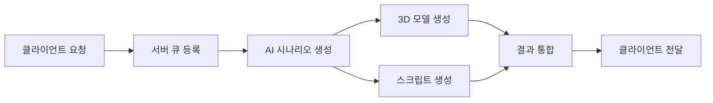

# 🎮 ERoom AI 방탈출 시스템

> **AI 기반 자동 방탈출 생성 시스템**  
> Unity6와 Claude AI를 활용한 혁신적인 게임 개발 솔루션

<div style="background: linear-gradient(135deg, #667eea 0%, #764ba2 100%); padding: 30px; border-radius: 15px; color: white; margin: 30px 0;">
  <h2 style="margin: 0; font-size: 2em;">🚀 5분 만에 방탈출 게임 생성</h2>
  <p style="margin: 10px 0 0 0; font-size: 1.2em;">테마와 키워드만 입력하면 AI가 완전한 게임을 자동 생성합니다</p>
</div>

---

## 🎯 프로젝트 개요

ERoom은 **Anthropic Claude AI**와 **Meshy 3D AI**를 활용하여 방탈출 게임을 자동으로 생성하는 혁신적인 시스템입니다. 복잡한 게임 개발 과정을 AI가 대신하여, 누구나 쉽게 창의적인 방탈출 게임을 만들 수 있습니다.

### ✨ 핵심 기능

| 기능 | 설명 |
|------|------|
| **🤖 AI 시나리오 생성** | Claude AI가 테마에 맞는 독창적인 퍼즐과 스토리 생성 |
| **🎨 3D 모델 자동 생성** | Meshy AI를 통한 게임 오브젝트 3D 모델 실시간 생성 |
| **💻 Unity 스크립트 생성** | 게임 로직이 포함된 C# 스크립트 자동 생성 |
| **⚡ 실시간 처리** | 비동기 큐 시스템으로 안정적인 요청 처리 |
| **🔐 보안 API** | API Key 기반 인증으로 안전한 서비스 제공 |

---

## 🔄 시스템 워크플로우



---

## 🚀 빠른 시작

### 1️⃣ 환경 변수 설정
```bash
export ANTHROPIC_KEY="your-anthropic-api-key"
export MESHY_KEY_1="your-meshy-api-key-1"
export MESHY_KEY_2="your-meshy-api-key-2"
export MESHY_KEY_3="your-meshy-api-key-3"
export EROOM_PRIVATE_KEY="your-server-api-key"
```

### 2️⃣ 서버 실행
```bash
./gradlew run
```

### 3️⃣ API 테스트
```bash
curl -X POST http://localhost:8080/room/create \
  -H "Authorization: your-server-api-key" \
  -H "Content-Type: application/json" \
  -d '{
    "uuid": "user_12345",
    "theme": "우주정거장",
    "keywords": ["미래", "과학", "AI"],
    "difficulty": "normal",
    "room_prefab": "https://example.com/prefab/space_station.fbx"
  }'
```

---

## 🛠️ 기술 스택

<div style="display: grid; grid-template-columns: repeat(2, 1fr); gap: 20px; margin: 20px 0;">
  <div style="background: #f7f7f7; padding: 20px; border-radius: 10px;">
    <h3>🔧 백엔드</h3>
    <ul>
      <li><strong>Java 17</strong> - 최신 LTS 버전</li>
      <li><strong>Undertow</strong> - 고성능 웹 서버</li>
      <li><strong>Gson</strong> - JSON 처리</li>
      <li><strong>OkHttp</strong> - HTTP 클라이언트</li>
    </ul>
  </div>
  <div style="background: #f7f7f7; padding: 20px; border-radius: 10px;">
    <h3>🤖 AI 서비스</h3>
    <ul>
      <li><strong>Anthropic Claude</strong> - 시나리오/스크립트 생성</li>
      <li><strong>Meshy AI</strong> - 3D 모델 생성</li>
      <li><strong>Unity6</strong> - 게임 엔진</li>
      <li><strong>Firebase</strong> - 데이터 저장</li>
    </ul>
  </div>
</div>

---

## 📊 주요 API 엔드포인트

| 메서드 | 경로 | 설명 |
|--------|------|------|
| `GET` | `/` | 서버 상태 확인 |
| `GET` | `/health` | 상세 헬스체크 |
| `POST` | `/room/create` | 방탈출 생성 요청 |
| `GET` | `/room/result?ruid={id}` | 생성 결과 조회 |
| `GET` | `/queue/status` | 큐 상태 확인 |

---

## 📈 성능 특징

- **동시 처리**: 기본 1개, 확장 가능한 아키텍처
- **처리 시간**: 평균 5-10분 (시나리오 1-3분, 3D 모델 4-8분)
- **안정성**: 큐 기반 비동기 처리로 시스템 안정성 보장
- **확장성**: 마이크로서비스 아키텍처로 수평 확장 가능

---

## 🔒 보안 기능

- **API Key 인증**: 모든 요청에 대한 인증 필수
- **환경 변수 관리**: 민감한 정보의 안전한 관리
- **요청 검증**: 모든 입력값에 대한 철저한 검증
- **에러 처리**: 상세한 에러 로깅 및 안전한 에러 응답

---

## 📚 더 알아보기

- [프로젝트 소개](project-overview/project-introduction.md)
- [시스템 아키텍처](project-overview/system-architecture.md)
- [API 문서](api-reference/rest-api-spec.md)
- [통합 가이드](integration/system-integration.md)

---

<div style="text-align: center; margin-top: 50px; padding: 20px; background: #f0f0f0; border-radius: 10px;">
  <p style="margin: 0; color: #666;">© 2024 ERoom Project. AI-Powered Escape Room Generation System.</p>
</div>