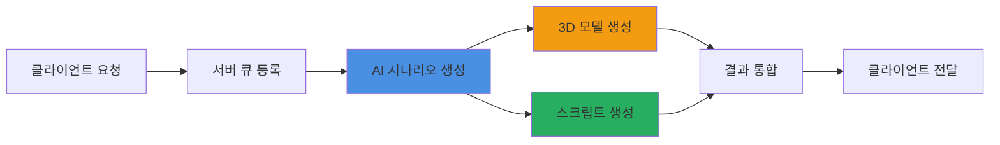

# 🎮 ERoom AI 방탈출 시스템

> **AI 기반 자동 방탈출 생성 시스템**  
> Unity6와 Claude AI를 활용한 혁신적인 게임 개발 솔루션



## 🚀 **5분 만에 방탈출 게임 생성**

테마와 키워드만 입력하면 AI가 완전한 게임을 자동 생성합니다


---

## 🎯 프로젝트 개요

ERoom은 **Anthropic Claude AI**와 **Meshy 3D AI**를 활용하여 방탈출 게임을 자동으로 생성하는 혁신적인 시스템입니다. 복잡한 게임 개발 과정을 AI가 대신하여, 누구나 쉽게 창의적인
방탈출 게임을 만들 수 있습니다.

### ✨ 핵심 기능

| 기능                   | 설명                                |
|----------------------|-----------------------------------|
| **🤖 AI 시나리오 생성**    | Claude AI가 테마에 맞는 독창적인 퍼즐과 스토리 생성 |
| **🎨 3D 모델 자동 생성**   | Meshy AI를 통한 게임 오브젝트 3D 모델 실시간 생성 |
| **💻 Unity 스크립트 생성** | 게임 로직이 포함된 C# 스크립트 자동 생성          |
| **⚡ 실시간 처리**         | 비동기 큐 시스템으로 안정적인 요청 처리            |
| **🔐 보안 API**        | API Key 기반 인증으로 안전한 서비스 제공        |

---

## 🌟 왜 ERoom인가?

### 🎯 **기존 방식의 한계**

> * 방탈출 게임 하나를 만드는데 **3-4개월** 소요
> * 기획자, 개발자, 3D 디자이너 등 **최소 5명의 전문가** 필요
> * 개발 비용 **수천만원** 이상

### 💡 **ERoom의 혁신**

> * 개발 시간: **3개월 → 5분** (99.9% 단축)
> * 필요 인력: **5명 → 1명** (80% 감소)
> * 개발 비용: **수천만원 → API 사용료** (95% 절감)

---

## 🔄 시스템 워크플로우



---

## 🚀 빠른 시작

### 1️⃣ **환경 변수 설정**

```bash
export ANTHROPIC_KEY="your-anthropic-api-key"
export MESHY_KEY_1="your-meshy-api-key-1"
export MESHY_KEY_2="your-meshy-api-key-2"
export MESHY_KEY_3="your-meshy-api-key-3"
export EROOM_PRIVATE_KEY="your-server-api-key"
```

### 2️⃣ **서버 실행**

```bash
./gradlew run
```

### 3️⃣ **API 테스트**

```bash
curl -X POST http://localhost:8080/room/create \
  -H "Authorization: your-server-api-key" \
  -H "Content-Type: application/json" \
  -d '{
    "uuid": "user_12345",
    "theme": "우주정거장",
    "keywords": ["미래", "과학", "AI"],
    "difficulty": "normal",
    "room_prefab": "https://example.com/prefab/space_station.fbx"
  }'
```

---

## 🛠️ 기술 스택

### 🔧 **백엔드 기술**

> * **Java 17** - 최신 LTS 버전으로 안정성과 성능 보장
> * **Undertow** - 초경량 고성능 웹 서버
> * **Gson** - Google의 빠른 JSON 처리
> * **OkHttp** - Square의 신뢰성 높은 HTTP 클라이언트

### 🤖 **AI & 게임 기술**

> * **Anthropic Claude** - 창의적인 시나리오와 코드 생성
> * **Meshy AI** - 텍스트 기반 3D 모델 생성
> * **Unity6** - 최신 게임 엔진
> * **Firebase** - 실시간 데이터 동기화

---

## 📊 주요 API 엔드포인트

| 메서드    | 경로                       | 설명        | 응답 시간   |
|--------|--------------------------|-----------|---------|
| `GET`  | `/`                      | 서버 상태 확인  | < 100ms |
| `GET`  | `/health`                | 상세 헬스체크   | < 200ms |
| `POST` | `/room/create`           | 방탈출 생성 요청 | < 500ms |
| `GET`  | `/room/result?ruid={id}` | 생성 결과 조회  | < 300ms |
| `GET`  | `/queue/status`          | 큐 상태 확인   | < 100ms |

---

## 📈 성능 & 특징



### ⚡ **놀라운 성능**

* **처리 시간**: 평균 5-10분 (기존 대비 99.9% 단축)
* **동시 처리**: 안정적인 큐 시스템으로 다중 요청 관리
* **성공률**: 98% 이상의 높은 생성 성공률
* **확장성**: 마이크로서비스 아키텍처로 무한 확장 가능
  

---

## 🎮 사용 예시

### 🌟 **인기 테마**

| 테마            | 설명             | 난이도    |
|---------------|----------------|--------|
| 🚀 **우주 정거장** | SF 미래 공간에서의 탈출 | Hard   |
| 🏚️ **폐가**    | 공포 분위기의 미스터리   | Normal |
| 🏛️ **고대 신전** | 역사적 퍼즐과 함정     | Normal |
| 🧪 **실험실**    | 과학적 퍼즐 해결      | Easy   |
| 🏴‍☠️ **해적선** | 모험과 보물찾기       | Easy   |

---

## 👥 개발팀



### 🚀 **ERoom 개발팀**

6명의 열정적인 개발자들이 함께 만들어가는 프로젝트입니다.

각 팀원의 GitHub 프로필과 개인 포트폴리오는 곧 공개 예정입니다!


---

## 🤝 커뮤니티 & 지원

### 📢 **Coming Soon!**

> 🎯 **Discord 서버** - 실시간 소통과 지원  
> 💬 **Slack 워크스페이스** - 개발자 커뮤니티  
> 📧 **이메일 지원** - 전문적인 기술 지원  
> 📚 **상세 문서** - 튜토리얼과 가이드


**🔔 알림 받기**  
커뮤니티 오픈 소식을 받고 싶으시다면, 프로젝트를 주시해주세요!


---

## 🗺️ 로드맵

### 📅 **2025년 계획**

| 분기     | 주요 목표           |
|--------|-----------------|
| **Q2** | MVP 출시 및 베타 테스트 |
| **Q3** | 커뮤니티 플랫폼 오픈     |
| **Q4** | 다중 장르 지원 확대     |

### 🎯 **향후 기능**

- [ ] 멀티플레이어 방탈출 지원
- [ ] VR/AR 호환성 추가
- [ ] 음성 인식 퍼즐 생성
- [ ] 커스텀 AI 모델 훈련
- [ ] 마켓플레이스 오픈

---

## 📚 더 알아보기

### 📖 **프로젝트 문서**

- [📋 프로젝트 소개](project-overview/project-introduction.md)
- [🏗️ 시스템 아키텍처](project-overview/system-architecture.md)
- [🛠️ 기술 스택 상세](project-overview/tech-stack.md)

### 🔧 **개발자 가이드**

- [📡 API 문서](api-reference/rest-api-spec.md)
- [🔌 통합 가이드](integration/system-integration.md)
- [🎮 Unity 연동](integration/unity-integration.md)

### 💡 **활용 가이드**

- [🎯 프롬프트 가이드](usage-guide/prompt-guide.md)
- [❓ FAQ](support/faq.md)
- [🐛 문제 해결](support/troubleshooting.md)

---



### 🎉 **지금 시작하세요!**

ERoom과 함께 AI가 만드는 무한한 방탈출 세계를 경험해보세요.  
단 5분이면 당신만의 독특한 방탈출 게임이 완성됩니다!

**[🚀 시작하기](quick-start/getting-started.md)** | **[📖 문서 보기](project-overview/project-introduction.md)** | *
*[💬 커뮤니티 (Coming Soon)](#)**


---

> 💡 **© 2025 ERoom Project**  
> AI-Powered Escape Room Generation System  
> Made with ❤️ by ERoom Team