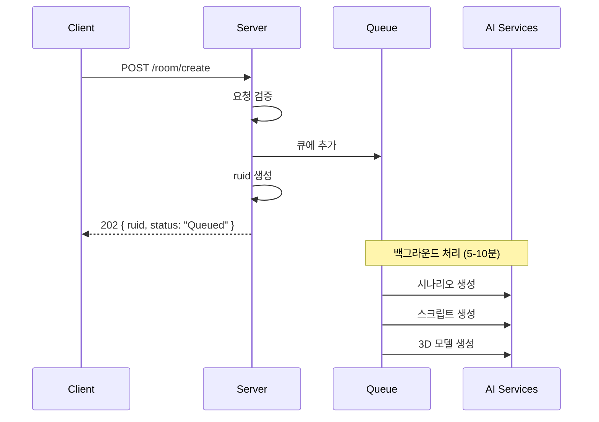

# 룸 생성 요청 API

## POST /room/create

### 개요
AI 기반 방탈출 룸 생성을 시작하는 핵심 API입니다. 테마와 키워드를 받아 완전한 방탈출 게임 콘텐츠를 생성합니다.

---

## 요청 상세

### HTTP 메서드
```
POST /room/create
```

### 필수 헤더
```http
Authorization: your_api_key
Content-Type: application/json; charset=utf-8
```

### 요청 본문

```json
{
  "uuid": "user_12345",
  "theme": "우주정거장",
  "keywords": ["미래", "과학", "생존"],
  "difficulty": "normal",
  "room_prefab": "https://example.com/prefab/space_station.fbx"
}
```

### 요청 필드 설명

| 필드 | 타입 | 필수 | 설명 | 제약사항 |
|------|------|------|------|----------|
| `uuid` | String | ✅ | 사용자 고유 식별자 | 비어있을 수 없음 |
| `theme` | String | ✅ | 방탈출 테마 | 최대 100자 |
| `keywords` | String[] | ✅ | 키워드 배열 | 최소 1개, 각 키워드 비어있을 수 없음 |
| `difficulty` | String | ❌ | 난이도 설정 | "easy", "normal", "hard" 중 하나 (기본값: "normal") |
| `room_prefab` | String | ✅ | Unity 프리팹 URL | https:// 로 시작하는 유효한 URL |

### 난이도별 특징

| 난이도 | 오브젝트 수 | 퍼즐 복잡도 | 힌트 수준 |
|--------|-------------|-------------|-----------|
| `easy` | 4-5개 | 직접적인 단서 | 명확한 지시 |
| `normal` | 5-7개 | 적절한 추리 필요 | 간접적 힌트 |
| `hard` | 7-9개 | 복잡한 연결고리 | 최소한의 힌트 |

---

## 응답 상세

### 성공 응답 (202 Accepted)

```json
{
  "ruid": "room_a1b2c3d4e5f6",
  "status": "Queued",
  "message": "Room creation request has been accepted. Poll /room/result?ruid=room_a1b2c3d4e5f6 for status."
}
```

| 필드 | 타입 | 설명 |
|------|------|------|
| `ruid` | String | 룸 고유 식별자 (Room Unique ID) |
| `status` | String | 현재 상태 ("Queued") |
| `message` | String | 다음 단계 안내 메시지 |

### 에러 응답

#### 400 Bad Request - 요청 형식 오류

```json
{
  "success": false,
  "error": "Invalid request body or missing 'uuid' (userId)."
}
```

#### 400 Bad Request - 검증 실패

```json
{
  "success": false,
  "error": "테마가 비어있습니다"
}
```

가능한 검증 오류:
- "UUID가 비어있습니다"
- "테마가 비어있습니다"
- "키워드가 비어있습니다"
- "빈 키워드가 포함되어 있습니다"
- "유효하지 않은 roomPrefab URL 형식입니다"
- "유효하지 않은 난이도입니다. easy, normal, hard 중 하나를 선택하세요."

#### 401 Unauthorized

```json
{
  "error": "인증 실패"
}
```

#### 500 Internal Server Error

```json
{
  "success": false,
  "error": "Failed to queue request: [오류 메시지]"
}
```

---

## 사용 예시

### cURL을 이용한 요청

```bash
curl -X POST http://localhost:8080/room/create \
  -H "Authorization: your_api_key" \
  -H "Content-Type: application/json; charset=utf-8" \
  -d '{
    "uuid": "user_12345",
    "theme": "미래 우주정거장",
    "keywords": ["SF", "퍼즐", "생존"],
    "difficulty": "normal",
    "room_prefab": "https://example.com/prefabs/space_station.fbx"
  }'
```

### Unity C#에서 요청

```csharp
[System.Serializable]
public class RoomCreationRequest
{
    public string uuid;
    public string theme;
    public string[] keywords;
    public string difficulty;
    public string room_prefab;
}

[System.Serializable]
public class RoomCreationResponse
{
    public string ruid;
    public string status;
    public string message;
}

IEnumerator CreateRoom(RoomCreationRequest request)
{
    string json = JsonUtility.ToJson(request);
    byte[] bodyRaw = System.Text.Encoding.UTF8.GetBytes(json);
    
    using (UnityWebRequest www = new UnityWebRequest(
        "http://localhost:8080/room/create", "POST"))
    {
        www.uploadHandler = new UploadHandlerRaw(bodyRaw);
        www.downloadHandler = new DownloadHandlerBuffer();
        
        www.SetRequestHeader("Authorization", apiKey);
        www.SetRequestHeader("Content-Type", "application/json; charset=utf-8");
        
        yield return www.SendWebRequest();
        
        if (www.result == UnityWebRequest.Result.Success)
        {
            RoomCreationResponse response = 
                JsonUtility.FromJson<RoomCreationResponse>(www.downloadHandler.text);
            
            Debug.Log($"Room creation started! RUID: {response.ruid}");
            
            // 결과 폴링 시작
            StartCoroutine(PollForResult(response.ruid));
        }
        else
        {
            Debug.LogError($"Room creation failed: {www.error}");
            Debug.LogError($"Response: {www.downloadHandler.text}");
        }
    }
}
```

### JavaScript에서 요청

```javascript
async function createRoom(roomData) {
  try {
    const response = await fetch('http://localhost:8080/room/create', {
      method: 'POST',
      headers: {
        'Authorization': 'your_api_key',
        'Content-Type': 'application/json; charset=utf-8'
      },
      body: JSON.stringify({
        uuid: roomData.userId,
        theme: roomData.theme,
        keywords: roomData.keywords,
        difficulty: roomData.difficulty || 'normal',
        room_prefab: roomData.prefabUrl
      })
    });
    
    if (response.status === 202) {
      const data = await response.json();
      console.log(`Room creation started: ${data.ruid}`);
      
      // 폴링 시작
      pollForResult(data.ruid);
    } else {
      const error = await response.json();
      console.error('Room creation failed:', error);
    }
  } catch (err) {
    console.error('Network error:', err);
  }
}
```

---

## 처리 과정

### 비동기 처리 플로우



### 예상 처리 시간

| 단계 | 소요 시간 |
|------|-----------|
| 요청 검증 및 큐 등록 | < 100ms |
| 시나리오 생성 | 1-3분 |
| 스크립트 생성 | 30초 |
| 3D 모델 생성 | 4-8분 |
| **총 처리 시간** | **5-10분** |

---

## 주의사항

### 1. 요청 제한
- 동일 uuid로 과도한 요청 자제 (권장: 분당 10회 이하)
- 서버 과부하 방지를 위한 적절한 간격 유지

### 2. 키워드 선택
- 테마와 관련된 구체적인 키워드 사용
- 너무 추상적인 키워드는 피하기
- 3-5개의 키워드가 적정

### 3. 프리팹 URL
- 실제 접근 가능한 URL 제공
- Unity에서 로드 가능한 형식
- 적절한 크기 (권장: 10MB 이하)

### 4. 폴링 전략
- 즉시 `/room/result` 엔드포인트로 폴링 시작
- 초기 2초 간격, 점진적으로 증가 (최대 10초)
- 타임아웃: 15분 권장

---

## 에러 처리 가이드

### 일반적인 문제 해결

| 오류 | 원인 | 해결 방법 |
|------|------|-----------|
| "UUID가 비어있습니다" | uuid 필드 누락 | uuid 필드 추가 |
| "키워드가 비어있습니다" | keywords 배열 비어있음 | 최소 1개 키워드 추가 |
| "유효하지 않은 난이도" | 잘못된 difficulty 값 | easy/normal/hard 중 선택 |
| "인증 실패" | API 키 오류 | Authorization 헤더 확인 |

---

## 다음 단계

룸 생성 요청 후에는 반환된 `ruid`를 사용하여 결과를 조회해야 합니다.

➡️ [GET /room/result - 결과 조회 API](room-result.md)

---

## 관련 엔드포인트

- [GET /room/result](room-result.md) - 생성 결과 조회
- [GET /queue/status](queue-status.md) - 큐 상태 확인

---

[← API 명세서로 돌아가기](../rest-api-spec.md)---|-------------|-----------|
| `easy` | 4-5개 | 직접적인 단서 | 명확한 지시 |
| `normal` | 5-7개 | 적절한 추리 필요 | 간접적 힌트 |
| `hard` | 7-9개 | 복잡한 연결고리 | 최소한의 힌트 |