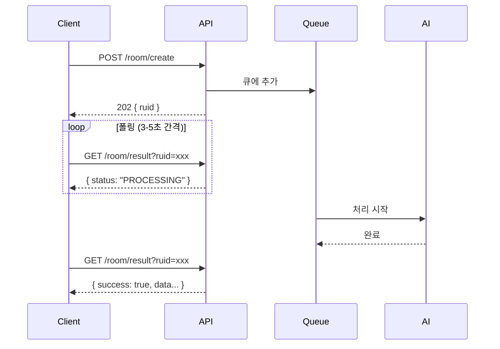

# 6.1 REST API 명세서

## 🌐 API 개요

<div style="background: linear-gradient(135deg, #667eea 0%, #764ba2 100%); padding: 30px; border-radius: 15px; color: white; margin: 20px 0;">
  <h3 style="margin: 0;">ERoom REST API v1.0</h3>
  <p style="margin: 10px 0 0 0;">AI 기반 방탈출 게임 생성을 위한 완전한 API 문서</p>
</div>

### Base URL
```
http://localhost:8080
```

### 공통 인증 헤더
모든 API 요청에는 다음 헤더가 필요합니다:

```http
Authorization: your_api_key
Content-Type: application/json; charset=utf-8
```

---

## 📋 API 엔드포인트 목록

| 메서드  | 엔드포인트         | 설명             | 인증 필요 |
|------|---------------|----------------|:-----:|
| GET  | /             | 서버 기본 상태 확인    |   ✅   |
| GET  | /health       | 상세 헬스체크 및 큐 상태 |   ✅   |
| POST | /room/create  | 새로운 룸 생성 요청    |   ✅   |
| GET  | /room/result  | 룸 생성 결과 조회     |   ✅   |
| GET  | /queue/status | 큐 처리 상태 확인     |   ✅   |

---

## 🔍 엔드포인트 상세

### 1. GET / - 서버 상태 확인

<div style="background: #e3f2fd; padding: 20px; border-radius: 10px; margin: 20px 0;">
  <h4 style="margin: 0 0 15px 0;">기본 서버 상태 확인</h4>

**요청 예시:**
```bash
curl http://localhost:8080/ \
  -H "Authorization: your_api_key"
```

**정상 응답 (200 OK):**
```json
{
  "status": "online",
  "message": "Eroom 서버가 작동 중입니다",
  "success": true
}
```

**에러 응답 (401 Unauthorized):**
```json
{
  "error": "인증이 필요합니다"
}
```

<div style="margin-top: 15px; text-align: center;">
  <a href="endpoints/health-check.md" style="color: #667eea; text-decoration: none; font-weight: bold;">
    📖 자세한 내용은 이곳을 클릭해주세요 →
  </a>
</div>
</div>

### 2. GET /health - 상세 헬스체크

<div style="background: #e8f5e9; padding: 20px; border-radius: 10px; margin: 20px 0;">
  <h4 style="margin: 0 0 15px 0;">서버 상태 및 큐 통계</h4>

**요청 예시:**
```bash
curl http://localhost:8080/health \
  -H "Authorization: your_api_key"
```

**정상 응답 (200 OK):**
```json
{
  "status": "healthy",
  "queue": {
    "queued": 3,
    "active": 1,
    "completed": 150,
    "maxConcurrent": 1
  },
  "success": true
}
```

<div style="margin-top: 15px; text-align: center;">
  <a href="endpoints/health-check.md" style="color: #667eea; text-decoration: none; font-weight: bold;">
    📖 자세한 내용은 이곳을 클릭해주세요 →
  </a>
</div>
</div>

### 3. POST /room/create - 룸 생성 요청

<div style="background: #f3e5f5; padding: 20px; border-radius: 10px; margin: 20px 0;">
  <h4 style="margin: 0 0 15px 0;">AI 기반 룸 생성 시작</h4>

**요청 본문 (Request Body):**

| 필드          | 타입       | 필수 | 설명                          | 예시                                                                                       |
|-------------|----------|:--:|-----------------------------|------------------------------------------------------------------------------------------|
| uuid        | string   | ✅  | 사용자 고유 식별자                  | "user_12345"                                                                             |
| theme       | string   | ✅  | 방탈출 테마                      | "victoria"                                                                               |
| keywords    | string[] | ✅  | 관련 키워드 배열 (1-7개)            | ["vase", "music box", "fire place"]                                                      |
| difficulty  | string   | ❌  | 난이도 (기본값: "normal")         | "easy", "normal", "hard"                                                                 |
| room_prefab | string   | ✅  | Unity 프리팹 URL (https:// 필수) | "https://github.com/BangTalBoyBand/Claude_Checking_Room_List/blob/main/testMap03.prefab" |

**요청 예시:**
```bash
curl -X POST http://localhost:8080/room/create \
  -H "Authorization: your_api_key" \
  -H "Content-Type: application/json; charset=utf-8" \
  -d '{
    "uuid": "user_12345",
    "theme": "victoria",
    "keywords": ["vase", "music box", "fire place"],
    "difficulty": "normal",
    "room_prefab": "https://github.com/BangTalBoyBand/Claude_Checking_Room_List/blob/main/testMap03.prefab"
  }'
```

**정상 응답 (202 Accepted):**
```json
{
  "ruid": "room_a1b2c3d4e5f6",
  "status": "대기중",
  "message": "방 생성 요청이 수락되었습니다. 상태 확인을 위해 /room/result?ruid=room_a1b2c3d4e5f6를 폴링하세요.",
  "success": true
}
```

**에러 응답 예시:**

**400 Bad Request - 필수 필드 누락:**
```json
{
  "success": false,
  "error": "UUID가 비어있습니다",
  "timestamp": "1718123456789"
}
```

**400 Bad Request - 잘못된 난이도:**
```json
{
  "success": false,
  "error": "유효하지 않은 난이도입니다. easy, normal, hard 중 하나를 선택하세요.",
  "timestamp": "1718123456789"
}
```

**400 Bad Request - 잘못된 URL 형식:**
```json
{
  "success": false,
  "error": "유효하지 않은 roomPrefab URL 형식입니다",
  "timestamp": "1718123456789"
}
```

<div style="margin-top: 15px; text-align: center;">
  <a href="endpoints/room-create.md" style="color: #667eea; text-decoration: none; font-weight: bold;">
    📖 자세한 내용은 이곳을 클릭해주세요 →
  </a>
</div>
</div>

### 4. GET /room/result - 결과 조회

<div style="background: #fff3cd; padding: 20px; border-radius: 10px; margin: 20px 0;">
  <h4 style="margin: 0 0 15px 0;">생성 결과 확인 및 다운로드</h4>

**요청 파라미터:**

| 파라미터 | 타입     | 필수 | 설명                 |
|------|--------|----|--------------------|
| ruid | string | ✅  | 룸 생성 요청 시 받은 고유 ID |

**요청 예시:**
```bash
curl "http://localhost:8080/room/result?ruid=room_a1b2c3d4e5f6" \
  -H "Authorization: your_api_key"
```

**처리 상태별 응답:**

**1. 대기 중 (200 OK):**
```json
{
  "ruid": "room_a1b2c3d4e5f6",
  "status": "QUEUED"
}
```

**2. 처리 중 (200 OK):**
```json
{
  "ruid": "room_a1b2c3d4e5f6",
  "status": "PROCESSING"
}
```

**3. 완료 (200 OK):**
```json
{
  "uuid": "user_12345",
  "ruid": "room_a1b2c3d4e5f6",
  "theme": "victoria",
  "difficulty": "normal",
  "keywords": ["vase", "music box", "fire place"],
  "room_prefab": "https://github.com/BangTalBoyBand/Claude_Checking_Room_List/blob/main/testMap03.prefab",
  "scenario": {
    "scenario_data": {
      "theme": "victoria",
      "difficulty": "normal",
      "description": "빅토리아 시대의 낡은 가정집에서 깨어났다...",
      "escape_condition": "열쇠로 문을 열고 탈출",
      "puzzle_flow": "미스테리한 가구들 조합 → 힌트 획득 → 특정 오브젝트 상호작용 → 열쇠 획득"
    },
    "object_instructions": [
      {
        "name": "GameManager",
        "type": "game_manager",
        "description": "게임 전체 흐름 관리"
      },
      {
        "name": "AntiqueMusicBox",
        "type": "interactable",
        "visual_description": "Antique MusicBox with ballerina...",
        "description": "MusicBox를 특정한 음으로 연주하여 잠금해제"
      }
    ]
  },
  "scripts": {
    "GameManager.cs": "dXNpbmcgVW5pdHlFbmdpbmU7IHVzaW5nIFVuaXR5RW5naW5lLklucHV0U3lzdGVtOy4uLg==",
    "OxygenTank.cs": "dXNpbmcgVW5pdHlFbmdpbmU7IHVzaW5nIFVuaXR5RW5naW5lLklucHV0U3lzdGVtOy4uLg=="
  },
  "model_tracking": {
    "OxygenTank": "https://assets.meshy.ai/abc123/model.fbx",
    "ControlPanel": "https://assets.meshy.ai/def456/model.fbx",
    "failed_models": {
      "BrokenDoor": "timeout-preview-xyz789"
    }
  },
  "success": true,
  "timestamp": "1718123456789"
}
```

**4. 실패 (200 OK):**
```json
{
  "uuid": "user_12345",
  "ruid": "room_a1b2c3d4e5f6",
  "success": false,
  "error": "통합 시나리오 생성 단계에서 오류 발생: JSON 파싱 실패",
  "timestamp": "1718123456789"
}
```

**에러 응답 (404 Not Found):**
```json
{
  "success": false,
  "error": "ruid 'room_invalid'에 해당하는 작업을 찾을 수 없습니다. 이미 처리되었거나 존재하지 않는 작업입니다.",
  "timestamp": "1718123456789"
}
```

<div style="margin-top: 15px; text-align: center;">
  <a href="endpoints/room-result.md" style="color: #667eea; text-decoration: none; font-weight: bold;">
    📖 자세한 내용은 이곳을 클릭해주세요 →
  </a>
</div>
</div>

### 5. GET /queue/status - 큐 상태 확인

<div style="background: #e3f2fd; padding: 20px; border-radius: 10px; margin: 20px 0;">
  <h4 style="margin: 0 0 15px 0;">처리 대기열 모니터링</h4>

**요청 예시:**
```bash
curl http://localhost:8080/queue/status \
  -H "Authorization: your_api_key"
```

**정상 응답 (200 OK):**
```json
{
  "queued": 5,
  "active": 1,
  "completed": 142,
  "maxConcurrent": 1
}
```

**응답 필드 설명:**

| 필드            | 설명            |
|---------------|---------------|
| queued        | 대기 중인 요청 수    |
| active        | 현재 처리 중인 요청 수 |
| completed     | 완료된 총 요청 수    |
| maxConcurrent | 최대 동시 처리 가능 수 |

<div style="margin-top: 15px; text-align: center;">
  <a href="endpoints/queue-status.md" style="color: #667eea; text-decoration: none; font-weight: bold;">
    📖 자세한 내용은 이곳을 클릭해주세요 →
  </a>
</div>
</div>

---

## 🔄 API 사용 플로우

### 전체 워크플로우



### 처리 시간 예상

| 단계       | 예상 시간    | 설명                 |
|----------|----------|--------------------|
| 큐 대기     | 0-60초    | 현재 처리 중인 요청에 따라 변동 |
| 시나리오 생성  | 60초      | Claude AI 처리       |
| 스크립트 생성  | 20초      | Claude AI 처리       |
| 3D 모델 생성 | 5-7분     | Meshy AI 병렬 처리     |
| **총 시간** | **5-8분** | 평균 처리 시간           |

---

## 📊 HTTP 상태 코드

| 코드      | 의미                    | 사용 시나리오            |
|---------|-----------------------|--------------------|
| **200** | OK                    | 성공적인 GET 요청        |
| **202** | Accepted              | 비동기 작업 시작됨         |
| **400** | Bad Request           | 잘못된 요청 형식 또는 검증 실패 |
| **401** | Unauthorized          | 인증 실패              |
| **404** | Not Found             | 리소스 없음 (잘못된 ruid)  |
| **500** | Internal Server Error | 서버 오류              |

---

## 🔐 인증 및 보안

### API Key 사용법

<div style="background: #ffcdd2; padding: 20px; border-radius: 10px; margin: 20px 0;">
  <h4 style="margin: 0 0 15px 0;">🔑 인증 헤더 설정</h4>

**모든 요청에 필수:**
```
Authorization: your_api_key_here
```

**환경 변수 설정:**
```bash
export EROOM_PRIVATE_KEY="your-secure-api-key"
```

**자동 키 생성:**
환경 변수가 설정되지 않으면 서버가 자동으로 UUID 기반 키를 생성합니다.
서버 로그에서 생성된 키를 확인할 수 있습니다.
</div>

---

## 📈 Rate Limiting

### 요청 제한

| 엔드포인트             | 제한     | 기간 | 비고            |
|-------------------|--------|----|---------------|
| POST /room/create | 10 요청  | 1분 | 동시 처리는 1개로 제한 |
| GET /room/result  | 60 요청  | 1분 | 폴링 고려         |
| GET /health       | 120 요청 | 1분 | 모니터링용         |
| GET /queue/status | 120 요청 | 1분 | 모니터링용         |

*현재 버전에서는 Rate Limiting이 구현되지 않았습니다. 향후 추가 예정입니다.*

---

## 🐛 에러 처리

### 표준 에러 응답 형식

```json
{
  "success": false,
  "error": "구체적인 에러 메시지",
  "timestamp": "1718123456789"
}
```

### 일반적인 에러 시나리오

| 에러                            | 원인                            | 해결 방법                 |
|-------------------------------|-------------------------------|-----------------------|
| **401 Unauthorized**          | API 키 누락/오류                   | 올바른 API 키 사용          |
| **400 Bad Request - UUID 누락** | uuid 필드 누락                    | 요청에 uuid 추가           |
| **400 Bad Request - 빈 테마**    | theme 필드 비어있음                 | 유효한 테마 입력             |
| **400 Bad Request - 잘못된 난이도** | difficulty 값 오류               | easy/normal/hard 중 선택 |
| **400 Bad Request - URL 형식**  | roomPrefab이 https://로 시작하지 않음 | 올바른 URL 형식 사용         |
| **404 Not Found**             | 잘못된 ruid                      | ruid 확인 또는 이미 조회됨     |
| **500 Server Error**          | 내부 서버 오류                      | 로그 확인, 재시도            |

### 검증 규칙

| 필드          | 검증 규칙                                             |
|-------------|---------------------------------------------------|
| uuid        | 필수, 공백 불가                                         |
| theme       | 필수, 공백 불가                                         |
| keywords    | 필수, 최소 1개, 각 항목 공백 불가                             |
| difficulty  | 선택, "easy", "normal", "hard" 중 하나 (기본값: "normal") |
| room_prefab | 필수, https://로 시작                                  |

---

## 🚀 빠른 시작 가이드

### 1. 첫 요청 테스트

```bash
# 헬스체크
curl http://localhost:8080/health \
  -H "Authorization: your-api-key"

# 룸 생성 (Easy 난이도)
curl -X POST http://localhost:8080/room/create \
  -H "Authorization: your-api-key" \
  -H "Content-Type: application/json; charset=utf-8" \
  -d '{
    "uuid": "test_user",
    "theme": "해적선",
    "keywords": ["보물", "모험"],
    "difficulty": "easy",
    "room_prefab": "https://example.com/pirate_ship.fbx"
  }'

# 결과 폴링 (3-5초 간격 권장)
curl "http://localhost:8080/room/result?ruid=room_xxxxx" \
  -H "Authorization: your-api-key"
```

### 2. 생성된 데이터 활용

**스크립트 디코딩 (Base64):**
```bash
# Base64로 인코딩된 스크립트를 디코딩
echo "dXNpbmcgVW5pdHlFbmdpbmU7Li4u" | base64 -d > GameManager.cs
```

**Unity에서 활용:**
1. 디코딩된 스크립트를 Unity 프로젝트에 추가
2. model_tracking의 FBX URL에서 3D 모델 다운로드
3. scenario 데이터로 게임 설정 구성

---

## 💡 모범 사례

### 효율적인 폴링

```javascript
// 추천 폴링 구현 (JavaScript 예시)
async function pollResult(ruid, apiKey) {
  const maxAttempts = 120; // 최대 10분 (5초 * 120)
  let attempts = 0;
  
  while (attempts < maxAttempts) {
    const response = await fetch(`/room/result?ruid=${ruid}`, {
      headers: { 'Authorization': apiKey }
    });
    
    const data = await response.json();
    
    if (data.status !== 'QUEUED' && data.status !== 'PROCESSING') {
      return data; // 완료 또는 실패
    }
    
    await new Promise(resolve => setTimeout(resolve, 5000)); // 5초 대기
    attempts++;
  }
  
  throw new Error('Timeout: 생성이 10분을 초과했습니다');
}
```

### 에러 처리 예시

```java
// Java 클라이언트 예시
try {
    String ruid = createRoom(request);
    RoomResult result = pollForResult(ruid);
    
    if (result.isSuccess()) {
        // 성공 처리
        processScripts(result.getScripts());
        downloadModels(result.getModelTracking());
    } else {
        // 실패 처리
        logger.error("룸 생성 실패: " + result.getError());
    }
} catch (ApiException e) {
    handleApiError(e);
}
```

---

<div style="text-align: center; margin-top: 30px; color: #666;">
  <p>상세한 API 사용법은 각 엔드포인트별 문서를 참조하세요.</p>
  <p>문제가 있으시면 <a href="../troubleshooting/server-issues.md">문제 해결 가이드</a>를 확인해주세요.</p>
</div>