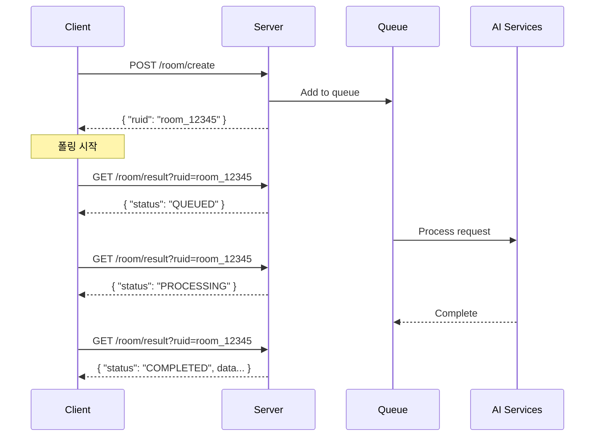

# 2.2 API 설계 명세

## 🌐 API 설계 개요

<div style="background: linear-gradient(135deg, #667eea 0%, #764ba2 100%); padding: 30px; border-radius: 15px; color: white; margin: 20px 0;">
  <h3 style="margin: 0;">RESTful API 설계</h3>
  <p style="margin: 10px 0 0 0;">비동기 처리와 상태 기반 폴링을 활용한 효율적인 API 구조</p>
</div>

---

## 📋 API 엔드포인트 요약

| 메서드 | 경로 | 목적 | 응답 시간 |
|--------|------|------|-----------|
| `GET` | `/` | 서버 상태 확인 | < 10ms |
| `GET` | `/health` | 상세 헬스체크 | < 20ms |
| `POST` | `/room/create` | 룸 생성 요청 | < 100ms |
| `GET` | `/room/result?ruid={id}` | 결과 조회 | < 50ms |
| `GET` | `/queue/status` | 큐 상태 확인 | < 20ms |

---

## 🔑 인증 방식

<div style="background: #e8f5e9; padding: 20px; border-radius: 10px; margin: 20px 0;">
  <h4 style="margin: 0 0 10px 0;">API Key 인증</h4>
  <p>모든 API 요청에는 <code>Authorization</code> 헤더가 필요합니다.</p>
  
  ```http
  Authorization: your-api-key-here
  Content-Type: application/json; charset=utf-8
  ```
</div>

---

## 🚀 핵심 API 플로우

### 룸 생성 요청 → 결과 조회 플로우



---

## 📝 요청/응답 포맷

### 최초 룸 생성 요청

<div style="display: grid; grid-template-columns: 1fr 1fr; gap: 20px; margin: 20px 0;">
  <div>
    <h4>요청 (Request)</h4>
    
```json
POST /room/create

{
  "uuid": "user_12345",
  "theme": "우주정거장",
  "keywords": ["미래", "과학"],
  "difficulty": "normal",
  "room_prefab": "https://example.com/prefab.fbx"
}
```
  </div>
  <div>
    <h4>응답 (Response)</h4>
    
```json
HTTP/1.1 202 Accepted

{
  "ruid": "room_a1b2c3d4e5f6",
  "status": "Queued",
  "message": "Poll /room/result?ruid=..."
}
```
  </div>
</div>

### 최종 완료 응답

```json
GET /room/result?ruid=room_a1b2c3d4e5f6

{
  "uuid": "user_12345",
  "ruid": "room_a1b2c3d4e5f6",
  "theme": "우주정거장",
  "difficulty": "normal",
  "keywords": ["미래", "과학"],
  "room_prefab": "https://example.com/prefab.fbx",
  "scenario": {
    "scenario_data": { ... },
    "object_instructions": [ ... ]
  },
  "scripts": {
    "GameManager.cs": "base64_encoded_content",
    "DoorLock.cs": "base64_encoded_content"
  },
  "model_tracking": {
    "SpaceHelmet": "mesh_tracking_id_1",
    "ControlPanel": "mesh_tracking_id_2"
  },
  "success": true,
  "timestamp": "1234567890"
}
```

---

## 🔄 상태 코드 설계

<div style="background: #f3e5f5; padding: 20px; border-radius: 10px; margin: 20px 0;">
  <h4 style="margin: 0 0 10px 0;">처리 상태</h4>
  <table style="width: 100%; margin-top: 10px;">
    <tr>
      <th>상태</th>
      <th>의미</th>
      <th>다음 액션</th>
    </tr>
    <tr>
      <td><code>QUEUED</code></td>
      <td>큐에 대기 중</td>
      <td>계속 폴링</td>
    </tr>
    <tr>
      <td><code>PROCESSING</code></td>
      <td>AI 처리 중</td>
      <td>계속 폴링</td>
    </tr>
    <tr>
      <td><code>COMPLETED</code></td>
      <td>성공적으로 완료</td>
      <td>결과 사용</td>
    </tr>
    <tr>
      <td><code>FAILED</code></td>
      <td>처리 실패</td>
      <td>에러 처리</td>
    </tr>
  </table>
</div>

---

## 📊 HTTP 상태 코드 활용

| HTTP 코드 | 의미 | 사용 시나리오 |
|-----------|------|---------------|
| `200 OK` | 성공 | GET 요청 성공 |
| `202 Accepted` | 수락됨 | 비동기 작업 시작 |
| `400 Bad Request` | 잘못된 요청 | 필수 파라미터 누락 |
| `401 Unauthorized` | 인증 실패 | API 키 누락/오류 |
| `404 Not Found` | 없음 | ruid가 존재하지 않음 |
| `500 Internal Server Error` | 서버 오류 | 예상치 못한 오류 |

---

## 🎯 API 설계 원칙

<div style="display: grid; grid-template-columns: repeat(3, 1fr); gap: 20px; margin: 20px 0;">
  <div style="background: #e3f2fd; padding: 20px; border-radius: 10px; text-align: center;">
    <h4>🔄 비동기 우선</h4>
    <p>긴 작업은 비동기로 처리하고 즉시 응답</p>
  </div>
  <div style="background: #e8f5e9; padding: 20px; border-radius: 10px; text-align: center;">
    <h4>📊 상태 기반</h4>
    <p>명확한 상태 전이와 폴링 메커니즘</p>
  </div>
  <div style="background: #fff3cd; padding: 20px; border-radius: 10px; text-align: center;">
    <h4>🛡️ 안전성</h4>
    <p>모든 입력 검증과 에러 처리</p>
  </div>
</div>

---

## 📈 성능 고려사항

### 폴링 권장 주기

```javascript
// 클라이언트 폴링 예제
const pollInterval = {
  initial: 2000,    // 2초
  max: 10000,       // 10초
  multiplier: 1.5   // 점진적 증가
};

async function pollResult(ruid) {
  let interval = pollInterval.initial;
  
  while (true) {
    const result = await fetch(`/room/result?ruid=${ruid}`);
    const data = await result.json();
    
    if (data.status === 'COMPLETED' || data.status === 'FAILED') {
      return data;
    }
    
    await sleep(interval);
    interval = Math.min(interval * pollInterval.multiplier, pollInterval.max);
  }
}
```

---

## 🔗 상세 API 문서

각 엔드포인트의 상세한 사용법은 아래 링크에서 확인하세요:

<div style="background: #f0f0f0; padding: 20px; border-radius: 10px; margin: 20px 0;">
  <p style="margin: 0; text-align: center; font-size: 1.1em;">
    <a href="../api-reference/rest-api-spec.md" style="color: #667eea; text-decoration: none; font-weight: bold;">
      📖 전체 API 레퍼런스 보기 →
    </a>
  </p>
</div>

---

<div style="text-align: center; margin-top: 30px; color: #666;">
  <p>이 API는 <strong>단순함</strong>과 <strong>효율성</strong>을 목표로 설계되었습니다.</p>
</div>