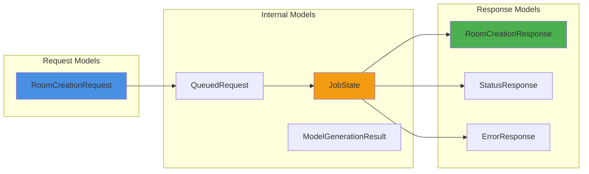
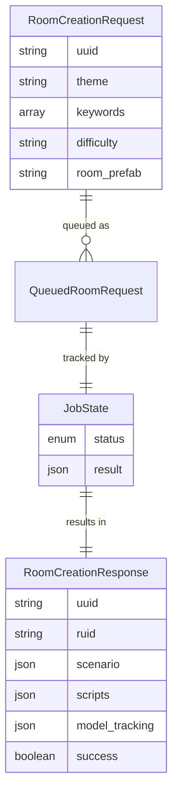

# 2.3 데이터 모델링

## 📊 데이터 모델 개요

<div style="background: linear-gradient(to right, #f093fb 0%, #f5576c 100%); padding: 30px; border-radius: 15px; color: white; margin: 20px 0;">
  <h3 style="margin: 0;">계층적 데이터 구조 설계</h3>
  <p style="margin: 10px 0 0 0;">요청부터 응답까지 일관된 데이터 흐름을 위한 모델링</p>
</div>

---

## 🔄 데이터 플로우 다이어그램



---

## 📋 핵심 데이터 모델

### 1️⃣ **요청 모델 (Request Models)**

#### RoomCreationRequest

<div style="background: #e3f2fd; padding: 20px; border-radius: 10px; margin: 20px 0;">
  <h4 style="margin: 0 0 15px 0;">룸 생성 요청 데이터</h4>
  
  | 필드 | 타입 | 필수 | 설명 |
  |------|------|------|------|
  | `uuid` | String | ✅ | 사용자 고유 식별자 |
  | `theme` | String | ✅ | 방탈출 테마 (예: "우주정거장") |
  | `keywords` | String[] | ✅ | 키워드 배열 (최소 1개) |
  | `difficulty` | String | ❌ | 난이도 (easy/normal/hard) |
  | `room_prefab` | String | ✅ | Unity 프리팹 URL |
</div>

```java
// 데이터 검증 로직
public String getValidatedDifficulty() {
    if (difficulty == null || difficulty.trim().isEmpty()) {
        return "normal"; // 기본값
    }
    
    String normalized = difficulty.trim().toLowerCase();
    return switch (normalized) {
        case "easy", "normal", "hard" -> normalized;
        default -> "normal"; // 잘못된 값은 기본값으로
    };
}
```

---

### 2️⃣ **내부 처리 모델 (Internal Models)**

#### JobState (작업 상태 관리)

<div style="background: #e8f5e9; padding: 20px; border-radius: 10px; margin: 20px 0;">
  <h4 style="margin: 0 0 15px 0;">비동기 작업 상태 추적</h4>
  
  ```java
  public record JobState(
      Status status,      // QUEUED, PROCESSING, COMPLETED, FAILED
      JsonObject result   // 최종 결과 또는 에러 정보
  )
  ```
  
  <div style="margin-top: 15px;">
    <strong>상태 전이도:</strong>
    
  ```mermaid
  stateDiagram-v2
      [*] --> QUEUED
      QUEUED --> PROCESSING
      PROCESSING --> COMPLETED
      PROCESSING --> FAILED
      COMPLETED --> [*]
      FAILED --> [*]
  ```
  </div>
</div>

#### QueuedRoomRequest

```java
private record QueuedRoomRequest(
    String ruid,                    // 서버 생성 고유 ID
    RoomCreationRequest request     // 원본 요청 데이터
)
```

#### ModelGenerationResult

<div style="background: #f3e5f5; padding: 20px; border-radius: 10px; margin: 20px 0;">
  <h4 style="margin: 0 0 15px 0;">3D 모델 생성 결과</h4>
  
  | 필드 | 타입 | 설명 |
  |------|------|------|
  | `objectName` | String | 오브젝트 이름 (예: "SpaceHelmet") |
  | `trackingId` | String | Meshy AI 추적 ID 또는 에러 코드 |
</div>

---

### 3️⃣ **응답 모델 (Response Models)**

#### RoomCreationResponse (성공 응답)

<div style="background: #fff3cd; padding: 25px; border-radius: 10px; margin: 20px 0;">
  <h4 style="margin: 0 0 15px 0;">완전한 룸 생성 결과</h4>
  
  <table style="width: 100%;">
    <tr>
      <th>필드</th>
      <th>타입</th>
      <th>설명</th>
    </tr>
    <tr>
      <td><code>uuid</code></td>
      <td>String</td>
      <td>요청한 사용자 ID</td>
    </tr>
    <tr>
      <td><code>ruid</code></td>
      <td>String</td>
      <td>룸 고유 ID</td>
    </tr>
    <tr>
      <td><code>theme</code></td>
      <td>String</td>
      <td>생성된 룸 테마</td>
    </tr>
    <tr>
      <td><code>scenario</code></td>
      <td>JsonObject</td>
      <td>AI 생성 시나리오 데이터</td>
    </tr>
    <tr>
      <td><code>scripts</code></td>
      <td>JsonObject</td>
      <td>Base64 인코딩된 C# 스크립트들</td>
    </tr>
    <tr>
      <td><code>model_tracking</code></td>
      <td>JsonObject</td>
      <td>3D 모델 추적 ID 매핑</td>
    </tr>
    <tr>
      <td><code>success</code></td>
      <td>Boolean</td>
      <td>처리 성공 여부</td>
    </tr>
    <tr>
      <td><code>timestamp</code></td>
      <td>String</td>
      <td>완료 시간</td>
    </tr>
  </table>
</div>

#### StatusResponse (상태 응답)

```json
{
  "ruid": "room_12345",
  "status": "PROCESSING"  // QUEUED, PROCESSING, COMPLETED, FAILED
}
```

#### ErrorResponse (에러 응답)

```json
{
  "ruid": "room_12345",
  "uuid": "user_12345",
  "success": false,
  "error": "상세한 에러 메시지",
  "timestamp": "1234567890"
}
```

---

## 🔗 데이터 관계도



---

## 📦 JSON 구조 상세

### Scenario 객체 구조

<div style="background: #e8f5e9; padding: 20px; border-radius: 10px; margin: 20px 0;">
  <h4 style="margin: 0 0 15px 0;">시나리오 데이터 구조</h4>
  
```json
{
  "scenario_data": {
    "theme": "우주정거장",
    "difficulty": "normal",
    "description": "버려진 우주정거장에서의 탈출",
    "escape_condition": "메인 에어락 열기",
    "puzzle_flow": "단계별 퍼즐 진행 설명"
  },
  "object_instructions": [
    {
      "name": "GameManager",
      "type": "game_manager",
      "functional_description": "전체 게임 상태 관리"
    },
    {
      "name": "SpaceHelmet",
      "type": "interactive_object",
      "visual_description": "우주 헬멧, 투명한 바이저",
      "interaction_method": "left_click",
      "puzzle_role": "산소 공급 퍼즐의 핵심"
    }
  ]
}
```
</div>

### Scripts 객체 구조

<div style="background: #f3e5f5; padding: 20px; border-radius: 10px; margin: 20px 0;">
  <h4 style="margin: 0 0 15px 0;">스크립트 저장 구조</h4>
  
  <p>모든 스크립트는 Base64로 인코딩되어 전송됩니다:</p>
  
```json
{
  "GameManager.cs": "dXNpbmcgVW5pdHlFbmdpbmU7CnVzaW5nIFN5c3RlbS5Db2xsZWN0aW9uczsK...",
  "SpaceHelmet.cs": "dXNpbmcgVW5pdHlFbmdpbmU7CnVzaW5nIFVuaXR5RW5naW5lLklucHV0U3lz...",
  "DoorController.cs": "dXNpbmcgVW5pdHlFbmdpbmU7CnB1YmxpYyBjbGFzcyBEb29yQ29udHJvbGxl..."
}
```
  
  <div style="margin-top: 15px; padding: 10px; background: #ede7f6; border-radius: 5px;">
    <strong>💡 디코딩 예제:</strong>
    <code>string decodedScript = Encoding.UTF8.GetString(Convert.FromBase64String(base64String));</code>
  </div>
</div>

---

## 🛡️ 데이터 검증 규칙

### 입력 검증

| 필드 | 검증 규칙 |
|------|-----------|
| `uuid` | 비어있지 않음, 공백 제거 |
| `theme` | 비어있지 않음, 최대 100자 |
| `keywords` | 최소 1개, 각 키워드 비어있지 않음 |
| `difficulty` | easy/normal/hard 중 하나 |
| `room_prefab` | https:// 로 시작하는 유효한 URL |

### 출력 검증

```java
// 시나리오 검증
private void validateScenario(JsonObject scenario) {
    // 필수 필드 확인
    if (!scenario.has("scenario_data") || 
        !scenario.has("object_instructions")) {
        throw new RuntimeException("Invalid scenario structure");
    }
    
    // GameManager 확인
    JsonArray objects = scenario.getAsJsonArray("object_instructions");
    if (objects.isEmpty() || 
        !objects.get(0).getAsJsonObject().get("name")
                .getAsString().equals("GameManager")) {
        throw new RuntimeException("GameManager must be first object");
    }
}
```

---

## 💾 저장소 매핑

### Firebase Firestore 구조

<div style="background: #fff3cd; padding: 20px; border-radius: 10px; margin: 20px 0;">
  <h4 style="margin: 0 0 15px 0;">클라이언트 측 데이터 저장 구조</h4>
  
```
firestore/
├── users/
│   └── {uuid}/
│       ├── profile
│       └── rooms/
│           └── {ruid}/
│               ├── metadata
│               ├── scenario
│               ├── scripts
│               └── models
└── global/
    └── statistics/
        ├── total_rooms
        └── daily_usage
```
</div>

---

## 📊 데이터 크기 예측

| 데이터 유형 | 평균 크기 | 최대 크기 |
|------------|-----------|-----------|
| 요청 데이터 | ~1 KB | 5 KB |
| 시나리오 | ~10 KB | 50 KB |
| 스크립트 (각) | ~5 KB | 20 KB |
| 전체 응답 | ~50 KB | 200 KB |
| 3D 모델 메타데이터 | ~2 KB | 5 KB |

---

<div style="text-align: center; margin-top: 30px; color: #666;">
  <p>이 데이터 모델은 <strong>확장성</strong>과 <strong>유지보수성</strong>을 고려하여 설계되었습니다.</p>
</div>