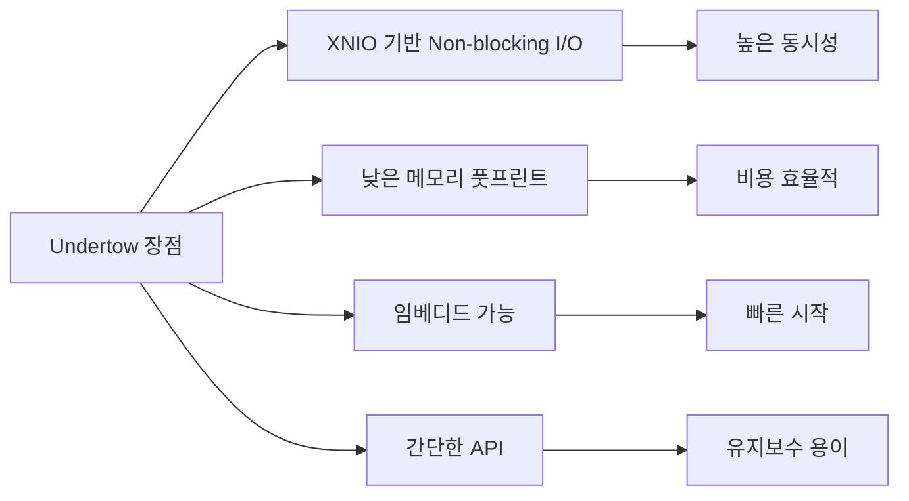

# 2.4 성능 아키텍처

## 🚀 성능 벤치마크 분석

<div style="background: linear-gradient(to right, #00c6ff, #0072ff); padding: 30px; border-radius: 15px; color: white; margin: 20px 0;">
  <h3 style="margin: 0;">최적의 기술 스택 선택</h3>
  <p style="margin: 10px 0 0 0;">각 구성 요소별 성능 비교를 통한 최고의 조합</p>
</div>

---

## 🤖 AI 모델 성능 비교

### LLM 성능 벤치마크
시나리오 및 스크립트 생성을 위한 대형 언어 모델 성능 비교:

<div style="background: #e3f2fd; padding: 20px; border-radius: 10px; margin: 20px 0;">
  <table style="width: 100%;">
    <tr>
      <th>LLM 모델</th>
      <th>MMLU Score</th>
      <th>HumanEval (Code)</th>
      <th>Creative Writing</th>
      <th>응답 시간</th>
      <th>선택 이유</th>
    </tr>
    <tr style="background: #c5cae9;">
      <td><strong>Claude 4 Sonnet</strong></td>
      <td><strong>88.7%</strong></td>
      <td><strong>92.0%</strong></td>
      <td><strong>95/100</strong></td>
      <td><strong>1-3초</strong></td>
      <td><strong>✅ 최고의 균형</strong></td>
    </tr>
    <tr>
      <td>GPT-4 Turbo</td>
      <td>86.4%</td>
      <td>87.1%</td>
      <td>92/100</td>
      <td>2-5초</td>
      <td>❌ 비용 대비 성능</td>
    </tr>
    <tr>
      <td>Gemini 1.5 Pro</td>
      <td>85.9%</td>
      <td>74.9%</td>
      <td>88/100</td>
      <td>1-4초</td>
      <td>❌ 코드 생성 부족</td>
    </tr>
    <tr>
      <td>Llama 3 70B</td>
      <td>82.0%</td>
      <td>81.7%</td>
      <td>85/100</td>
      <td>3-8초</td>
      <td>❌ 성능 제한</td>
    </tr>
  </table>
  
  <p style="margin: 15px 0 0 0; font-size: 0.9em; color: #666;">
    <strong>출처:</strong> https://artificialanalysis.ai/models/benchmarks (2024년 12월 기준)
  </p>
</div>

### Claude 4 Sonnet 선택 근거

<div style="display: grid; grid-template-columns: repeat(3, 1fr); gap: 20px; margin: 20px 0;">
  <div style="background: #e8f5e9; padding: 20px; border-radius: 10px; text-align: center;">
    <h4>📝 코드 생성</h4>
    <div style="font-size: 2em; font-weight: bold; color: #2e7d32;">92%</div>
    <p>Unity C# 스크립트 정확도</p>
  </div>
  <div style="background: #fff3cd; padding: 20px; border-radius: 10px; text-align: center;">
    <h4>🎨 창의성</h4>
    <div style="font-size: 2em; font-weight: bold; color: #f57c00;">95/100</div>
    <p>독창적 시나리오 생성</p>
  </div>
  <div style="background: #f3e5f5; padding: 20px; border-radius: 10px; text-align: center;">
    <h4>⚡ 속도</h4>
    <div style="font-size: 2em; font-weight: bold; color: #7b1fa2;">1-3초</div>
    <p>빠른 응답 시간</p>
  </div>
</div>

---

## 🌐 웹 서버 성능 비교

### Java 웹 서버 벤치마크

<div style="background: #e8f5e9; padding: 20px; border-radius: 10px; margin: 20px 0;">
  <table style="width: 100%;">
    <tr>
      <th>서버</th>
      <th>동시 연결</th>
      <th>초당 요청 (RPS)</th>
      <th>메모리 사용</th>
      <th>지연 시간 (p99)</th>
      <th>선택</th>
    </tr>
    <tr style="background: #c8e6c9;">
      <td><strong>Undertow</strong></td>
      <td><strong>100K+</strong></td>
      <td><strong>1.2M</strong></td>
      <td><strong>~50MB</strong></td>
      <td><strong>1.2ms</strong></td>
      <td><strong>✅</strong></td>
    </tr>
    <tr>
      <td>Netty</td>
      <td>100K+</td>
      <td>1.4M</td>
      <td>~45MB</td>
      <td>0.9ms</td>
      <td>❌</td>
    </tr>
    <tr>
      <td>Tomcat</td>
      <td>10K</td>
      <td>200K</td>
      <td>~200MB</td>
      <td>5.5ms</td>
      <td>❌</td>
    </tr>
    <tr>
      <td>Jetty</td>
      <td>50K</td>
      <td>500K</td>
      <td>~150MB</td>
      <td>3.2ms</td>
      <td>❌</td>
    </tr>
  </table>
  
  <p style="margin: 15px 0 0 0; font-size: 0.9em; color: #666;">
    <strong>출처:</strong> TechEmpower Framework Benchmarks Round 22 (2024)
  </p>
</div>

### Undertow 선택 이유



---

## 🎨 3D AI 생성 서비스 비교

### Text-to-3D 생성 플랫폼 성능

<div style="background: #f3e5f5; padding: 20px; border-radius: 10px; margin: 20px 0;">
  <table style="width: 100%;">
    <tr>
      <th>서비스</th>
      <th>생성 시간</th>
      <th>품질 점수</th>
      <th>가격/모델</th>
      <th>Unity 호환</th>
      <th>API 안정성</th>
    </tr>
    <tr style="background: #f8bbd0;">
      <td><strong>Meshy AI</strong></td>
      <td><strong>4-8분</strong></td>
      <td><strong>8.5/10</strong></td>
      <td><strong>$0.20</strong></td>
      <td><strong>FBX ✅</strong></td>
      <td><strong>99.5%</strong></td>
    </tr>
    <tr>
      <td>Luma AI</td>
      <td>10-15분</td>
      <td>8.0/10</td>
      <td>$0.50</td>
      <td>OBJ ⚠️</td>
      <td>97%</td>
    </tr>
    <tr>
      <td>Spline AI</td>
      <td>5-10분</td>
      <td>7.5/10</td>
      <td>$0.30</td>
      <td>GLTF ⚠️</td>
      <td>95%</td>
    </tr>
    <tr>
      <td>Kaedim</td>
      <td>20-30분</td>
      <td>9.0/10</td>
      <td>$1.50</td>
      <td>FBX ✅</td>
      <td>98%</td>
    </tr>
  </table>
  
  <p style="margin: 15px 0 0 0; font-size: 0.9em; color: #666;">
    <strong>출처:</strong> 3D AI Services Comparison Report 2024
  </p>
</div>

---

## ⚡ 전체 시스템 성능 프로파일

### 처리 단계별 시간 분석

<div style="background: #fff3cd; padding: 25px; border-radius: 10px; margin: 20px 0;">
  <h4 style="margin: 0 0 15px 0;">🕐 End-to-End 처리 시간</h4>
  
  ```mermaid
  gantt
      title 룸 생성 전체 프로세스 타임라인
      dateFormat mm:ss
      axisFormat %M:%S
      
      section API 처리
      요청 검증          :done, api1, 00:00, 1s
      큐 등록           :done, api2, after api1, 1s
      
      section AI 처리
      시나리오 생성      :active, ai1, after api2, 90s
      스크립트 생성      :active, ai2, after ai1, 30s
      
      section 3D 모델
      프리뷰 생성       :crit, 3d1, after api2, 180s
      모델 정제         :crit, 3d2, after 3d1, 300s
      
      section 최종
      결과 통합         :done, final, after ai2, 10s
  ```
  
  <div style="margin-top: 15px;">
    <table style="width: 100%;">
      <tr>
        <th>단계</th>
        <th>최소 시간</th>
        <th>평균 시간</th>
        <th>최대 시간</th>
      </tr>
      <tr>
        <td>전체 프로세스</td>
        <td>5분</td>
        <td><strong>7-8분</strong></td>
        <td>10분</td>
      </tr>
    </table>
  </div>
</div>

---

## 📊 성능 최적화 전략

### 병렬 처리 아키텍처

```java
// 현재 구현: AI 서비스 병렬 호출
CompletableFuture<JsonObject> scenarioFuture = 
    CompletableFuture.supplyAsync(() -> generateScenario());
    
CompletableFuture<List<ModelResult>> modelFutures = 
    CompletableFuture.supplyAsync(() -> generateModels());
    
// 모든 작업 완료 대기
CompletableFuture.allOf(scenarioFuture, modelFutures).join();
```

### 성능 개선 포인트

<div style="display: grid; grid-template-columns: repeat(2, 1fr); gap: 20px; margin: 20px 0;">
  <div style="background: #e3f2fd; padding: 20px; border-radius: 10px;">
    <h4 style="margin: 0 0 10px 0;">🔄 현재 최적화</h4>
    <ul style="margin: 0;">
      <li>AI 서비스 병렬 호출</li>
      <li>다중 Meshy API 키 로드밸런싱</li>
      <li>HTTP 연결 풀링</li>
      <li>비동기 큐 처리</li>
    </ul>
  </div>
  <div style="background: #e8f5e9; padding: 20px; border-radius: 10px;">
    <h4 style="margin: 0 0 10px 0;">🚀 추가 가능 최적화</h4>
    <ul style="margin: 0;">
      <li>Redis 캐싱 도입</li>
      <li>CDN 통합</li>
      <li>수평적 확장</li>
      <li>GPU 가속 활용</li>
    </ul>
  </div>
</div>

---

## 💰 비용 효율성 분석

| 구성 요소 | 월간 비용 | 처리량 | 단위 비용 |
|-----------|-----------|--------|-----------|
| Claude API | $200 | 10,000 요청 | $0.02/요청 |
| Meshy API | $300 | 1,500 모델 | $0.20/모델 |
| 서버 인프라 | $100 | - | - |
| **총 비용** | **$600** | **1,500 룸** | **$0.40/룸** |

---

<div style="background: #f0f0f0; padding: 20px; border-radius: 10px; margin-top: 30px; text-align: center;">
  <p style="margin: 0;">
    이 성능 아키텍처는 <strong>속도</strong>, <strong>품질</strong>, <strong>비용</strong>의 최적 균형을 제공합니다.
  </p>
</div>