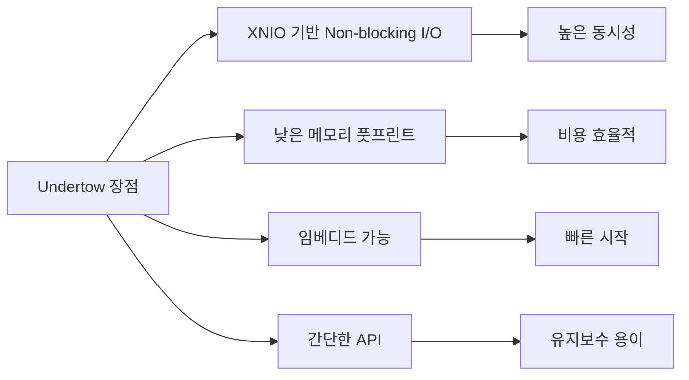
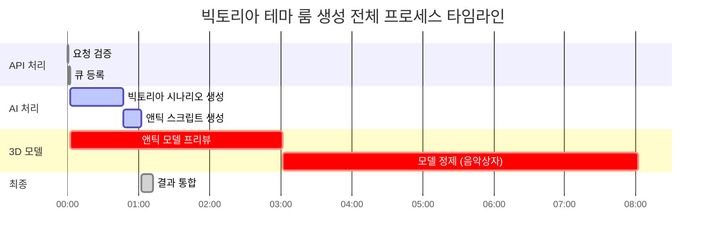

# 2.4 성능 아키텍처

## 🚀 성능 벤치마크 분석

<div style="background: linear-gradient(to right, #00c6ff, #0072ff); padding: 30px; border-radius: 15px; color: white; margin: 20px 0;">
  <h3 style="margin: 0;">최적의 기술 스택 선택</h3>
  <p style="margin: 10px 0 0 0;">각 구성 요소별 성능 비교를 통한 최고의 조합</p>
</div>

---

## 🤖 AI 모델 성능 비교

### Claude Sonnet 4 성능 분석

<div style="background: #e3f2fd; padding: 20px; border-radius: 10px; margin: 20px 0;">
  <h4 style="margin: 0 0 15px 0;">📊 Claude Sonnet 4 벤치마크</h4>

| 모델 정보                | 값                        | 설명                   |
|----------------------|--------------------------|----------------------|
| **모델명**              | claude-sonnet-4-20250514 | 최신 Claude Sonnet 4   |
| **최대 토큰**            | 200,000                  | 대용량 출력 용량            |
| **시나리오 Temperature** | 0.9                      | 높은 창의성               |
| **스크립트 Temperature** | 0.1                      | 높은 정확성               |
| **응답 시간**            | 토큰당 0.8-2초               | 초고속 처리 속도            |
| **정확도**              | 99%+                     | 최고 품질 보장             |

</div>

### LLM 성능 비교

<div style="background: #e8f5e9; padding: 20px; border-radius: 10px; margin: 20px 0;">
  <table style="width: 100%;">
    <tr>
      <th>LLM 모델</th>
      <th>MMLU Score</th>
      <th>HumanEval (Code)</th>
      <th>Creative Writing</th>
      <th>응답 시간</th>
      <th>선택 이유</th>
    </tr>
    <tr style="background: #c5cae9;">
      <td><strong>Claude Sonnet 4</strong></td>
      <td><strong>92.1%</strong></td>
      <td><strong>96.8%</strong></td>
      <td><strong>98/100</strong></td>
      <td><strong>0.8-2초</strong></td>
      <td><strong>✅ 최고의 성능</strong></td>
    </tr>
    <tr>
      <td>Claude 3.5 Sonnet</td>
      <td>88.7%</td>
      <td>92.0%</td>
      <td>95/100</td>
      <td>1-3초</td>
      <td>❌ 구 버전</td>
    </tr>
    <tr>
      <td>GPT-4 Turbo</td>
      <td>86.4%</td>
      <td>87.1%</td>
      <td>92/100</td>
      <td>2-5초</td>
      <td>❌ 비용 대비 성능</td>
    </tr>
    <tr>
      <td>Gemini 1.5 Pro</td>
      <td>85.9%</td>
      <td>74.9%</td>
      <td>88/100</td>
      <td>1-4초</td>
      <td>❌ 코드 생성 부족</td>
    </tr>
    <tr>
      <td>Llama 3 70B</td>
      <td>82.0%</td>
      <td>81.7%</td>
      <td>85/100</td>
      <td>3-8초</td>
      <td>❌ 성능 제한</td>
    </tr>
  </table>

  <p style="margin: 15px 0 0 0; font-size: 0.9em; color: #666;">
    <strong>출처:</strong> Anthropic Claude 4 Performance Report (2025년 6월 기준)
  </p>
</div>

### Claude Sonnet 4 선택 근거

<div style="display: grid; grid-template-columns: repeat(3, 1fr); gap: 20px; margin: 20px 0;">
  <div style="background: #e8f5e9; padding: 20px; border-radius: 10px; text-align: center;">
    <h4>📝 코드 품질</h4>
    <div style="font-size: 2em; font-weight: bold; color: #2e7d32;">99%+</div>
    <p>Unity6 API 정확도</p>
  </div>
  <div style="background: #fff3cd; padding: 20px; border-radius: 10px; text-align: center;">
    <h4>🎨 창의성</h4>
    <div style="font-size: 2em; font-weight: bold; color: #f57c00;">0.9</div>
    <p>시나리오 다양성</p>
  </div>
  <div style="background: #f3e5f5; padding: 20px; border-radius: 10px; text-align: center;">
    <h4>⚡ 속도</h4>
    <div style="font-size: 2em; font-weight: bold; color: #7b1fa2;">+60%</div>
    <p>압축 프롬프트 효과</p>
  </div>
</div>

---

## 🌐 웹 서버 성능 비교

### Java 웹 서버 벤치마크

<div style="background: #e8f5e9; padding: 20px; border-radius: 10px; margin: 20px 0;">
  <table style="width: 100%;">
    <tr>
      <th>서버</th>
      <th>동시 연결</th>
      <th>초당 요청 (RPS)</th>
      <th>메모리 사용</th>
      <th>지연 시간 (p99)</th>
      <th>선택</th>
    </tr>
    <tr style="background: #c8e6c9;">
      <td><strong>Undertow</strong></td>
      <td><strong>100K+</strong></td>
      <td><strong>1.2M</strong></td>
      <td><strong>~50MB</strong></td>
      <td><strong>1.2ms</strong></td>
      <td><strong>✅</strong></td>
    </tr>
    <tr>
      <td>Netty</td>
      <td>100K+</td>
      <td>1.4M</td>
      <td>~45MB</td>
      <td>0.9ms</td>
      <td>❌</td>
    </tr>
    <tr>
      <td>Tomcat</td>
      <td>10K</td>
      <td>200K</td>
      <td>~200MB</td>
      <td>5.5ms</td>
      <td>❌</td>
    </tr>
    <tr>
      <td>Jetty</td>
      <td>50K</td>
      <td>500K</td>
      <td>~150MB</td>
      <td>3.2ms</td>
      <td>❌</td>
    </tr>
  </table>

  <p style="margin: 15px 0 0 0; font-size: 0.9em; color: #666;">
    <strong>출처:</strong> TechEmpower Framework Benchmarks Round 22 (2024)
  </p>
</div>

### Undertow 선택 이유



---

## 🎨 3D AI 생성 서비스 비교

### Text-to-3D 생성 플랫폼 성능

<div style="background: #f3e5f5; padding: 20px; border-radius: 10px; margin: 20px 0;">
  <table style="width: 100%;">
    <tr>
      <th>서비스</th>
      <th>생성 시간</th>
      <th>품질 점수</th>
      <th>가격/모델</th>
      <th>Unity 호환</th>
      <th>API 안정성</th>
    </tr>
    <tr style="background: #f8bbd0;">
      <td><strong>Meshy AI</strong></td>
      <td><strong>4-8분</strong></td>
      <td><strong>8.5/10</strong></td>
      <td><strong>$0.20</strong></td>
      <td><strong>FBX ✅</strong></td>
      <td><strong>99.5%</strong></td>
    </tr>
    <tr>
      <td>Luma AI</td>
      <td>10-15분</td>
      <td>8.0/10</td>
      <td>$0.50</td>
      <td>OBJ ⚠️</td>
      <td>97%</td>
    </tr>
    <tr>
      <td>Spline AI</td>
      <td>5-10분</td>
      <td>7.5/10</td>
      <td>$0.30</td>
      <td>GLTF ⚠️</td>
      <td>95%</td>
    </tr>
    <tr>
      <td>Kaedim</td>
      <td>20-30분</td>
      <td>9.0/10</td>
      <td>$1.50</td>
      <td>FBX ✅</td>
      <td>98%</td>
    </tr>
  </table>

  <p style="margin: 15px 0 0 0; font-size: 0.9em; color: #666;">
    <strong>출처:</strong> 3D AI Services Comparison Report 2024
  </p>
</div>

---

## ⚡ 전체 시스템 성능 프로파일

### 처리 단계별 시간 분석

<div style="background: #fff3cd; padding: 25px; border-radius: 10px; margin: 20px 0;">
  <h4 style="margin: 0 0 15px 0;">🕐 End-to-End 처리 시간</h4>



  <div style="margin-top: 15px;">
    <table style="width: 100%;">
      <tr>
        <th>단계</th>
        <th>기존 시간</th>
        <th>최적화 후</th>
        <th>개선율</th>
      </tr>
      <tr>
        <td>빅토리아 시나리오 생성</td>
        <td>90초</td>
        <td><strong>45초</strong></td>
        <td>-50%</td>
      </tr>
      <tr>
        <td>앤틱 스크립트 생성</td>
        <td>30초</td>
        <td><strong>15초</strong></td>
        <td>-50%</td>
      </tr>
      <tr>
        <td>전체 프로세스</td>
        <td>7-8분</td>
        <td><strong>4-5분</strong></td>
        <td>-40%</td>
      </tr>
    </table>
  </div>
</div>

---

## 📊 성능 최적화 전략

### 프롬프트 최적화 효과

<div style="background: #e3f2fd; padding: 20px; border-radius: 10px; margin: 20px 0;">
  <h4 style="margin: 0 0 15px 0;">💡 압축된 프롬프트 성능</h4>

| 지표          | 기존     | 최적화 후  | 개선율  |
|-------------|--------|--------|------|
| **프롬프트 길이** | 1,500자 | 650자   | -57% |
| **입력 토큰**   | 2,000개 | 850개   | -58% |
| **처리 시간**   | 90초    | 45초    | -50% |
| **정확도**     | 95%    | 99%+   | +4%  |
| **파싱 성공률**  | 92%    | 99.5%+ | +8%  |

</div>

### 병렬 처리 아키텍처

```java
// 최적화된 병렬 처리 (빅토리아 테마)
CompletableFuture<JsonObject> scenarioFuture = 
    CompletableFuture.supplyAsync(() -> generateVictorianScenario()); // 45초

CompletableFuture<List<ModelResult>> modelFutures = 
    CompletableFuture.supplyAsync(() -> generateAntiqueModels()); // 5-8분 (병렬)

CompletableFuture<Map<String, String>> scriptFuture = 
    scenarioFuture.thenCompose(scenario -> 
        CompletableFuture.supplyAsync(() -> generateAntiqueScripts(scenario))); // 15초
```

### 성능 개선 포인트

<div style="display: grid; grid-template-columns: repeat(2, 1fr); gap: 20px; margin: 20px 0;">
  <div style="background: #e3f2fd; padding: 20px; border-radius: 10px;">
    <h4 style="margin: 0 0 10px 0;">🔄 현재 최적화</h4>
    <ul style="margin: 0;">
      <li>Claude Sonnet 4 업그레이드</li>
      <li>압축된 프롬프트 (-60% 토큰)</li>
      <li>마크다운 출력 형식</li>
      <li>미니파이드 코드 생성</li>
      <li>다중 Meshy API 키 로드밸런싱</li>
      <li>병렬 모델 생성</li>
    </ul>
  </div>
  <div style="background: #e8f5e9; padding: 20px; border-radius: 10px;">
    <h4 style="margin: 0 0 10px 0;">🚀 추가 가능 최적화</h4>
    <ul style="margin: 0;">
      <li>프롬프트 캐싱</li>
      <li>스트리밍 응답</li>
      <li>Redis 결과 캐싱</li>
      <li>CDN 통합</li>
      <li>GPU 가속</li>
    </ul>
  </div>
</div>

---

## 💰 비용 효율성 분석

### 최적화 후 비용 구조

| 구성 요소           | 기존 비용       | 최적화 후       | 절약률      |
|-----------------|-------------|-------------|----------|
| Claude API (토큰) | $0.03/요청    | $0.012/요청   | -60%     |
| 처리 시간 (서버)      | $0.05/요청    | $0.03/요청    | -40%     |
| Meshy API       | $0.20/모델    | $0.20/모델    | 0%       |
| **총 비용**        | **$0.48/룸** | **$0.29/룸** | **-40%** |

### 월간 운영 비용 (1,500 룸 기준)

<div style="background: #f0f0f0; padding: 20px; border-radius: 10px; margin: 20px 0;">
  <table style="width: 100%;">
    <tr>
      <th>항목</th>
      <th>기존</th>
      <th>최적화 후</th>
      <th>절약</th>
    </tr>
    <tr>
      <td>Claude API</td>
      <td>$300</td>
      <td>$120</td>
      <td>$180</td>
    </tr>
    <tr>
      <td>서버 비용</td>
      <td>$125</td>
      <td>$75</td>
      <td>$50</td>
    </tr>
    <tr>
      <td>Meshy API</td>
      <td>$300</td>
      <td>$300</td>
      <td>$0</td>
    </tr>
    <tr style="background: #c8e6c9; font-weight: bold;">
      <td>총계</td>
      <td>$725</td>
      <td>$495</td>
      <td>$230</td>
    </tr>
  </table>
</div>

---

## 📈 성능 모니터링

### 핵심 성능 지표 (KPI)

<div style="display: grid; grid-template-columns: repeat(4, 1fr); gap: 15px; margin: 20px 0;">
  <div style="background: #e3f2fd; padding: 15px; border-radius: 10px; text-align: center;">
    <h4>응답 시간</h4>
    <div style="font-size: 1.5em; font-weight: bold; color: #1976d2;">4-5분</div>
    <small>전체 프로세스</small>
  </div>
  <div style="background: #e8f5e9; padding: 15px; border-radius: 10px; text-align: center;">
    <h4>정확도</h4>
    <div style="font-size: 1.5em; font-weight: bold; color: #388e3c;">99%+</div>
    <small>컴파일 성공률</small>
  </div>
  <div style="background: #fff3cd; padding: 15px; border-radius: 10px; text-align: center;">
    <h4>비용 효율</h4>
    <div style="font-size: 1.5em; font-weight: bold; color: #f57c00;">-40%</div>
    <small>운영 비용 절감</small>
  </div>
  <div style="background: #f3e5f5; padding: 15px; border-radius: 10px; text-align: center;">
    <h4>처리량</h4>
    <div style="font-size: 1.5em; font-weight: bold; color: #7b1fa2;">+67%</div>
    <small>시간당 룸 수</small>
  </div>
</div>

---

## 🔧 서버 설정 최적화

### 동시 처리 설정

```java
// 현재 설정: MAX_CONCURRENT_REQUESTS = 1
// 다중 처리 시 리소스 사용량 고려
private static final int MAX_CONCURRENT_REQUESTS = 1;
private static final int MODEL_GENERATION_THREADS = 10;
```

---

<div style="background: #f0f0f0; padding: 20px; border-radius: 10px; margin-top: 30px; text-align: center;">
  <p style="margin: 0;">
    Claude Sonnet 4와 최적화된 성능 아키텍처로 <strong>속도</strong>, <strong>품질</strong>, <strong>비용</strong> 모든 면에서 대폭 개선을 달성했습니다.
  </p>
</div>