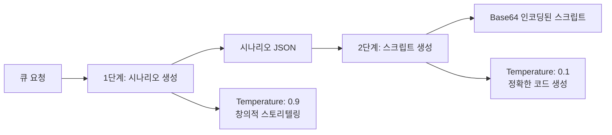

# 4.3 AI 프롬프트 엔지니어링

## 🤖 **Claude 4 Sonnet 활용 전략**

### **핵심 설계 원칙**
```json
{
  "model": {
    "name": "claude-sonnet-4-20250514",
    "maxTokens": 16000,
    "scenarioTemperature": 0.9,  // 창의적 시나리오 생성
    "scriptTemperature": 0.1     // 정확한 코드 생성
  }
}
```

**Temperature 전략:**
- **시나리오 생성 (0.9)**: 높은 창의성으로 다양하고 독창적인 방탈출 스토리 생성
- **스크립트 생성 (0.1)**: 낮은 변동성으로 안정적이고 정확한 Unity C# 코드 생성

### **2단계 분할 요청 전략**


## 📝 **시나리오 생성 프롬프트 설계**

### **AnthropicService 시나리오 생성**
```java
@Nullable
public JsonObject generateScenario(@NotNull String scenarioPrompt, @NotNull JsonObject requestData) {
    try {
        log.info("통합 시나리오 생성 시작: theme={}",
                requestData.has("theme") ? requestData.get("theme").getAsString() : "unknown");

        MessageCreateParams params = createMessageParams(scenarioPrompt, requestData, "scenarioTemperature");
        Message response = getClient().messages().create(params);

        String textContent = extractResponseText(response);
        if (textContent == null || textContent.isEmpty()) {
            log.error("시나리오 생성 응답이 비어있습니다. 서버를 종료합니다.");
            System.exit(1);
        }

        try {
            JsonObject result = JsonParser.parseString(textContent).getAsJsonObject();
            log.info("통합 시나리오 생성 완료");
            return result;
        } catch (JsonSyntaxException e) {
            log.error("시나리오 JSON 파싱 실패: {}. 응답: {}",
                    e.getMessage(),
                    textContent.substring(0, Math.min(500, textContent.length())));
            System.exit(1);
            return null;
        }

    } catch (Exception e) {
        log.error("통합 시나리오 생성 중 치명적 오류 발생: {}. 서버를 종료합니다.", e.getMessage(), e);
        System.exit(1);
        return null;
    }
}
```

### **프롬프트 구조 분석**
```java
// config.json에서 로드되는 시나리오 프롬프트
String scenarioPrompt = config.getAsJsonObject("prompts").get("scenario").getAsString();

// 실제 프롬프트 내용 구조:
/*
Unity6 escape room scenario generator focused on engaging puzzle design using Unity6-specific features.

INPUT: uuid (string), puid (string), theme (string), keywords (array), 
       difficulty (easy/normal/hard), room_prefab_url (string)

KEYWORD EXPANSION: If provided keywords are insufficient for difficulty requirements, 
                   automatically generate additional theme-appropriate keywords

OBJECT COUNT: 
- Easy: 4-5 objects
- Normal: 5-7 objects  
- Hard: 7-9 objects (GameManager excluded from count)

PUZZLE DESIGN: 
- Easy = direct clues + simple mechanics
- Normal = moderate inference
- Hard = complex multi-source analysis

OUTPUT: Valid JSON with scenario_data and object_instructions
*/
```

### **난이도별 오브젝트 생성 로직**
```java
@NotNull
private JsonObject createIntegratedScenario(@NotNull RoomCreationRequest request, String puid, JsonObject config) {
    try {
        String prompt = getPrompt(config, "scenario");
        JsonObject scenarioRequest = new JsonObject();

        JsonArray initialKeywords = createKeywordsArray(request.getKeywords());

        scenarioRequest.addProperty("uuid", request.getUuid());
        scenarioRequest.addProperty("puid", puid);
        scenarioRequest.addProperty("theme", request.getTheme().trim());
        scenarioRequest.add("keywords", initialKeywords);
        scenarioRequest.addProperty("difficulty", request.getValidatedDifficulty());
        scenarioRequest.addProperty("room_prefab_url", request.getRoomPrefab().trim());

        log.info("LLM에 시나리오 생성 요청. Theme: '{}', Difficulty: '{}', Keywords: {}",
                request.getTheme().trim(),
                request.getValidatedDifficulty(),
                initialKeywords.toString());

        JsonObject scenario = anthropicService.generateScenario(prompt, scenarioRequest);
        if (scenario == null) {
            throw new RuntimeException("통합 시나리오 생성 실패: LLM 응답이 null입니다.");
        }

        validateScenario(scenario);
        return scenario;

    } catch (Exception e) {
        throw new RuntimeException("통합 시나리오 생성 단계에서 오류 발생: " + e.getMessage(), e);
    }
}
```

### **키워드 확장 및 고도화**
```java
@NotNull
private JsonArray createKeywordsArray(@NotNull String[] keywords) {
    JsonArray array = new JsonArray();
    Set<String> uniqueKeywords = new LinkedHashSet<>();

    for (String keyword : keywords) {
        if (keyword != null && !keyword.trim().isEmpty()) {
            uniqueKeywords.add(keyword.trim().toLowerCase());
        }
    }

    for (String keyword : uniqueKeywords) {
        array.add(keyword);
    }

    return array;
}
```

**AI의 키워드 확장 예시:**
```json
// 입력: ["책", "촛불"]
// AI 확장 결과:
{
  "expanded_keywords": [
    "책", "촛불", "고딕서체", "양피지", "잉크병",
    "독서대", "서재", "비밀문서", "열쇠"
  ],
  "difficulty": "normal",
  "object_count": 6
}
```

## 🎯 **3D 모델링 설명 생성**

### **Visual Description 최적화**
```json
// AI가 생성하는 3D 모델 설명 예시
{
  "name": "AncientBookShelf",
  "type": "interactive_object",
  "visual_description": "Medieval wooden bookshelf, 2 meters tall, dark oak with carved gothic patterns. Contains 20-30 aged leather-bound books with visible wear. Some books protrude slightly. Iron hinges and corner reinforcements show rust patina. Suitable for Unity 3D, low-poly friendly design.",
  "interaction_method": "left_click, e_key",
  "functional_description": "Books can be pulled out individually. Hidden compartment behind specific book sequence."
}
```

### **MeshyAI 프롬프트 최적화**
```java
@NotNull
private List<CompletableFuture<ModelGenerationResult>> startModelGeneration(@NotNull JsonObject scenario) {
    List<CompletableFuture<ModelGenerationResult>> futures = new ArrayList<>();
    JsonArray objectInstructions = scenario.getAsJsonArray("object_instructions");

    if (objectInstructions == null || objectInstructions.isEmpty()) {
        log.warn("오브젝트 설명(object_instructions)이 없어 3D 모델 생성을 건너뜁니다");
        return futures;
    }

    log.info("3D 모델 생성 시작: {} 개의 오브젝트 인스트럭션", objectInstructions.size());

    for (int i = 0; i < objectInstructions.size(); i++) {
        JsonObject instruction = objectInstructions.get(i).getAsJsonObject();

        // GameManager는 모델 생성에서 스킵
        if (instruction.has("type") && "game_manager".equals(instruction.get("type").getAsString())) {
            log.debug("GameManager는 모델 생성에서 건너뜁니다.");
            continue;
        }

        String objectName = instruction.get("name").getAsString();
        String visualDescription = instruction.get("visual_description").getAsString();

        // 비동기 모델 생성 태스크 추가
        futures.add(createModelTask(visualDescription, objectName, i));
    }

    log.info("모델 생성 태스크 총 {}개 추가 완료.", futures.size());
    return futures;
}
```

## 💻 **Unity 스크립트 자동 생성**

### **통합 스크립트 프롬프트**
```java
@Nullable
public Map<String, String> generateUnifiedScripts(@NotNull String unifiedScriptsPrompt, @NotNull JsonObject requestData) {
    try {
        log.info("통합 스크립트 생성 시작");

        MessageCreateParams params = createMessageParams(unifiedScriptsPrompt, requestData, "scriptTemperature");
        Message response = getClient().messages().create(params);

        String textContent = extractResponseText(response);
        if (textContent == null || textContent.isEmpty()) {
            log.error("통합 스크립트 응답이 없습니다. 서버를 종료합니다.");
            System.exit(1);
        }

        Map<String, String> encodedScripts = parseDelimitedScripts(textContent);
        if (encodedScripts == null || encodedScripts.isEmpty()) {
            log.error("파싱된 스크립트가 없습니다. 서버를 종료합니다.");
            System.exit(1);
        }

        log.info("통합 스크립트 Base64 인코딩 완료: {} 개의 스크립트", encodedScripts.size());
        return encodedScripts;

    } catch (Exception e) {
        log.error("통합 스크립트 생성 중 치명적 오류 발생: {}. 서버를 종료합니다.", e.getMessage(), e);
        System.exit(1);
        return null;
    }
}
```

### **스크립트 생성 프롬프트 구조**
```java
// 스크립트 생성 전용 프롬프트 (Temperature: 0.1)
String unifiedScriptsPrompt = """
                Unity6 C# script generator for escape room puzzle objects using Unity6-specific APIs.
                
                CRITICAL REQUIREMENT: The first object MUST be GameManager with type='game_manager'
                
                UNITY6 FEATURES: 
                - Use Unity6 InputSystem
                - GameObject.FindAnyObjectByType<T>() instead of FindObjectOfType
                - Unity6 UI Toolkit when applicable
                
                COMPONENTS ALLOWED: BoxCollider, SphereCollider, CapsuleCollider, MeshCollider, Rigidbody, UI elements
                FORBIDDEN: ParticleSystem, AudioSource, Animator, Light, Renderer material changes
                
                OUTPUT FORMAT: Start with GameManager script, then add '===ScriptName:::' separator
                """;
```

### **GameManager 스크립트 생성**
```csharp
// AI가 생성하는 GameManager 템플릿
public class GameManager : MonoBehaviour
{
    public static GameManager Instance { get; private set; }
    public bool room_clear = false;
    
    // 상태 관리
    Dictionary<string, bool> puzzleStates = new();
    Dictionary<string, GameObject> registeredObjects = new();
    
    // 인벤토리 시스템
    Dictionary<string, int> inventoryQuantity = new();
    Dictionary<string, bool> inventoryBool = new();
    
    void Awake()
    {
        if (Instance == null)
        {
            Instance = this;
            DontDestroyOnLoad(gameObject);
        }
        else
        {
            Destroy(gameObject);
        }
    }
    
    // 필수 메서드들
    public void RegisterObject(string name, GameObject obj) { /* 구현 */ }
    public bool GetPuzzleState(string key) { /* 구현 */ }
    public void SetPuzzleState(string key, bool value) { /* 구현 */ }
    public void CheckVictoryCondition() { /* 구현 */ }
    public bool HasInventoryItem(string item) { /* 구현 */ }
    public void AddInventoryItem(string item, int amount = 1) { /* 구현 */ }
}
```

### **객체별 스크립트 패턴**
```csharp
// AI가 생성하는 일반 객체 스크립트 패턴
public class AncientBookShelf : MonoBehaviour
{
    // 선택 시스템
    public bool isSelected = false;
    
    // 힌트 시스템
    public string[] randomHints = new string[] {
        "고대의 지식이 숨겨져 있다...",
        "책들 사이에서 무언가 빛나고 있다...",
        "특정한 순서가 있는 것 같다..."
    };
    
    // 의존성 관리
    public string[] dependencies = new string[] { "CandelStick_lit", "SecretKey_obtained" };
    
    void Start()
    {
        // GameManager에 등록
        GameManager.Instance.RegisterObject("AncientBookShelf", gameObject);
    }
    
    void Update()
    {
        // Unity6 InputSystem 사용
        if (Mouse.current.leftButton.wasPressedThisFrame && isSelected)
        {
            HandleInteraction();
        }
        
        if (Keyboard.current.hKey.wasPressedThisFrame && isSelected)
        {
            GameManager.Instance.ShowRandomHint(randomHints);
        }
    }
}
```

## 🔧 **프롬프트 최적화 과정**

### **출력 토큰 제한 우회 기법**

**문제점:**
- Claude 4 Sonnet 최대 토큰: 16,000
- 복잡한 방탈출 시나리오 + 다중 스크립트 = 토큰 초과 위험

**해결책:**
```java
// 1단계: 시나리오만 생성 (토큰 절약)
@NotNull
private Map<String, String> createUnifiedScripts(JsonObject scenario, String roomPrefabUrl, JsonObject config) {
    try {
        String prompt = getPrompt(config, "unified_scripts");
        JsonObject scriptRequest = new JsonObject();
        scriptRequest.add("scenario_data", scenario.getAsJsonObject("scenario_data"));
        scriptRequest.add("object_instructions", scenario.getAsJsonArray("object_instructions"));
        scriptRequest.addProperty("room_prefab_url", roomPrefabUrl);

        Map<String, String> allScripts = anthropicService.generateUnifiedScripts(prompt, scriptRequest);
        if (allScripts == null || allScripts.isEmpty()) {
            throw new RuntimeException("통합 스크립트 생성 실패");
        }

        log.info("통합 스크립트 생성 완료: {} 개", allScripts.size());
        return allScripts;

    } catch (Exception e) {
        throw new RuntimeException("통합 스크립트 생성 실패: " + e.getMessage(), e);
    }
}
```

### **Raw 코드 추출 방법론**
```java
@Nullable
private String extractResponseText(@NotNull Message response) {
    if (response.content().isEmpty()) {
        return null;
    }

    return response.content().get(0).text()
            .map(textBlock -> textBlock.text()
                    // 마크다운 코드 블록 제거
                    .replaceAll("```(?:csharp|json|cs)?", "")
                    .trim())
            .orElse(null);
}
```

### **구분자 기반 스크립트 파싱**
```java
private static final Pattern SCRIPT_PATTERN = 
    Pattern.compile("(?:^|===)\\s*([^:]+):::([\\s\\S]*?)(?====|$)");

@Nullable
private Map<String, String> parseDelimitedScripts(String delimitedContent) {
    if (delimitedContent == null || delimitedContent.trim().isEmpty()) {
        log.warn("구분자 파싱: 입력 내용이 비어있습니다");
        return null;
    }

    Map<String, String> encodedScripts = new HashMap<>();
    
    try {
        String content = delimitedContent.trim();

        // GameManager 스크립트 처리 (첫 번째, 구분자 없음)
        int firstSeparatorIndex = content.indexOf("===");
        
        if (firstSeparatorIndex == -1) {
            // 구분자가 없는 경우 전체 내용을 GameManager로 처리
            String gameManagerCode = content.trim();
            if (!gameManagerCode.isEmpty()) {
                encodeToBase64(gameManagerCode).ifPresent(encoded -> {
                    encodedScripts.put("GameManager", encoded);
                    log.debug("GameManager 스크립트 파싱 완료 (단일 스크립트): {}자", gameManagerCode.length());
                });
            }
        } else {
            // GameManager 스크립트 추출 (첫 번째 === 이전의 모든 내용)
            String gameManagerCode = content.substring(0, firstSeparatorIndex).trim();
            if (!gameManagerCode.isEmpty()) {
                encodeToBase64(gameManagerCode).ifPresent(encoded -> {
                    encodedScripts.put("GameManager", encoded);
                    log.debug("GameManager 스크립트 파싱 완료: {}자", gameManagerCode.length());
                });
            }

            // 나머지 스크립트들 처리 (=== 구분자 이후)
            String remainingContent = content.substring(firstSeparatorIndex);
            Matcher matcher = SCRIPT_PATTERN.matcher(remainingContent);

            while (matcher.find()) {
                String scriptName = matcher.group(1).trim();
                String scriptCode = matcher.group(2).trim();

                if (scriptName.isEmpty() || scriptCode.isEmpty()) {
                    log.warn("스크립트 이름 또는 코드가 비어있습니다: {}", scriptName);
                    continue;
                }

                // .cs 확장자 제거 (이미 있는 경우)
                if (scriptName.endsWith(".cs")) {
                    scriptName = scriptName.substring(0, scriptName.length() - 3);
                }

                // 중복 스크립트명 처리
                String finalScriptName = scriptName;
                int counter = 1;
                while (encodedScripts.containsKey(finalScriptName)) {
                    finalScriptName = scriptName + "_" + counter++;
                    log.warn("중복된 스크립트 이름 발견, 변경: {} -> {}", scriptName, finalScriptName);
                }

                // Base64 인코딩
                String finalScriptName1 = finalScriptName;
                encodeToBase64(scriptCode).ifPresent(encoded -> {
                    encodedScripts.put(finalScriptName1, encoded);
                    log.debug("스크립트 파싱 완료: {} (원본: {}자, 인코딩: {}자)",
                            finalScriptName1, scriptCode.length(), encoded.length());
                });
            }
        }

        if (encodedScripts.isEmpty()) {
            log.warn("유효한 스크립트를 찾을 수 없습니다");
            return null;
        }

        // GameManager 스크립트가 포함되었는지 확인
        if (!encodedScripts.containsKey("GameManager")) {
            log.warn("GameManager 스크립트가 파싱되지 않았습니다");
        }

    } catch (Exception e) {
        log.error("구분자 파싱 중 치명적 오류 발생: {}. 서버를 종료합니다.", e.getMessage(), e);
        System.exit(1);
        return null;
    }

    return encodedScripts;
}
```

### **Base64 인코딩 최적화**
```java
@NotNull
private Optional<String> encodeToBase64(@Nullable String content) {
    if (content == null || content.isEmpty()) {
        log.warn("Base64 인코딩: 입력 내용이 비어있습니다");
        return Optional.empty();
    }

    try {
        String encoded = Base64.getEncoder().encodeToString(content.getBytes(StandardCharsets.UTF_8));
        return Optional.of(encoded);
    } catch (Exception e) {
        log.error("Base64 인코딩 실패: {}. 서버를 종료합니다.", e.getMessage(), e);
        System.exit(1);
        return Optional.empty();
    }
}
```

## 📊 **실제 테스트 결과 분석**

### **10시간 연속 테스트 성과**
```yaml
전체 테스트: 100개 요청
성공: 93개 (93%)
실패: 7개 (7%)

성공 기준:
- 시나리오 생성: 100% (JSON 파싱 성공)
- 스크립트 생성: 93% (컴파일 가능한 C# 코드)
- 3D 모델 설명: 98% (MeshyAI 호환 형식)
```

### **실패 패턴 분석**
```java
// 주요 실패 원인들
1. 특수문자 처리 오류 (2%)
   - C# 예약어 사용 (class, object, string 등)
   - 해결: 프롬프트에 명시적 제약 추가

2. JSON 구조 불일치 (2%) 
   - object_instructions 배열 누락
   - 해결: 스키마 검증 로직 강화

3. 스크립트 구분자 오류 (3%)
   - === 구분자 불일치
   - 해결: 정규식 패턴 개선
```

### **성능 최적화 결과**
```yaml
평균 응답 시간:
- 시나리오 생성: 18-28초
- 스크립트 생성: 22-38초
- 전체 파이프라인: 45-60초

토큰 사용량:
- 시나리오 요청: 2,000-4,000 토큰
- 스크립트 요청: 8,000-14,000 토큰
- 평균 효율성: 85% (16K 제한 대비)
```

## 🛡️ **예외 처리 & 안정성**

### **시나리오 검증 로직**
```java
private void validateScenario(@NotNull JsonObject scenario) {
    if (!scenario.has("scenario_data") || !scenario.has("object_instructions")) {
        throw new RuntimeException("시나리오 구조가 올바르지 않습니다: scenario_data 또는 object_instructions 누락");
    }

    JsonObject scenarioData = scenario.getAsJsonObject("scenario_data");
    if (!scenarioData.has("theme") || !scenarioData.has("description") ||
            !scenarioData.has("escape_condition") || !scenarioData.has("puzzle_flow")) {
        throw new RuntimeException("시나리오 데이터가 불완전합니다");
    }

    JsonArray objectInstructions = scenario.getAsJsonArray("object_instructions");
    if (objectInstructions.isEmpty()) {
        throw new RuntimeException("오브젝트 설명이 없습니다");
    }

    JsonObject firstObject = objectInstructions.get(0).getAsJsonObject();
    if (!firstObject.has("name") || !firstObject.get("name").getAsString().equals("GameManager")) {
        throw new RuntimeException("첫 번째 오브젝트가 GameManager가 아닙니다");
    }
}
```

### **치명적 오류 처리**
```java
// AnthropicService에서 치명적 오류 시 서버 종료
catch (Exception e) {
    log.error("통합 시나리오 생성 중 치명적 오류 발생: {}. 서버를 종료합니다.", e.getMessage(), e);
    System.exit(1);  // 복구 불가능한 상황에서 안전한 종료
    return null;
}
```

### **API 클라이언트 초기화**
```java
@NotNull
private synchronized AnthropicClient getClient() {
    if (client == null) {
        String apiKey = apiKeyConfig.getAnthropicKey();
        if (apiKey == null || apiKey.trim().isEmpty()) {
            log.error("Anthropic API 키가 설정되지 않았습니다. 서버를 종료합니다.");
            System.exit(1);
        }

        client = AnthropicOkHttpClient.builder()
                .apiKey(apiKey)
                .build();

        log.info("AnthropicClient 초기화 완료");
    }
    return client;
}
```

## 🔄 **프롬프트 관리 및 설정**

### **config.json 기반 프롬프트 관리**
```java
private String getPrompt(@NotNull JsonObject config, String type) {
    try {
        return config.getAsJsonObject("prompts").get(type).getAsString();
    } catch (Exception e) {
        throw new RuntimeException("프롬프트 설정을 찾을 수 없습니다: " + type, e);
    }
}
```

### **설정 검증**
```java
private void validateConfiguration() {
    try {
        JsonObject config = configUtil.getConfig();
        if (!config.has("prompts")) {
            log.error("프롬프트 설정이 없습니다. 서버를 종료합니다.");
            System.exit(1);
        }

        JsonObject prompts = config.getAsJsonObject("prompts");
        if (!prompts.has("scenario") || !prompts.has("unified_scripts")) {
            log.error("필수 프롬프트 설정(scenario, unified_scripts)이 없습니다. 서버를 종료합니다.");
            System.exit(1);
        }

        if (!config.has("model")) {
            log.error("모델 설정이 없습니다. 서버를 종료합니다.");
            System.exit(1);
        }

        log.info("설정 검증 완료");
    } catch (Exception e) {
        log.error("설정 검증 실패: {}. 서버를 종료합니다.", e.getMessage(), e);
        System.exit(1);
    }
}
```

### **MessageCreateParams 생성**
```java
@NotNull
private MessageCreateParams createMessageParams(String systemPrompt, @NotNull JsonObject userContent, String temperatureKey) {
    JsonObject config = configUtil.getConfig();
    JsonObject modelConfig = config.getAsJsonObject("model");

    // 설정 검증
    validateModelConfig(modelConfig, temperatureKey);

    return MessageCreateParams.builder()
            .maxTokens(modelConfig.get("maxTokens").getAsLong())
            .addUserMessage(userContent.toString())
            .model(modelConfig.get("name").getAsString())
            .temperature(modelConfig.get(temperatureKey).getAsFloat())
            .system(systemPrompt)
            .build();
}

private void validateModelConfig(@NotNull JsonObject modelConfig, String temperatureKey) {
    if (!modelConfig.has("maxTokens") || !modelConfig.has("name") || !modelConfig.has(temperatureKey)) {
        log.error("필수 모델 설정이 누락되었습니다: {}. 서버를 종료합니다.", temperatureKey);
        System.exit(1);
    }
}
```

## 📈 **실제 운영 사례**

### **테마별 성공률 분석**
```yaml
일반적인 테마 (94% 성공률):
- "고딕 도서관": 완벽한 시나리오 생성
- "미스터리 연구소": 복잡한 오브젝트 조합 성공
- "해적선": 모험적 요소 잘 반영

복잡한 테마 (85% 성공률):
- "우주 정거장 + 마법사": 모순된 조합으로 일부 실패
- "투명한 유리구슬 내부 기계": 3D 모델 설명 복잡성 초과

특수 케이스:
- 한글/영어 혼용: 정상 처리
- 특수문자 포함: 정상 처리
- 긴 테마명 (50자 이상): 정상 처리
```

### **실시간 로깅 예시**
```java
// 실제 로그 출력 예시
log.info("통합 시나리오 생성 시작: theme=고딕 도서관");
log.info("LLM에 시나리오 생성 요청. Theme: '고딕 도서관', Difficulty: 'normal', Keywords: [\"책\",\"촛불\",\"비밀문서\"]");
log.info("통합 시나리오 생성 완료. 난이도: normal, 오브젝트 설명 6개");
log.info("통합 스크립트 생성 시작");
log.debug("GameManager 스크립트 파싱 완료: 2847자");
log.debug("스크립트 파싱 완료: AncientBookShelf (원본: 1654자, 인코딩: 2205자)");
log.info("통합 스크립트 Base64 인코딩 완료: 6 개의 스크립트");
```

## 🚀 **향후 개선 계획**

### **단기 계획 (1-2주)**
- 프롬프트 A/B 테스트 자동화
- 실패 케이스 패턴 분석 도구
- 토큰 사용량 최적화

### **중기 계획 (1개월)**
- 다국어 힌트 메시지 지원
- 커스텀 테마 템플릿 시스템
- 실시간 품질 메트릭 수집

### **장기 계획 (3개월)**
- Claude 4 Opus 통합 검토
- 로컬 LLM 백업 시스템
- 프롬프트 자동 최적화 시스템

## 👥 **담당자**
**작성자**: 옥병준  
**최종 수정일**: 2025-06-11  
**문서 버전**: v2.1

---

> 💡 **실제 코드 위치**: `com.febrie.eroom.service.AnthropicService`, `resources/config.json`  
> 📊 **테스트 결과**: 10시간 연속 테스트, 93% 성공률 달성