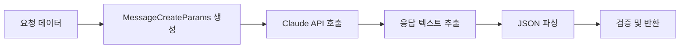

# 3.5 Anthropic AI 연동

## 🤖 Anthropic 서비스 개요

#### Claude AI 기반 콘텐츠 생성

시나리오와 게임 스크립트를 자동으로 생성하는 AI 통합 서비스

***

## 🏗️ AnthropicAiService 구조

### 주요 구성 요소

**🔧 서비스 아키텍처**

````java
public class AnthropicAiService implements AiService {
  private static final Pattern MARKDOWN_SCRIPT_PATTERN = Pattern.compile(
          "```(?:csharp|cs|c#)?\\s*\\n([\\s\\S]*?)```",
          Pattern.MULTILINE | Pattern.CASE_INSENSITIVE
  );

  private static final Pattern SCRIPT_NAME_PATTERN = Pattern.compile(
          "```(\\w+(?:\\.cs)?)\\s*\\n([\\s\\S]*?)```",
          Pattern.MULTILINE
  );

  private static final Pattern CLASS_NAME_PATTERN = Pattern.compile(
          "public\\s+(?:partial\\s+)?class\\s+(\\w+)\\s*[:{]",
          Pattern.MULTILINE
  );

  private final ApiKeyProvider apiKeyProvider;
  private final ConfigurationManager configManager;
  private volatile AnthropicClient client;

  // 주요 메서드
  public JsonObject generateScenario(String prompt, JsonObject requestData)

  public Map<String, String> generateUnifiedScripts(String prompt, JsonObject requestData)
}
````

**특징:**

* ✅ Claude ${anthropic.model.name} 모델 사용
* ✅ 싱글톤 클라이언트 패턴
* ✅ 마크다운 코드 블록 파싱
* ✅ 클래스 이름 자동 추출
* ✅ 자동 Base64 인코딩
* ✅ 강력한 에러 처리

***

## 🎯 시나리오 생성

### generateScenario() 메서드

**🎭 AI 시나리오 생성 프로세스**

**입력 파라미터:**

* `scenarioPrompt`: config.json의 시나리오 프롬프트
* `requestData`: 사용자 요청 데이터 (테마, 키워드, 난이도 등)

**처리 과정:**



**모델 설정:**

```json
{
"model": "${anthropic.model.name}",
"maxTokens": ${
anthropic.max.tokens
},
"temperature": ${anthropic.scenario.temperature}, // 창의적 생성
"system": "시나리오 생성 프롬프트"
}
```

**처리 시간:** ${scenario.generation.time.avg}

### JSON 응답 파싱

```java
private JsonObject parseJsonResponse(String textContent) {
    try {
        // 마크다운 코드 블록 안의 JSON 추출 시도
        String jsonContent = extractJsonFromMarkdown(textContent);
        if (jsonContent == null) {
            jsonContent = textContent;  // 전체 텍스트를 JSON으로 파싱
        }

        JsonObject result = JsonParser.parseString(jsonContent).getAsJsonObject();
        log.info("통합 시나리오 생성 완료");
        return result;
    } catch (JsonSyntaxException e) {
        log.error("시나리오 JSON 파싱 실패: {}", e.getMessage());
        terminateWithError("JSON 파싱 실패");
        return null;
    }
}
```

***

## 💻 스크립트 생성

### generateUnifiedScripts() 메서드

**📝 Unity C# 스크립트 자동 생성**

**특징:**

* 모든 오브젝트의 스크립트를 한 번에 생성
* Unity6 최신 API 활용
* 마크다운 형식으로 생성
* Base64 자동 인코딩

**모델 설정:**

```json
{
"temperature": ${
anthropic.script.temperature
},  // 정확한 코드 생성
"maxTokens": ${anthropic.max.tokens},
"system": "Unity6 스크립트 생성 프롬프트"
}
```

**처리 시간:** ${script.generation.time.avg}

***

## 🔄 마크다운 스크립트 파싱

### 고급 파싱 로직

**✂️ 스크립트 추출 프로세스**

**AI 응답 형식:**

```markdown
\`\`\`csharp
// GameManager.cs - 명시적 이름 없이
using UnityEngine;
public class GameManager : MonoBehaviour {
// 코드 내용
}
\`\`\`

\`\`\`PowerGenerator.cs
using UnityEngine;
public class PowerGenerator : MonoBehaviour {
// 코드 내용
}
\`\`\`
```

**파싱 전략:**

1. **이름이 명시된 코드 블록 우선 탐색**
   * 패턴: \`\`\`ScriptName.cs
   * C# 언어 표시자 스킵 (csharp, cs, c#)
2. **클래스 이름 자동 추출**
   * 패턴: `public [partial] class ClassName`
   * 중복 이름 처리 (\_1, \_2 등 추가)
3. **빈 스크립트 처리**
   * 빈 코드는 자동 스킵
   * 경고 로그 생성

### 파싱 구현 상세

```java
private Map<String, String> extractScriptsFromMarkdown(String content) {
    Map<String, String> encodedScripts = new HashMap<>();

    // 1. 이름이 명시된 코드 블록 처리
    Matcher namedMatcher = SCRIPT_NAME_PATTERN.matcher(content);
    while (namedMatcher.find()) {
        String scriptName = normalizeScriptName(namedMatcher.group(1).trim());
        String scriptCode = namedMatcher.group(2).trim();

        if (shouldSkipScript(scriptName)) {
            // C# 언어 표시자인 경우 클래스 이름 추출
            scriptName = extractClassNameFromCode(scriptCode);
            if (scriptName == null) {
                log.warn("클래스 이름을 추출할 수 없는 C# 코드 블록을 건너뜁니다.");
                continue;
            }
        }

        String uniqueName = ensureUniqueName(scriptName, encodedScripts);
        encodeAndStore(uniqueName, scriptCode, encodedScripts);
    }

    // 2. 이름 없는 C# 코드 블록 처리 (폴백)
    if (encodedScripts.isEmpty()) {
        log.debug("이름이 명시된 코드 블록을 찾지 못했습니다. 일반 C# 코드 블록을 검색합니다.");
        // MARKDOWN_SCRIPT_PATTERN으로 재검색
    }

    return encodedScripts;
}
```

***

## 🛡️ 에러 처리

### 치명적 오류 처리 전략

**⚠️ 시스템 종료 시나리오**

```java
private void terminateWithError(String message) {
  log.error("{} 서버를 종료합니다.", message);
  System.exit(1);
}

private void terminateWithError(String message, Exception e) {
  log.error("{} 서버를 종료합니다.", message, e);
  System.exit(1);
}
```

**종료 조건:**

* API 키 누락 또는 빈 값
* AI 응답 없음 또는 빈 응답
* JSON 파싱 실패
* 필수 모델 설정 누락
* Base64 인코딩 실패

**이유:** AI 서비스는 핵심 기능이므로 실패 시 서버 운영 불가

***

## 📊 성능 최적화

### 클라이언트 재사용

```java
private synchronized AnthropicClient getClient() {
    if (client == null) {
        initializeClient();
    }
    return client;
}

private void initializeClient() {
    String apiKey = apiKeyProvider.getAnthropicKey();
    validateApiKey(apiKey);

    client = AnthropicOkHttpClient.builder()
            .apiKey(apiKey)
            .build();

    log.info("AnthropicClient 초기화 완료");
}
```

### Temperature 전략

**🎨 시나리오 생성**

${anthropic.scenario.temperature}

높은 창의성과 다양성

* 독창적인 스토리
* 다양한 퍼즐 아이디어
* 흥미로운 설정

**💻 스크립트 생성**

${anthropic.script.temperature}

정확성과 일관성

* 문법 오류 최소화
* 일관된 코딩 스타일
* 예측 가능한 구조

***

## 🔍 검증 및 로깅

### 시나리오 검증

```java
private void validateResponse(String textContent, String contentType) {
    if (textContent == null || textContent.isEmpty()) {
        terminateWithError(contentType + " 생성 응답이 비어있습니다.");
    }
}
```

### GameManager 검증

```java
private void validateGameManagerExists(Map<String, String> scripts) {
    if (!scripts.containsKey(GAME_MANAGER_NAME)) {
        log.warn("GameManager 스크립트가 파싱되지 않았습니다");
        // 경고만 하고 계속 진행 (치명적이지 않음)
    }
}
```

### 로그 포맷

```java
// 시나리오 생성
log.info("통합 시나리오 생성 시작: theme={}",theme);
log.

info("LLM에 시나리오 생성 요청. ruid: '{}', Theme: '{}', Difficulty: '{}'",
     ruid, theme.trim(),difficulty);

// 스크립트 파싱
        log.

debug("총 {} 개의 스크립트를 추출했습니다.",encodedScripts.size());
        log.

debug("스크립트 파싱 완료: {} (원본: {}자, 인코딩: {}자)",
      scriptName, scriptCode.length(),encoded.

length());

// 경고
        log.

warn("중복된 스크립트 이름 발견, 변경: {} -> {}",scriptName, uniqueName);
log.

warn("클래스 이름을 추출할 수 없는 코드 블록을 발견했습니다.");
```

***

## 📈 API 사용 통계

### 예상 사용량

| 항목        | 시나리오 생성                         | 스크립트 생성                       | 총계                                                              |
| --------- | ------------------------------- | ----------------------------- | --------------------------------------------------------------- |
| **토큰 입력** | \~2,000                         | \~3,000                       | \~5,000                                                         |
| **토큰 출력** | \~1,500                         | \~8,000                       | \~9,500                                                         |
| **처리 시간** | ${scenario.generation.time.avg} | ${script.generation.time.min} | ${scenario.generation.time.max} + ${script.generation.time.min} |
| **비용/요청** | $0.01                           | $0.05                         | ${anthropic.cost.per.request}                                   |

***

## 🚀 최적화 가능성

**🔮 향후 개선 방향**

1. **프롬프트 캐싱**
   * 자주 사용되는 테마 캐싱
   * 프롬프트 최적화
2. **스트리밍 응답**
   * 실시간 생성 진행률
   * 부분 결과 미리보기
3. **다중 모델 지원**
   * Claude Opus 4 (고품질)
   * Claude Haiku (빠른 응답)
4. **백업 전략**
   * 다른 LLM 폴백
   * 로컬 템플릿 시스템
5. **스크립트 검증**
   * C# 문법 체크
   * Unity API 호환성 검증

***

Anthropic 서비스는 **창의성**과 **정확성**의 완벽한 조화를 제공합니다.
