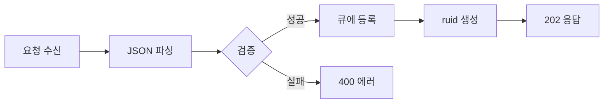
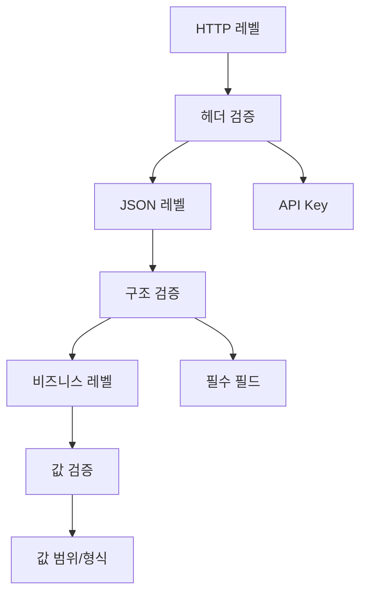

# 3.2 API 핸들러 구조

## 📡 API 핸들러 개요


### **요청/응답 처리의 중심**
모든 HTTP 요청을 처리하고 적절한 응답을 생성하는 핵심 컴포넌트


---

## 🏗️ ApiHandler 클래스 구조

### 주요 구성 요소

```java
public class ApiHandler {
    private final Gson gson;
    private final RoomRequestQueueManager queueManager;
    private final JobResultStore resultStore;
    
    public ApiHandler(Gson gson, RoomRequestQueueManager queueManager, JobResultStore resultStore) {
        // 의존성 주입
    }
}
```

### 의존성 관계


#### 🔗 **컴포넌트 의존성**


graph TD
    A[ApiHandler] --> B[Gson]
    A --> C[QueueManager]
    A --> D[JobResultStore]
    
    B --> E[JSON 직렬화]
    C --> F[요청 큐잉]
    D --> G[결과 조회]
    
    style A fill:#4a90e2
    style B fill:#f39c12
    style C fill:#2ecc71
    style D fill:#e74c3c
```


---

## 📋 핸들러 메서드 상세

### 1️⃣ **handleRoot() - 서버 상태**


#### **GET /**

**기능:** 서버 기본 상태 확인

**응답:**
```json
{
  "status": "online",
  "message": "Eroom 서버가 작동 중입니다"
}
```

**특징:**
- 가장 간단한 헬스체크
- 서버 동작 여부만 확인
- 응답 시간 < 10ms
  

### 2️⃣ **handleHealth() - 상세 헬스체크**


#### **GET /health**

**기능:** 서버 상태와 큐 통계 제공

**응답 구조:**
```json
{
  "status": "healthy",
  "queue": {
    "queued": 3,
    "active": 1,
    "completed": 150,
    "maxConcurrent": 1
  }
}
```

**활용:**
- 모니터링 시스템 연동
- 부하 상태 파악
- 자동 스케일링 트리거
  

### 3️⃣ **handleRoomCreate() - 룸 생성 요청**


#### **POST /room/create**

**처리 플로우:**



**주요 검증:**
- `uuid` 필수 확인
- JSON 형식 검증
- 요청 크기 제한

**비동기 처리:**
- 즉시 ruid 반환
- 백그라운드 처리 시작
- 클라이언트 폴링 유도
  

### 4️⃣ **handleRoomResult() - 결과 조회**


#### **GET /room/result?ruid={id}**

**상태별 응답 처리:**

| 상태 | HTTP 코드 | 응답 | 액션 |
|------|-----------|------|------|
| `QUEUED` | 200 | 상태만 반환 | 계속 폴링 |
| `PROCESSING` | 200 | 상태만 반환 | 계속 폴링 |
| `COMPLETED` | 200 | 전체 결과 반환 | 결과 삭제 |
| `FAILED` | 200 | 에러 정보 반환 | 결과 삭제 |
| 없음 | 404 | Not Found | 재시도 불가 |

**자동 정리:**
- 결과 조회 시 자동 삭제
- 메모리 효율적 관리
- 중복 조회 방지
  

---

## 🛠️ 유틸리티 메서드

### JSON 응답 처리

```java
private void sendJsonResponse(HttpServerExchange exchange, int statusCode, JsonObject body) {
    // HTTP 상태 코드 설정
    // Content-Type: application/json; charset=utf-8
    // Gson을 통한 JSON 직렬화
    // 응답 전송
}
```

### 에러 응답 생성

```java
private void sendErrorResponse(HttpServerExchange exchange, int statusCode, String errorMessage) {
    // 표준 에러 응답 형식
    {
        "success": false,
        "error": "구체적인 에러 메시지"
    }
}
```

---

## 📊 요청/응답 처리 패턴

### 비동기 요청 수신


#### 🔄 **Non-blocking 처리**

```java
exchange.getRequestReceiver().receiveFullString((httpExchange, message) -> {
    // 요청 본문 처리
    // JSON 파싱
    // 비즈니스 로직
}, (httpExchange, e) -> {
    // 에러 처리
});


**장점:**
- 스레드 블로킹 없음
- 높은 동시성 지원
- 메모리 효율적
  

---

## 🔒 입력 검증 전략

### 계층적 검증



### 검증 실패 처리

| 검증 단계 | 실패 시 응답 | HTTP 코드 |
|-----------|--------------|-----------|
| API Key | Unauthorized | 401 |
| JSON 파싱 | Bad Request | 400 |
| 필수 필드 | Bad Request | 400 |
| 값 형식 | Bad Request | 400 |
| 서버 오류 | Internal Error | 500 |

---

## 📈 성능 최적화

### 응답 시간 목표

#### ⚡ **GET 요청**
> **< 50ms**
>
> 조회 작업 응답 시간

#### ⚡ **POST 요청**
> **< 100ms**
>
> 생성 작업 응답 시간

#### ⚡ **에러 응답**
> **< 20ms**
>
> 에러 처리 응답 시간

---

## 🐛 에러 처리 철학


#### 💡 **핵심 원칙**

1. **구체적인 에러 메시지**: 문제 해결을 위한 충분한 정보 제공
2. **일관된 응답 형식**: 모든 에러가 동일한 구조
3. **적절한 HTTP 코드**: RESTful 규약 준수
4. **로깅과 분리**: 민감한 정보는 로그에만 기록
   

---

> 💡 ApiHandler는 **안정적**이고 **예측 가능한** API 서비스의 핵심입니다.