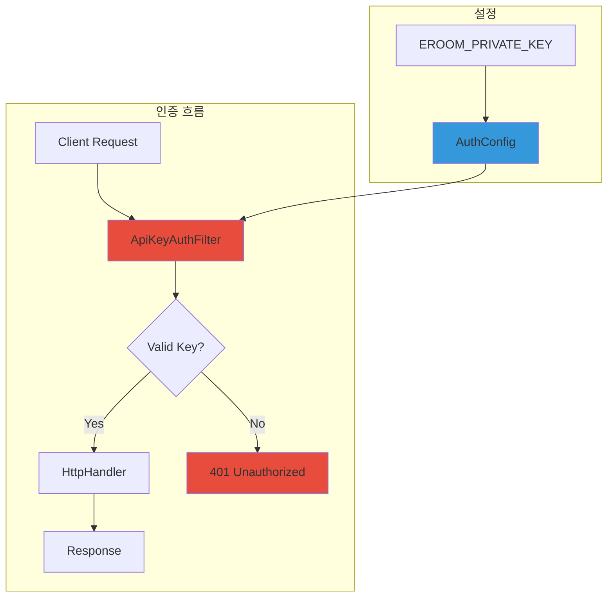
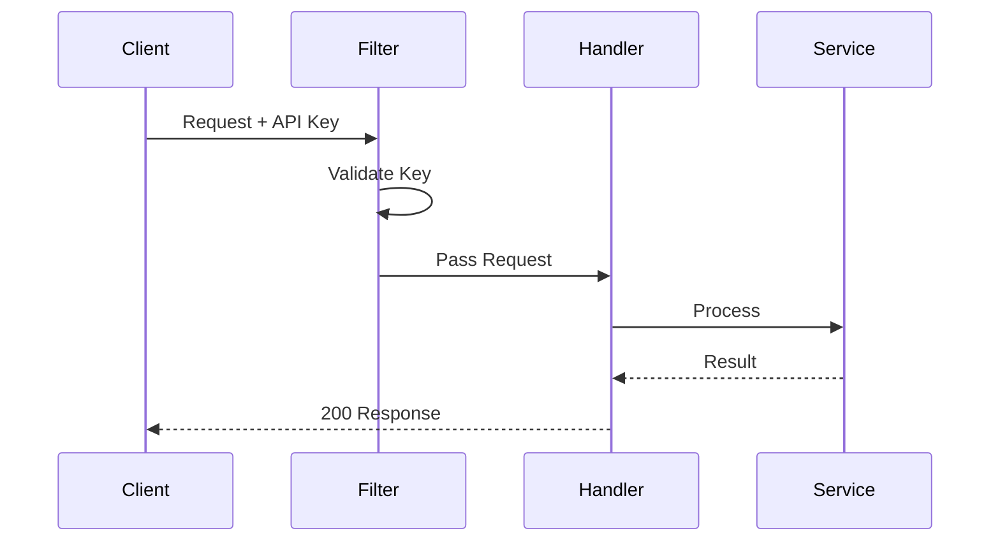
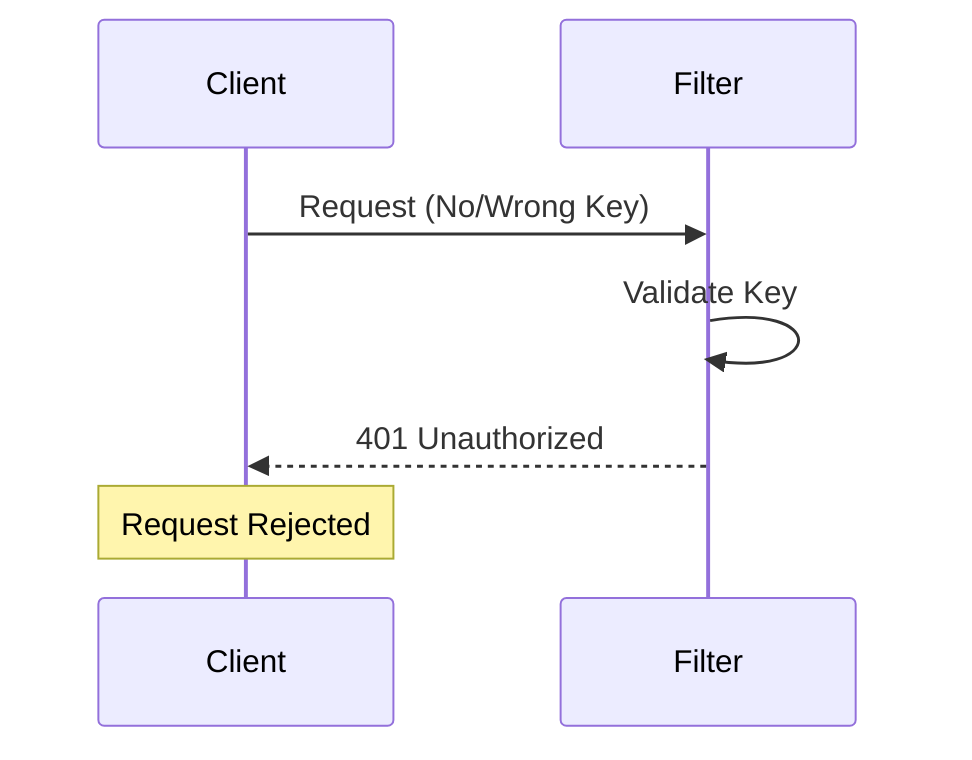

# 3.3 인증 시스템 (API Key)

## 🔐 API Key 인증 개요

<div style="background: linear-gradient(135deg, #f093fb 0%, #f5576c 100%); padding: 30px; border-radius: 15px; color: white; margin: 20px 0;">
  <h3 style="margin: 0;">단순하면서도 안전한 인증</h3>
  <p style="margin: 10px 0 0 0;">API Key 기반 인증으로 모든 요청을 보호하는 필터 시스템</p>
</div>

---

## 🏗️ 인증 시스템 구조

### 컴포넌트 관계도



---

## 📋 AuthConfig - 설정 관리

### API Key 초기화 로직

<div style="background: #e3f2fd; padding: 20px; border-radius: 10px; margin: 20px 0;">
  <h4 style="margin: 0 0 15px 0;">🔑 API Key 생성 전략</h4>
  
  ```java
  public class AuthConfig {
      private static final String EROOM_PRIVATE_KEY = System.getenv("EROOM_PRIVATE_KEY");
      private final String apiKey;
      
      public AuthConfig() {
          if (EROOM_PRIVATE_KEY == null || EROOM_PRIVATE_KEY.trim().isEmpty()) {
              // 환경 변수 없음 → 랜덤 UUID 생성
              apiKey = UUID.randomUUID().toString();
              log.warn("랜덤 키 생성: {}", apiKey);
          } else {
              // 환경 변수 사용
              apiKey = EROOM_PRIVATE_KEY;
              log.info("환경 변수 키 사용");
          }
      }
  }
  ```
  
  **특징:**
  - ✅ 환경 변수 우선
  - ✅ 미설정 시 자동 생성
  - ✅ 명확한 로깅
  - ⚠️ 재시작 시 키 변경 주의
</div>

---

## 🛡️ ApiKeyAuthFilter - 인증 필터

### 필터 구현 상세

<div style="background: #e8f5e9; padding: 20px; border-radius: 10px; margin: 20px 0;">
  <h4 style="margin: 0 0 15px 0;">🔍 요청 검증 프로세스</h4>
  
  ```java
  public class ApiKeyAuthFilter implements HttpHandler {
      private static final String AUTH_HEADER = "Authorization";
      private final String validApiKey;
      private final HttpHandler next;
      
      @Override
      public void handleRequest(HttpServerExchange exchange) {
          // 1. Authorization 헤더 확인
          // 2. API Key 검증
          // 3. 성공 시 다음 핸들러로
          // 4. 실패 시 401 응답
      }
  }
  ```
  
  **검증 단계:**
  1. 헤더 존재 확인
  2. 헤더 값 비어있지 않음
  3. 저장된 키와 정확히 일치
  4. 대소문자 구분
</div>

### 인증 실패 응답

```json
// 헤더 누락
{
  "error": "인증이 필요합니다"
}

// 잘못된 API Key
{
  "error": "인증 실패"
}
```

---

## 🔄 인증 플로우 상세

### 성공적인 인증



### 인증 실패



---

## 💡 보안 고려사항

### API Key 관리 모범 사례

<div style="background: #fff3cd; padding: 20px; border-radius: 10px; margin: 20px 0;">
  <h4 style="margin: 0 0 15px 0;">🛡️ 보안 권장사항</h4>
  
  | 항목 | 권장사항 | 이유 |
  |------|----------|------|
  | **키 생성** | 강력한 랜덤 값 사용 | 예측 불가능성 |
  | **키 저장** | 환경 변수 사용 | 코드 분리 |
  | **키 전송** | HTTPS 필수 (프로덕션) | 중간자 공격 방지 |
  | **키 로테이션** | 주기적 변경 | 장기 노출 위험 감소 |
  | **키 로깅** | 부분만 표시 | 로그 유출 대비 |
</div>

---

## 📊 인증 성능

### 성능 특성

<div style="display: grid; grid-template-columns: repeat(3, 1fr); gap: 20px; margin: 20px 0;">
  <div style="background: #e3f2fd; padding: 20px; border-radius: 10px; text-align: center;">
    <h4>검증 시간</h4>
    <div style="font-size: 2em; font-weight: bold; color: #1976d2;">< 1ms</div>
    <p>문자열 비교만 수행</p>
  </div>
  <div style="background: #e8f5e9; padding: 20px; border-radius: 10px; text-align: center;">
    <h4>메모리 사용</h4>
    <div style="font-size: 2em; font-weight: bold; color: #388e3c;">~0 MB</div>
    <p>추가 메모리 없음</p>
  </div>
  <div style="background: #f3e5f5; padding: 20px; border-radius: 10px; text-align: center;">
    <h4>CPU 오버헤드</h4>
    <div style="font-size: 2em; font-weight: bold; color: #7b1fa2;">< 0.1%</div>
    <p>거의 없음</p>
  </div>
</div>

---

## 🔧 구현 세부사항

### 필터 체인 구성

```java
// UndertowServer.java에서
HttpHandler apiKeyProtectedHandler = 
    new ApiKeyAuthFilter(routingHandler, authConfig.getApiKey());

server = Undertow.builder()
    .addHttpListener(port, "0.0.0.0")
    .setHandler(apiKeyProtectedHandler)  // 모든 요청이 필터 통과
    .build();
```

### 로깅 전략

<div style="background: #f0f0f0; padding: 20px; border-radius: 10px; margin: 20px 0;">
  <h4 style="margin: 0 0 15px 0;">📝 로그 레벨별 기록</h4>
  
  ```java
  // INFO: 정상 동작
  log.info("ApiKeyAuthFilter가 초기화되었습니다");
  
  // WARN: 인증 실패 (보안 이벤트)
  log.warn("잘못된 API 키가 제공되었습니다: {}", exchange.getRequestPath());
  
  // 키 값은 로그에 기록하지 않음 (보안)
  ```
</div>

---

## 🚀 확장 가능성

### 향후 개선 방향

<div style="background: #e8f5e9; padding: 20px; border-radius: 10px; margin: 20px 0;">
  <h4 style="margin: 0 0 15px 0;">🔮 가능한 확장</h4>
  
  1. **다중 API Key 지원**
     - 클라이언트별 다른 키
     - 권한 레벨 구분
  
  2. **JWT 토큰 방식**
     - 상태 없는(Stateless) 인증
     - 토큰 만료 시간
  
  3. **Rate Limiting**
     - API Key별 요청 제한
     - DDoS 방어
  
  4. **OAuth 2.0**
     - 표준 프로토콜
     - 제3자 인증
</div>

---

## 🐛 문제 해결

### 일반적인 인증 문제

| 문제 | 원인 | 해결 방법 |
|------|------|-----------|
| 401 계속 발생 | 잘못된 키 | 서버 로그에서 생성된 키 확인 |
| 헤더 누락 오류 | 클라이언트 설정 | Authorization 헤더 추가 |
| 재시작 후 인증 실패 | 키 변경됨 | EROOM_PRIVATE_KEY 환경변수 설정 |

---

<div style="text-align: center; margin-top: 30px; color: #666;">
  <p>API Key 인증은 <strong>단순함</strong>과 <strong>효과성</strong>의 완벽한 균형입니다.</p>
</div>