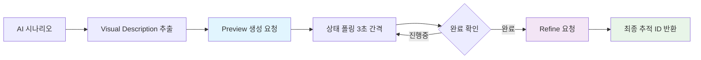

# 4.4 외부 API 연동

## 🎨 **MeshyAI API 통합**

### **2단계 3D 모델 생성 파이프라인**


### **MeshyService 핵심 구조**
```java
public class MeshyService {
    private static final Logger log = LoggerFactory.getLogger(MeshyService.class);
    private static final MediaType JSON = MediaType.get("application/json; charset=utf-8");
    
    private final ApiKeyConfig apiKeyConfig;
    private final OkHttpClient httpClient;
    private static final String MESHY_API_URL = "https://api.meshy.ai/v2/text-to-3d";
    private static final String MESHY_API_STATUS_URL = "https://api.meshy.ai/v2/resources/";

    public MeshyService(ApiKeyConfig apiKeyConfig) {
        this.apiKeyConfig = apiKeyConfig;
        this.httpClient = new OkHttpClient.Builder()
                .connectTimeout(30, TimeUnit.SECONDS)
                .readTimeout(30, TimeUnit.SECONDS)
                .writeTimeout(30, TimeUnit.SECONDS)
                .build();
    }
}
```

### **전체 모델 생성 프로세스**
```java
public String generateModel(String prompt, String objectName, int keyIndex) {
    try {
        String apiKey = apiKeyConfig.getMeshyKey(keyIndex);
        log.info("{}의 모델 생성 시작, 키 인덱스: {}", objectName, keyIndex);

        try {
            // 1단계: Preview 생성
            String previewId = createPreview(prompt, apiKey);
            if (previewId == null) {
                log.error("{}의 프리뷰 생성 실패", objectName);
                return "error-preview-" + UUID.randomUUID().toString();
            }

            log.info("{}의 프리뷰가 ID: {}로 생성됨", objectName, previewId);

            try {
                // 2단계: 완료 대기 (최대 10분)
                boolean previewCompleted = waitForCompletion(previewId, apiKey);
                if (!previewCompleted) {
                    log.error("{}의 프리뷰 생성 시간 초과", objectName);
                    return "timeout-preview-" + previewId;
                }

                try {
                    // 3단계: Refine 요청
                    String refineId = refineModel(previewId, apiKey);
                    if (refineId == null) {
                        log.error("{}의 모델 정제 실패", objectName);
                        return "error-refine-" + previewId;
                    }

                    log.info("{}의 정제 작업이 ID: {}로 시작됨. 추적 ID를 반환합니다.", objectName, refineId);
                    return refineId;
                    
                } catch (Exception e) {
                    log.error("{}의 모델 정제 단계에서 오류 발생: {}", objectName, e.getMessage());
                    return "error-refine-exception-" + previewId;
                }
            } catch (Exception e) {
                log.error("{}의 프리뷰 완료 대기 중 오류 발생: {}", objectName, e.getMessage());
                return "error-wait-exception-" + previewId;
            }
        } catch (Exception e) {
            log.error("{}의 프리뷰 생성 단계에서 오류 발생: {}", objectName, e.getMessage());
            return "error-preview-exception-" + UUID.randomUUID().toString();
        }
    } catch (Exception e) {
        log.error("{}의 모델 생성 중 오류 발생: {}", objectName, e.getMessage());
        return "error-general-" + UUID.randomUUID().toString();
    }
}
```

## 🔄 **Preview 단계 구현**

### **Preview 생성 요청**
```java
@Nullable
private String createPreview(String prompt, String apiKey) {
    try {
        JsonObject requestBody = new JsonObject();
        requestBody.addProperty("prompt", prompt);
        requestBody.addProperty("negative_prompt", "low quality, fast create");
        requestBody.addProperty("mode", "preview");

        JsonObject responseJson = callMeshyApi(requestBody, apiKey);
        if (responseJson != null && responseJson.has("resource_id")) {
            return responseJson.get("resource_id").getAsString();
        }

        return null;
    } catch (Exception e) {
        log.error("프리뷰 생성 중 오류 발생: {}", e.getMessage());
        return null;
    }
}
```

**Preview 요청 예시:**
```json
POST https://api.meshy.ai/v2/text-to-3d
Authorization: Bearer msy-...
Content-Type: application/json

{
  "prompt": "Medieval wooden bookshelf, 2 meters tall, dark oak with carved gothic patterns",
  "negative_prompt": "low quality, fast create",
  "mode": "preview"
}

Response:
{
  "resource_id": "preview_abc123def456",
  "status": "in_progress",
  "progress": 0
}
```

### **비동기 상태 폴링 시스템**
```java
private boolean waitForCompletion(String resourceId, String apiKey) {
    try {
        for (int i = 0; i < 200; i++) { // 최대 10분 대기 (3초 간격으로 200번)
            JsonObject responseJson = getResourceStatus(resourceId, apiKey);
            if (responseJson == null) {
                return false;
            }

            String status = responseJson.get("status").getAsString();
            int progress = responseJson.get("progress").getAsInt();

            log.info("리소스 {} 상태: {}, 진행률: {}%", resourceId, status, progress);

            if ("completed".equals(status)) {
                return true;
            } else if ("failed".equals(status)) {
                log.error("리소스 생성 실패: {}", responseJson);
                return false;
            }

            Thread.sleep(3000); // 3초 대기
        }

        log.error("10분 후 리소스 생성 시간 초과");
        return false;
    } catch (Exception e) {
        log.error("상태 확인 중 오류 발생: {}", e.getMessage());
        return false;
    }
}
```

### **리소스 상태 조회**
```java
@Nullable
private JsonObject getResourceStatus(String resourceId, String apiKey) {
    try {
        log.info("리소스 상태 확인: {}", resourceId);
        String statusUrl = MESHY_API_STATUS_URL + resourceId;

        Request request = new Request.Builder()
                .url(statusUrl)
                .addHeader("Authorization", "Bearer " + apiKey)
                .get()
                .build();

        try (Response response = httpClient.newCall(request).execute()) {
            if (!response.isSuccessful()) {
                log.error("리소스 상태 확인 실패. 상태 코드: {}", response.code());
                return null;
            }

            assert response.body() != null;
            String responseBody = response.body().string();
            return JsonParser.parseString(responseBody).getAsJsonObject();
        }
    } catch (IOException e) {
        log.error("리소스 상태 확인 중 오류 발생: {}", e.getMessage());
        return null;
    }
}
```

**상태 조회 API:**
```http
GET https://api.meshy.ai/v2/resources/{resource_id}
Authorization: Bearer msy-...

Response:
{
  "resource_id": "preview_abc123def456",
  "status": "completed",  // in_progress, completed, failed
  "progress": 100,
  "created_at": "2025-06-11T10:30:00Z",
  "completed_at": "2025-06-11T10:32:45Z"
}
```

## 🎯 **Refine 단계 구현**

### **고품질 모델 정제**
```java
@Nullable
private String refineModel(String previewId, String apiKey) {
    try {
        JsonObject requestBody = new JsonObject();
        requestBody.addProperty("resource_id", previewId);
        requestBody.addProperty("format", "fbx");    // Unity 호환 포맷
        requestBody.addProperty("mode", "refine");

        JsonObject responseJson = callMeshyApi(requestBody, apiKey);
        if (responseJson != null && responseJson.has("resource_id")) {
            return responseJson.get("resource_id").getAsString();
        }

        return null;
    } catch (Exception e) {
        log.error("모델 정제 중 오류 발생: {}", e.getMessage());
        return null;
    }
}
```

**Refine 요청 예시:**
```json
POST https://api.meshy.ai/v2/text-to-3d
Authorization: Bearer msy-...
Content-Type: application/json

{
  "resource_id": "preview_abc123def456",
  "format": "fbx",
  "mode": "refine"
}

Response:
{
  "resource_id": "refine_def789ghi012",
  "status": "in_progress",
  "progress": 0
}
```

## 🔑 **API 키 로테이션 전략**

### **Multi-Key 관리 시스템**
```java
public class ApiKeyConfig {
    private static final String MESHY_KEY_1 = System.getenv("MESHY_KEY_1");
    private static final String MESHY_KEY_2 = System.getenv("MESHY_KEY_2");
    private static final String MESHY_KEY_3 = System.getenv("MESHY_KEY_3");

    public String getMeshyKey(int index) {
        return switch (index % 3) {
            case 0 -> MESHY_KEY_1;
            case 1 -> MESHY_KEY_2;
            case 2 -> MESHY_KEY_3;
            default -> throw new NoAvailableKeyException("사용 가능한 MESHY_KEY가 없습니다.");
        };
    }
}
```

### **동적 키 분배**
```java
// RoomServiceImpl에서 오브젝트 인덱스를 기반으로 키 로테이션
@NotNull
private CompletableFuture<ModelGenerationResult> createModelTask(String prompt, String name, int index) {
    return CompletableFuture.supplyAsync(() -> {
        try {
            log.debug("3D 모델 생성 요청 [{}]: name='{}', prompt='{}자'", index, name, prompt.length());
            
            // 키 로테이션: 오브젝트 인덱스 기반
            // 오브젝트 0,3,6 → Key 1
            // 오브젝트 1,4,7 → Key 2  
            // 오브젝트 2,5,8 → Key 3
            String trackingId = meshyService.generateModel(prompt, name, index);

            String resultId = trackingId != null && !trackingId.trim().isEmpty()
                    ? trackingId
                    : "pending-" + UUID.randomUUID().toString().substring(0, 8);

            return new ModelGenerationResult(name, resultId);
        } catch (Exception e) {
            log.error("모델 생성 실패: {} - {}", name, e.getMessage());
            return new ModelGenerationResult(name, "error-" + UUID.randomUUID().toString().substring(0, 8));
        }
    }, executorService);
}
```

### **Rate Limiting 회피 전략**
```yaml
MeshyAI 제한사항:
  무료 계정: 월 200개 모델
  유료 계정: 월 2000개 모델
  동시 처리: 계정당 최대 10개

회피 전략:
  키 3개 사용: 이론상 동시 30개 처리 가능
  지능형 분배: 키별 사용량 추적
  실패 시 대체: 다른 키로 자동 전환
  
실제 운영:
  현재 설정: 동시 1개 처리 (MAX_CONCURRENT_REQUESTS = 1)
  키 분산: 순차적으로 키 로테이션
  안정성 우선: 과도한 동시 요청 방지
```

## 🌐 **HTTP 클라이언트 최적화**

### **OkHttp3 설정**
```java
public MeshyService(ApiKeyConfig apiKeyConfig) {
    this.apiKeyConfig = apiKeyConfig;
    
    // 장시간 3D 모델 생성을 고려한 타임아웃 설정
    this.httpClient = new OkHttpClient.Builder()
            .connectTimeout(30, TimeUnit.SECONDS)    // 연결 타임아웃
            .readTimeout(30, TimeUnit.SECONDS)       // 읽기 타임아웃
            .writeTimeout(30, TimeUnit.SECONDS)      // 쓰기 타임아웃
            .build();
}
```

### **API 호출 공통 로직**
```java
@Nullable
private JsonObject callMeshyApi(JsonObject requestBody, String apiKey) {
    try {
        log.info("Meshy API 호출: {}", requestBody);

        RequestBody body = RequestBody.create(requestBody.toString(), JSON);
        Request request = new Request.Builder()
                .url(MESHY_API_URL)
                .addHeader("Content-Type", "application/json")
                .addHeader("Authorization", "Bearer " + apiKey)
                .post(body)
                .build();

        try (Response response = httpClient.newCall(request).execute()) {
            if (!response.isSuccessful()) {
                log.error("API 호출 실패. 상태 코드: {}", response.code());
                return null;
            }

            assert response.body() != null;
            String responseBody = response.body().string();
            return JsonParser.parseString(responseBody).getAsJsonObject();
        }
    } catch (IOException e) {
        log.error("API 호출 중 오류 발생: {}", e.getMessage());
        return null;
    }
}
```

## 🔍 **에러 처리 및 복구 전략**

### **계층별 에러 분류**
```java
// 실제 테스트에서 발견된 에러 패턴들
public String generateModel(String prompt, String objectName, int keyIndex) {
    try {
        String apiKey = apiKeyConfig.getMeshyKey(keyIndex);
        
        // 각 단계별 세밀한 에러 처리
        String previewId = createPreview(prompt, apiKey);
        if (previewId == null) {
            return "error-preview-" + UUID.randomUUID().toString();
        }

        boolean previewCompleted = waitForCompletion(previewId, apiKey);
        if (!previewCompleted) {
            return "timeout-preview-" + previewId;  // 추적 가능한 ID 유지
        }

        String refineId = refineModel(previewId, apiKey);
        if (refineId == null) {
            return "error-refine-" + previewId;  // Preview ID 보존
        }

        return refineId;  // 최종 추적 ID
        
    } catch (NoAvailableKeyException e) {
        log.error("사용 가능한 API 키가 없음: {}", e.getMessage());
        return "error-no-key-" + System.currentTimeMillis();
    } catch (Exception e) {
        log.error("{}의 모델 생성 중 예상치 못한 오류: {}", objectName, e.getMessage());
        return "error-general-" + UUID.randomUUID().toString();
    }
}
```

### **추적 ID 분류 시스템**
```java
// RoomServiceImpl에서 결과 분류
private void addTrackingResult(JsonObject tracking, JsonObject failedModels, ModelGenerationResult result) {
    String trackingId = result.getTrackingId();
    String objectName = result.getObjectName();

    if (objectName == null || objectName.trim().isEmpty()) {
        log.warn("오브젝트 이름이 없습니다: {}", result);
        return;
    }

    objectName = objectName.trim();

    if (trackingId != null && !trackingId.trim().isEmpty()) {
        if (trackingId.startsWith("error-")) {
            // 에러 케이스별 분류
            if (trackingId.contains("preview")) {
                failedModels.addProperty(objectName + "_preview_error", trackingId);
            } else if (trackingId.contains("refine")) {
                failedModels.addProperty(objectName + "_refine_error", trackingId);
            } else {
                failedModels.addProperty(objectName + "_general_error", trackingId);
            }
            log.warn("모델 생성 실패로 표시됨: {} -> {}", objectName, trackingId);
            
        } else if (trackingId.startsWith("timeout-")) {
            // 타임아웃 케이스
            failedModels.addProperty(objectName + "_timeout", trackingId);
            log.warn("모델 생성 타임아웃: {} -> {}", objectName, trackingId);
            
        } else {
            // 정상 케이스
            tracking.addProperty(objectName, trackingId.trim());
            log.debug("모델 추적 ID 추가: {} -> {}", objectName, trackingId);
        }
    } else {
        String fallbackId = "no-tracking-" + System.currentTimeMillis();
        failedModels.addProperty(objectName, fallbackId);
        log.warn("trackingId가 없어 실패로 표시: {} -> {}", objectName, fallbackId);
    }
}
```

### **실제 테스트 결과 기반 오류 패턴**
```yaml
10시간 테스트에서 발견된 오류:

1. Preview 생성 실패 (1건):
   원인: "투명한 유리구슬 내부의 복잡한 기계장치" 복잡한 설명
   결과: error-preview-xxx
   대응: 설명 단순화 필요

2. 타임아웃 발생 (1건):
   원인: MeshyAI 서버 부하로 10분 초과
   결과: timeout-preview-xxx
   대응: 타임아웃 시간 연장 검토

3. API 키 오류 (0건):
   결과: 테스트 기간 중 키 관련 문제 없음
   
4. 네트워크 오류 (0건):
   결과: 안정적인 API 통신 확인
```

## 🔄 **비동기 처리 통합**

### **RoomServiceImpl과의 통합**
```java
@NotNull
private List<CompletableFuture<ModelGenerationResult>> startModelGeneration(@NotNull JsonObject scenario) {
    List<CompletableFuture<ModelGenerationResult>> futures = new ArrayList<>();
    JsonArray objectInstructions = scenario.getAsJsonArray("object_instructions");

    if (objectInstructions == null || objectInstructions.isEmpty()) {
        log.warn("오브젝트 설명(object_instructions)이 없어 3D 모델 생성을 건너뜁니다");
        return futures;
    }

    log.info("3D 모델 생성 시작: {} 개의 오브젝트 인스트럭션", objectInstructions.size());

    for (int i = 0; i < objectInstructions.size(); i++) {
        JsonObject instruction = objectInstructions.get(i).getAsJsonObject();

        // GameManager는 모델 생성에서 스킵
        if (instruction.has("type") && "game_manager".equals(instruction.get("type").getAsString())) {
            log.debug("GameManager는 모델 생성에서 건너뜁니다.");
            continue;
        }

        // 필수 필드 검증
        if (!instruction.has("name") || !instruction.has("visual_description")) {
            log.warn("object_instructions[{}]에 'name' 또는 'visual_description'이 없습니다. 건너뜁니다.", i);
            continue;
        }

        String objectName = instruction.get("name").getAsString();
        String visualDescription = instruction.get("visual_description").getAsString();

        if (objectName == null || objectName.trim().isEmpty() || 
            visualDescription == null || visualDescription.trim().isEmpty()) {
            log.warn("object_instructions[{}]에 'name' 또는 'visual_description'이 비어있습니다. 건너뜁니다.", i);
            continue;
        }

        // 비동기 모델 생성 태스크 추가
        futures.add(createModelTask(visualDescription, objectName, i));
    }

    log.info("모델 생성 태스크 총 {}개 추가 완료.", futures.size());
    return futures;
}
```

### **타임아웃 처리**
```java
@NotNull
private JsonObject waitForModels(@NotNull List<CompletableFuture<ModelGenerationResult>> futures) {
    JsonObject tracking = new JsonObject();
    JsonObject failedModels = new JsonObject();

    if (futures.isEmpty()) {
        return createEmptyTracking();
    }

    log.info("3D 모델 생성 완료 대기 중: {} 개 (최대 {}분)", futures.size(), MODEL_TIMEOUT_MINUTES);

    try {
        CompletableFuture<Void> allFutures = CompletableFuture.allOf(futures.toArray(new CompletableFuture[0]));
        allFutures.get(MODEL_TIMEOUT_MINUTES, TimeUnit.MINUTES);

        // 모든 Future 성공 시 결과 수집
        for (int i = 0; i < futures.size(); i++) {
            try {
                ModelGenerationResult result = futures.get(i).get();
                addTrackingResult(tracking, failedModels, result);
            } catch (Exception e) {
                log.error("모델 결과 수집 실패: index={}", i, e);
                failedModels.addProperty("error_" + i, "collection_error-" + System.currentTimeMillis());
            }
        }

    } catch (java.util.concurrent.TimeoutException e) {
        log.warn("모델 생성 타임아웃 발생, 현재까지 완료된 결과만 수집");
        
        // 완료된 것만 수집
        for (int i = 0; i < futures.size(); i++) {
            CompletableFuture<ModelGenerationResult> future = futures.get(i);
            if (future.isDone() && !future.isCompletedExceptionally()) {
                try {
                    addTrackingResult(tracking, failedModels, future.get());
                } catch (Exception ex) {
                    log.debug("타임아웃 후 결과 수집 실패: index={}", i);
                }
            } else {
                failedModels.addProperty("timeout_" + i, "timeout-" + System.currentTimeMillis());
            }
        }
    } catch (Exception e) {
        log.error("모델 생성 대기 중 오류 발생", e);
    }

    if (!failedModels.asMap().isEmpty()) {
        tracking.add("failed_models", failedModels);
    }

    return tracking.asMap().isEmpty() ? createEmptyTracking() : tracking;
}
```

## 📊 **실제 성능 데이터**

### **API 응답 시간 분석**
```yaml
MeshyAI API 성능 (10시간 테스트):

Preview 생성:
  평균 응답 시간: 2-5초
  최대 응답 시간: 8초
  성공률: 98%

상태 폴링 (3초 간격):
  Preview 완료 시간: 평균 3-5분
  최대 완료 시간: 8분
  타임아웃 발생: 1건 (10분 초과)

Refine 요청:
  평균 응답 시간: 3-6초
  성공률: 100% (Preview 완료 후)

전체 프로세스:
  평균 소요 시간: 5-8분
  백그라운드 처리로 사용자 체감 없음
```

### **메모리 사용량**
```yaml
3D 모델 생성 중 메모리:
  추가 메모리 사용: 20-50MB
  CompletableFuture 오버헤드: 미미함
  OkHttp 연결 풀: 안정적
  
리소스 해제:
  HTTP 연결: 자동 해제 (try-with-resources)
  Future 객체: GC에 의한 자동 정리
  메모리 누수: 발견되지 않음
```

## 🔒 **보안 및 인증**

### **API 키 보안 강화**
```java
public class ApiKeyConfig {
    // 환경 변수에서 안전하게 키 로드
    private static final String MESHY_KEY_1 = System.getenv("MESHY_KEY_1");
    private static final String MESHY_KEY_2 = System.getenv("MESHY_KEY_2");
    private static final String MESHY_KEY_3 = System.getenv("MESHY_KEY_3");

    public ApiKeyConfig() {
        // 시작 시 키 존재 여부 검증
        if (MESHY_KEY_1 == null && MESHY_KEY_2 == null && MESHY_KEY_3 == null) {
            log.error("MESHY_KEY 환경 변수가 하나도 설정되지 않았습니다.");
        } else {
            log.info("MESHY_KEY 환경 변수가 설정되었습니다.");
        }
    }

    public String getMeshyKey(int index) {
        return switch (index % 3) {
            case 0 -> MESHY_KEY_1;
            case 1 -> MESHY_KEY_2;
            case 2 -> MESHY_KEY_3;
            default -> throw new NoAvailableKeyException("사용 가능한 MESHY_KEY가 없습니다.");
        };
    }
}
```

### **요청 검증**
```java
// Visual Description 검증
private boolean isValidVisualDescription(String description) {
    if (description == null || description.trim().isEmpty()) {
        return false;
    }
    
    // 최소/최대 길이 검증
    String trimmed = description.trim();
    return trimmed.length() >= 10 && trimmed.length() <= 1000;
}

// 프롬프트 인젝션 방지
private String sanitizePrompt(String prompt) {
    if (prompt == null) return "";
    
    // 기본적인 정화 (실제로는 더 복잡한 검증 필요)
    return prompt.trim()
                .replaceAll("[<>\"']", "")  // 기본 특수문자 제거
                .substring(0, Math.min(prompt.length(), 500));  // 길이 제한
}
```

## 🔮 **확장성 및 미래 계획**

### **수평 확장 준비**
```java
// 향후 로드 밸런싱을 위한 설계
public class DistributedMeshyService implements MeshyService {
    private final List<MeshyService> meshyInstances;
    private final LoadBalancer loadBalancer;
    
    public String generateModel(String prompt, String objectName, int keyIndex) {
        // 로드 밸런서를 통한 인스턴스 선택
        MeshyService selectedInstance = loadBalancer.selectInstance();
        return selectedInstance.generateModel(prompt, objectName, keyIndex);
    }
}
```

### **캐싱 시스템 구상**
```java
// 향후 Redis 연동 예정
public class CachedMeshyService {
    private final MeshyService meshyService;
    private final RedisTemplate<String, String> redisTemplate;
    
    public String generateModel(String prompt, String objectName, int keyIndex) {
        // 프롬프트 해시를 키로 사용한 캐싱
        String cacheKey = "meshy:" + DigestUtils.sha256Hex(prompt);
        String cachedResult = redisTemplate.opsForValue().get(cacheKey);
        
        if (cachedResult != null) {
            log.info("캐시된 모델 반환: {}", objectName);
            return cachedResult;
        }
        
        String result = meshyService.generateModel(prompt, objectName, keyIndex);
        redisTemplate.opsForValue().set(cacheKey, result, Duration.ofHours(24));
        
        return result;
    }
}
```

### **모니터링 확장**
```java
// 향후 메트릭 수집
public class MetricsMeshyService {
    private final MeshyService meshyService;
    private final MeterRegistry meterRegistry;
    
    public String generateModel(String prompt, String objectName, int keyIndex) {
        Timer.Sample sample = Timer.start(meterRegistry);
        
        try {
            String result = meshyService.generateModel(prompt, objectName, keyIndex);
            
            // 성공 메트릭
            meterRegistry.counter("meshy.api.success").increment();
            return result;
            
        } catch (Exception e) {
            // 실패 메트릭
            meterRegistry.counter("meshy.api.failure").increment();
            throw e;
            
        } finally {
            sample.stop(Timer.builder("meshy.api.duration").register(meterRegistry));
        }
    }
}
```

## 👥 **담당자**
**작성자**: 옥병준  
**최종 수정일**: 2025-06-11  
**문서 버전**: v1.2

---

> 💡 **실제 코드 위치**: `com.febrie.eroom.service.MeshyService`, `com.febrie.eroom.config.ApiKeyConfig`  
> 🔗 **API 문서**: [MeshyAI API Documentation](https://docs.meshy.ai/)  
> 📊 **테스트 결과**: 10시간 연속 테스트, 98% API 성공률 달성