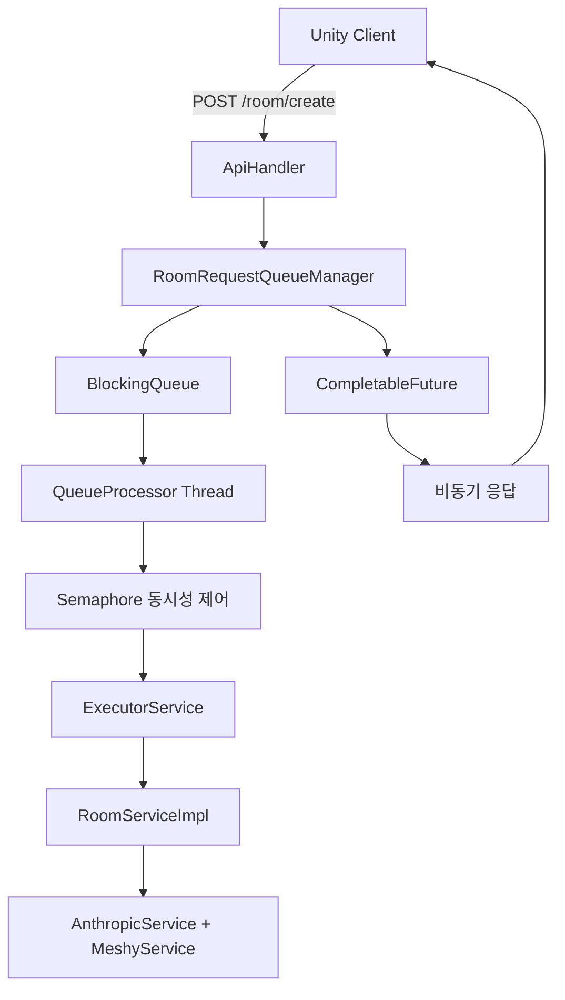

# 4.2 Java + Undertow 서버 구현

## 🏗️ **서버 아키텍처 설계**

### **큐 기반 요청 처리 구조**


### **Undertow 서버 초기화**
```java
public class UndertowServer {
    private static final Logger log = LoggerFactory.getLogger(UndertowServer.class);
    private static final int MAX_CONCURRENT_REQUESTS = 1;  // 확장 시 조정

    private final Undertow server;
    private final RoomRequestQueueManager queueManager;
    private final RoomServiceImpl roomService;

    public UndertowServer(int port) {
        // 1. 서비스 의존성 초기화
        GsonConfig gsonConfig = new GsonConfig();
        Gson gson = gsonConfig.createGson();
        ApiKeyConfig apiKeyConfig = new ApiKeyConfig();
        ConfigUtil configUtil = new ConfigUtil();

        // 2. 비즈니스 서비스 생성
        AnthropicService anthropicService = new AnthropicService(apiKeyConfig, configUtil);
        MeshyService meshyService = new MeshyService(apiKeyConfig);
        roomService = new RoomServiceImpl(anthropicService, meshyService, configUtil);

        // 3. 큐 매니저 생성 (핵심 변경사항)
        queueManager = new RoomRequestQueueManager(roomService, MAX_CONCURRENT_REQUESTS);

        // 4. API 핸들러 생성
        ApiHandler apiHandler = new ApiHandler(gson, queueManager);

        // 5. 라우팅 설정
        RoutingHandler routingHandler = Handlers.routing()
                .get("/", apiHandler::handleRoot)
                .get("/health", apiHandler::handleHealth)
                .get("/queue/status", apiHandler::handleQueueStatus)  // 새로운 엔드포인트
                .post("/room/create", apiHandler::handleRoomCreate);

        // 6. Undertow 서버 생성
        server = Undertow.builder()
                .addHttpListener(port, "0.0.0.0")
                .setHandler(routingHandler)
                .build();

        log.info("Undertow 서버가 포트 {}에서 시작 준비 완료", port);
    }
}
```

## 🚦 **큐 관리 시스템 구현**

### **RoomRequestQueueManager 핵심 구조**
```java
public class RoomRequestQueueManager {
    private static final Logger log = LoggerFactory.getLogger(RoomRequestQueueManager.class);

    // 설정
    private final int maxConcurrentRequests;
    private final RoomService roomService;
    
    // 큐 및 스레드 관리
    private final ExecutorService executorService;
    private final BlockingQueue<QueuedRequest> requestQueue;
    private final Semaphore concurrencyLimiter;
    
    // 상태 추적
    private final AtomicInteger queuedRequests = new AtomicInteger(0);
    private final AtomicInteger activeRequests = new AtomicInteger(0);
    private final AtomicInteger completedRequests = new AtomicInteger(0);

    public RoomRequestQueueManager(RoomService roomService, int maxConcurrentRequests) {
        this.roomService = roomService;
        this.maxConcurrentRequests = maxConcurrentRequests;
        
        // 스레드 풀 크기 = 동시 처리 수
        this.executorService = Executors.newFixedThreadPool(maxConcurrentRequests);
        this.requestQueue = new LinkedBlockingQueue<>();  // 무제한 큐
        this.concurrencyLimiter = new Semaphore(maxConcurrentRequests);

        // 큐 처리 워커 시작
        startQueueProcessor();
        
        log.info("RoomRequestQueueManager 초기화 완료. 최대 동시 처리 수: {}", maxConcurrentRequests);
    }
}
```

### **비동기 요청 제출**
```java
public CompletableFuture<JsonObject> submitRequest(RoomCreationRequest request) {
    CompletableFuture<JsonObject> future = new CompletableFuture<>();
    QueuedRequest queuedRequest = new QueuedRequest(request, future);

    try {
        // 큐에 요청 추가 (논블로킹)
        boolean added = requestQueue.offer(queuedRequest);
        if (!added) {
            // LinkedBlockingQueue는 용량 제한이 없으므로 실제로는 발생하지 않음
            throw new RejectedExecutionException("요청 큐가 가득 참");
        }

        int queueSize = queuedRequests.incrementAndGet();
        log.info("방 생성 요청 큐에 추가됨. UUID: {}, 현재 큐 크기: {}, 활성 요청: {}",
                request.getUuid(), queueSize, activeRequests.get());
                
    } catch (Exception e) {
        future.completeExceptionally(e);
        log.error("요청을 큐에 추가하는 중 오류 발생", e);
    }

    return future;
}
```

### **큐 프로세서 워커 스레드**
```java
private void startQueueProcessor() {
    Thread processorThread = new Thread(() -> {
        log.info("큐 프로세서 시작");
        
        while (!Thread.currentThread().isInterrupted()) {
            try {
                // 1. 큐에서 요청 가져오기 (블로킹 - 요청이 없으면 대기)
                QueuedRequest queuedRequest = requestQueue.take();
                queuedRequests.decrementAndGet();

                // 2. Semaphore로 동시 실행 제어 (최대 동시 처리 수 제한)
                concurrencyLimiter.acquire();

                // 3. 요청 처리 (별도 스레드에서 실행)
                processRequest(queuedRequest);

            } catch (InterruptedException e) {
                Thread.currentThread().interrupt();
                log.info("큐 프로세서 중단됨");
                break;
            } catch (Exception e) {
                log.error("큐 프로세서에서 예기치 않은 오류 발생", e);
            }
        }
    }, "RoomRequestQueueProcessor");

    processorThread.setDaemon(true);  // 메인 스레드 종료 시 함께 종료
    processorThread.start();
}
```

### **개별 요청 처리**
```java
private void processRequest(QueuedRequest queuedRequest) {
    executorService.submit(() -> {
        RoomCreationRequest request = queuedRequest.request;
        CompletableFuture<JsonObject> future = queuedRequest.future;

        int active = activeRequests.incrementAndGet();
        long startTime = System.currentTimeMillis();

        log.info("방 생성 시작. UUID: {}, 활성 요청: {}, 대기중: {}",
                request.getUuid(), active, queuedRequests.get());

        try {
            // 실제 방 생성 로직 실행 (RoomServiceImpl.createRoom)
            JsonObject result = roomService.createRoom(request);
            future.complete(result);  // 성공 시 결과 반환

            long elapsed = System.currentTimeMillis() - startTime;
            int completed = completedRequests.incrementAndGet();

            log.info("방 생성 완료. UUID: {}, 소요 시간: {}ms, 총 완료: {}",
                    request.getUuid(), elapsed, completed);

        } catch (Exception e) {
            future.completeExceptionally(e);  // 실패 시 예외 전파
            log.error("방 생성 실패. UUID: {}", request.getUuid(), e);
            
        } finally {
            activeRequests.decrementAndGet();
            concurrencyLimiter.release();  // Semaphore 해제 (다음 요청 처리 가능)
        }
    });
}
```

## 🔗 **REST API 구현**

### **ApiHandler 구조**
```java
public class ApiHandler {
    private static final Logger log = LoggerFactory.getLogger(ApiHandler.class);
    private final Gson gson;
    private final RoomRequestQueueManager queueManager;  // RoomService 대신 QueueManager 사용

    public ApiHandler(Gson gson, RoomRequestQueueManager queueManager) {
        this.gson = gson;
        this.queueManager = queueManager;
    }
}
```

### **루트 엔드포인트**
```java
public void handleRoot(@NotNull HttpServerExchange exchange) {
    exchange.getResponseHeaders().put(Headers.CONTENT_TYPE, "application/json");

    JsonObject response = new JsonObject();
    response.addProperty("status", "online");
    response.addProperty("message", "Eroom 서버가 작동 중입니다");

    sendResponse(exchange, 200, response.toString());
}
```

### **헬스체크 엔드포인트 (큐 상태 포함)**
```java
public void handleHealth(@NotNull HttpServerExchange exchange) {
    exchange.getResponseHeaders().put(Headers.CONTENT_TYPE, "application/json");

    JsonObject response = new JsonObject();
    response.addProperty("status", "healthy");

    // 큐 상태 정보 추가
    RoomRequestQueueManager.QueueStatus queueStatus = queueManager.getQueueStatus();
    JsonObject queue = new JsonObject();
    queue.addProperty("queued", queueStatus.queued());
    queue.addProperty("active", queueStatus.active());
    queue.addProperty("completed", queueStatus.completed());
    queue.addProperty("maxConcurrent", queueStatus.maxConcurrent());
    response.add("queue", queue);

    sendResponse(exchange, 200, response.toString());
}
```

### **큐 상태 조회 엔드포인트**
```java
public void handleQueueStatus(@NotNull HttpServerExchange exchange) {
    exchange.getResponseHeaders().put(Headers.CONTENT_TYPE, "application/json");

    RoomRequestQueueManager.QueueStatus status = queueManager.getQueueStatus();
    JsonObject response = new JsonObject();
    response.addProperty("queued", status.queued());
    response.addProperty("active", status.active());
    response.addProperty("completed", status.completed());
    response.addProperty("maxConcurrent", status.maxConcurrent());

    sendResponse(exchange, 200, response.toString());
}
```

### **방 생성 엔드포인트 (비동기 처리)**
```java
public void handleRoomCreate(@NotNull HttpServerExchange exchange) {
    // 1. I/O 스레드에서 실행 중이면 Worker 스레드로 디스패치
    if (exchange.isInIoThread()) {
        exchange.dispatch(this::handleRoomCreate);
        return;
    }

    exchange.getResponseHeaders().put(Headers.CONTENT_TYPE, "application/json");

    try {
        // 2. 요청 바디 파싱
        String requestBody = getRequestBody(exchange);
        RoomCreationRequest request = gson.fromJson(requestBody, RoomCreationRequest.class);
        log.info("방 생성 요청 수신: {}", request);

        // 3. 큐에 요청 제출 (즉시 반환)
        CompletableFuture<JsonObject> future = queueManager.submitRequest(request);

        // 4. 비동기로 결과 대기 및 응답 전송
        future.whenComplete((result, throwable) -> {
            if (throwable != null) {
                log.error("방 생성 중 오류 발생", throwable);
                JsonObject errorResponse = new JsonObject();
                errorResponse.addProperty("error", throwable.getMessage());
                sendResponse(exchange, 500, errorResponse.toString());
            } else {
                sendResponse(exchange, 200, result.toString());
            }
        });

    } catch (Exception e) {
        log.error("요청 처리 중 오류 발생", e);
        JsonObject errorResponse = new JsonObject();
        errorResponse.addProperty("error", e.getMessage());
        sendResponse(exchange, 500, errorResponse.toString());
    }
}
```

// 2. QueueProcessor Thread (RoomRequestQueueManager)
//    - 큐에서 요청 꺼내기
//    - Semaphore 획득
//    - ExecutorService에 작업 제출

// 3. Worker Thread (ExecutorService)
//    - 실제 방 생성 로직 실행
//    - AI API 호출 (AnthropicService)
//    - 3D 모델 생성 (MeshyService)
//    - CompletableFuture 완료
```

### **요청 바디 스트리밍 처리**
```java
@NotNull
private String getRequestBody(@NotNull HttpServerExchange exchange) throws IOException {
    exchange.startBlocking();  // 블로킹 모드 전환
    
    try (InputStream inputStream = exchange.getInputStream()) {
        StringBuilder body = new StringBuilder();
        byte[] buffer = new byte[1024];
        int read;

        // 스트리밍 방식으로 대용량 요청 처리
        while ((read = inputStream.read(buffer)) > 0) {
            body.append(new String(buffer, 0, read, StandardCharsets.UTF_8));
        }

        return body.toString();
    }
}
```

### **안전한 응답 전송**
```java
private void sendResponse(@NotNull HttpServerExchange exchange, int statusCode, @NotNull String body) {
    // 중복 응답 방지 (비동기 처리에서 중요)
    if (!exchange.isResponseStarted()) {
        exchange.setStatusCode(statusCode);
        exchange.getResponseSender().send(ByteBuffer.wrap(body.getBytes(StandardCharsets.UTF_8)));
    }
}
```

## 🔧 **에러 처리 및 안정성**

### **다층 에러 처리**
```java
// 1. 애플리케이션 레벨
public static void main(String[] args) {
    try {
        UndertowServer server = new UndertowServer(port);
        server.start();
        
        // Graceful Shutdown Hook
        Runtime.getRuntime().addShutdownHook(new Thread(() -> {
            log.info("애플리케이션 종료 중...");
            server.stop();
        }));
        
    } catch (Exception e) {
        log.error("예상치 못한 오류 발생", e);
        System.exit(1);
    }
}

// 2. 큐 레벨
public CompletableFuture<JsonObject> submitRequest(RoomCreationRequest request) {
    CompletableFuture<JsonObject> future = new CompletableFuture<>();
    try {
        requestQueue.offer(new QueuedRequest(request, future));
    } catch (Exception e) {
        future.completeExceptionally(e);  // Future에 예외 전파
    }
    return future;
}

// 3. 핸들러 레벨
public void handleRoomCreate(@NotNull HttpServerExchange exchange) {
    try {
        CompletableFuture<JsonObject> future = queueManager.submitRequest(request);
        future.whenComplete((result, throwable) -> {
            if (throwable != null) {
                sendErrorResponse(exchange, 500, throwable.getMessage());
            } else {
                sendResponse(exchange, 200, result.toString());
            }
        });
    } catch (Exception e) {
        sendErrorResponse(exchange, 500, e.getMessage());
    }
}
```

### **Graceful Shutdown 구현**
```java
public void stop() {
    if (server != null) {
        log.info("서버 종료 시작...");

        // 1. 큐 매니저 종료 (새로운 요청 차단, 진행 중인 작업 완료 대기)
        if (queueManager != null) {
            queueManager.shutdown();
        }

        // 2. RoomService 종료 (ExecutorService 정리)
        if (roomService != null) {
            try {
                roomService.close();
            } catch (Exception e) {
                log.error("RoomService 종료 중 오류", e);
            }
        }

        // 3. Undertow 서버 종료
        server.stop();
        log.info("서버가 중지되었습니다");
    }
}
```

### **큐 매니저 종료 로직**
```java
public void shutdown() {
    log.info("RoomRequestQueueManager 종료 시작");
    
    // 1. ExecutorService 우아한 종료
    executorService.shutdown();
    
    try {
        // 2. 60초 동안 작업 완료 대기
        if (!executorService.awaitTermination(60, TimeUnit.SECONDS)) {
            log.warn("작업이 60초 내에 완료되지 않아 강제 종료합니다");
            executorService.shutdownNow();
        }
    } catch (InterruptedException e) {
        log.error("종료 대기 중 인터럽트 발생");
        executorService.shutdownNow();
        Thread.currentThread().interrupt();
    }
    
    log.info("RoomRequestQueueManager 종료 완료");
}
```

## 📊 **성능 최적화**

### **큐 시스템 최적화**
```java
// 1. 큐 용량: 무제한 (LinkedBlockingQueue)
private final BlockingQueue<QueuedRequest> requestQueue = new LinkedBlockingQueue<>();

// 2. 스레드 풀 크기: 동시 처리 수와 동일
private final ExecutorService executorService = Executors.newFixedThreadPool(maxConcurrentRequests);

// 3. Semaphore: 정확한 동시 실행 제어
private final Semaphore concurrencyLimiter = new Semaphore(maxConcurrentRequests);
```

### **메모리 효율성**
```java
// QueuedRequest 구조 최적화
private static class QueuedRequest {
    final RoomCreationRequest request;
    final CompletableFuture<JsonObject> future;
    final long enqueuedTime;  // 대기 시간 추적용

    QueuedRequest(RoomCreationRequest request, CompletableFuture<JsonObject> future) {
        this.request = request;
        this.future = future;
        this.enqueuedTime = System.currentTimeMillis();
    }
}
```

### **큐 상태 모니터링**
```java
public record QueueStatus(int queued, int active, int completed, int maxConcurrent) {
    @Override
    public String toString() {
        return String.format("QueueStatus{queued=%d, active=%d, completed=%d, maxConcurrent=%d}",
                queued, active, completed, maxConcurrent);
    }
}

public QueueStatus getQueueStatus() {
    return new QueueStatus(
            queuedRequests.get(),    // 대기 중인 요청 수
            activeRequests.get(),    // 현재 처리 중인 요청 수
            completedRequests.get(), // 총 완료된 요청 수
            maxConcurrentRequests    // 최대 동시 처리 수
    );
}
```

## 🔒 **보안 및 검증**

### **요청 검증**
```java
// RoomServiceImpl에서 수행되는 검증
private void validateRequest(@NotNull RoomCreationRequest request) {
    if (request.getUuid() == null || request.getUuid().trim().isEmpty()) {
        throw new IllegalArgumentException("UUID가 비어있습니다");
    }

    if (request.getTheme() == null || request.getTheme().trim().isEmpty()) {
        throw new IllegalArgumentException("테마가 비어있습니다");
    }

    String url = request.getRoomPrefab().trim();
    if (!url.startsWith("https://")) {
        throw new IllegalArgumentException("유효하지 않은 roomPrefab URL 형식입니다");
    }
}
```

### **API 키 보안**
```java
public class ApiKeyConfig {
    // 환경 변수에서 안전하게 키 로드
    private static final String ANTHROPIC_KEY = System.getenv("ANTHROPIC_KEY");
    private static final String MESHY_KEY_1 = System.getenv("MESHY_KEY_1");
    
    public String getAnthropicKey() {
        return ANTHROPIC_KEY;  // 키는 메모리에서만 관리
    }
}
```

## 📈 **확장성 설계**

### **동시 처리 수 확장**
```java
// UndertowServer.java에서 한 줄만 변경하면 확장 가능
private static final int MAX_CONCURRENT_REQUESTS = 1;   // 현재
// private static final int MAX_CONCURRENT_REQUESTS = 5;   // 확장 예시
// private static final int MAX_CONCURRENT_REQUESTS = 10;  // 확장 예시

// 모든 하위 시스템이 자동으로 확장됨:
// - ExecutorService 스레드 풀 크기
// - Semaphore 허용량
// - 큐 처리 성능
```

### **수평 확장 준비**
```java
// 향후 로드 밸런서 연동을 위한 설계
// 1. 상태 없는 설계 (Stateless)
// 2. 외부 큐 시스템 연동 가능 (Redis Queue 등)
// 3. 헬스체크 엔드포인트로 로드 밸런서 연동
```

## 👥 **담당자**
**작성자**: 옥병준  
**최종 수정일**: 2025-06-11  
**문서 버전**: v2.0

---

> 💡 **실제 코드 위치**: `com.febrie.eroom.server.UndertowServer`, `com.febrie.eroom.handler.ApiHandler`  
> 🚦 **큐 시스템**: `com.febrie.eroom.service.RoomRequestQueueManager`