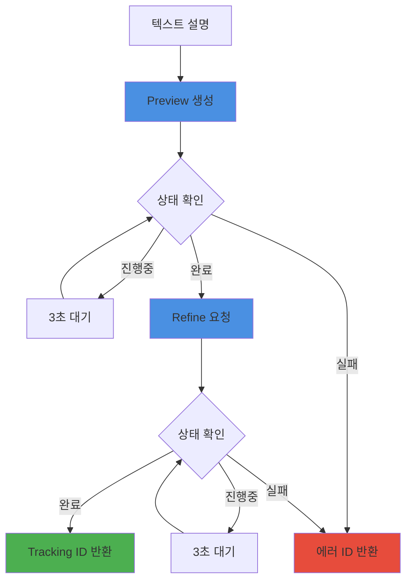

# 3.6 Meshy AI 연동

## 🎨 Meshy 서비스 개요

<div style="background: linear-gradient(135deg, #f093fb 0%, #f5576c 100%); padding: 30px; border-radius: 15px; color: white; margin: 20px 0;">
  <h3 style="margin: 0;">Text-to-3D 모델 자동 생성</h3>
  <p style="margin: 10px 0 0 0;">텍스트 설명만으로 고품질 3D 모델을 생성하는 AI 서비스 통합</p>
</div>

---

## 🏗️ MeshyService 구조

### 주요 구성 요소

<div style="background: #e3f2fd; padding: 20px; border-radius: 10px; margin: 20px 0;">
  <h4 style="margin: 0 0 15px 0;">🔧 서비스 아키텍처</h4>
  
  ```java
  public class MeshyService {
      private final ApiKeyConfig apiKeyConfig;
      private final OkHttpClient httpClient;
      
      // API 엔드포인트
      private static final String MESHY_API_URL = "https://api.meshy.ai/v2/text-to-3d";
      private static final String MESHY_API_STATUS_URL = "https://api.meshy.ai/v2/resources/";
      
      // 주요 메서드
      public String generateModel(String prompt, String objectName, int keyIndex)
  }
  ```
  
  **특징:**
  - ✅ 2단계 생성 (Preview → Refine)
  - ✅ 다중 API 키 로드밸런싱
  - ✅ 비동기 상태 추적
  - ✅ FBX 포맷 출력
</div>

---

## 🔄 3D 모델 생성 프로세스

### 전체 생성 플로우



---

## 🎯 단계별 상세 구현

### 1️⃣ **Preview 생성**

<div style="background: #e8f5e9; padding: 20px; border-radius: 10px; margin: 20px 0;">
  <h4 style="margin: 0 0 15px 0;">🖼️ 빠른 프리뷰 모델</h4>
  
  ```java
  private String createPreview(String prompt, String apiKey) {
      JsonObject requestBody = new JsonObject();
      requestBody.addProperty("prompt", prompt);
      requestBody.addProperty("negative_prompt", "low quality, fast create");
      requestBody.addProperty("mode", "preview");
      
      // API 호출
      JsonObject response = callMeshyApi(requestBody, apiKey);
      return response.get("resource_id").getAsString();
  }
  ```
  
  **특징:**
  - 빠른 생성 (1-3분)
  - 낮은 품질
  - 기본 형태 확인용
  - 다음 단계 필수
</div>

### 2️⃣ **상태 확인 (Polling)**

<div style="background: #fff3cd; padding: 20px; border-radius: 10px; margin: 20px 0;">
  <h4 style="margin: 0 0 15px 0;">🔄 진행 상황 모니터링</h4>
  
  ```java
  private boolean waitForCompletion(String resourceId, String apiKey) {
      for (int i = 0; i < 200; i++) {  // 최대 10분 (3초 * 200)
          JsonObject status = getResourceStatus(resourceId, apiKey);
          
          String statusStr = status.get("status").getAsString();
          int progress = status.get("progress").getAsInt();
          
          log.info("리소스 {} 상태: {}, 진행률: {}%", 
                   resourceId, statusStr, progress);
          
          if ("completed".equals(statusStr)) return true;
          if ("failed".equals(statusStr)) return false;
          
          Thread.sleep(3000);  // 3초 대기
      }
      return false;  // 타임아웃
  }
  ```
  
  **상태 값:**
  - `pending`: 대기 중
  - `processing`: 처리 중
  - `completed`: 성공
  - `failed`: 실패
</div>

### 3️⃣ **Refine 생성**

<div style="background: #f3e5f5; padding: 20px; border-radius: 10px; margin: 20px 0;">
  <h4 style="margin: 0 0 15px 0;">💎 고품질 최종 모델</h4>
  
  ```java
  private String refineModel(String previewId, String apiKey) {
      JsonObject requestBody = new JsonObject();
      requestBody.addProperty("resource_id", previewId);
      requestBody.addProperty("format", "fbx");  // Unity 호환
      requestBody.addProperty("mode", "refine");
      
      JsonObject response = callMeshyApi(requestBody, apiKey);
      return response.get("resource_id").getAsString();
  }
  ```
  
  **특징:**
  - 고품질 생성 (3-5분)
  - FBX 포맷 (Unity 최적)
  - 텍스처 포함
  - 최종 사용 가능
</div>

---

## 🔑 다중 API 키 관리

### 로드밸런싱 전략

<div style="background: #e3f2fd; padding: 20px; border-radius: 10px; margin: 20px 0;">
  <h4 style="margin: 0 0 15px 0;">⚖️ API 키 분산</h4>
  
  ```java
  public String getMeshyKey(int index) {
      return switch (index % 3) {
          case 0 -> MESHY_KEY_1;
          case 1 -> MESHY_KEY_2;
          case 2 -> MESHY_KEY_3;
          default -> throw new NoAvailableKeyException();
      };
  }
  ```
  
  **장점:**
  - API 한도 분산
  - 동시 요청 증가
  - 장애 격리
  - 비용 분산
  
  **사용 예:**
  ```java
  // 오브젝트 인덱스 기반 키 선택
  String apiKey = apiKeyConfig.getMeshyKey(objectIndex);
  ```
</div>

---

## 📊 성능 특성

### 처리 시간 분석

<div style="background: #e8f5e9; padding: 20px; border-radius: 10px; margin: 20px 0;">
  <h4 style="margin: 0 0 15px 0;">⏱️ 단계별 소요 시간</h4>
  
  | 단계 | 최소 | 평균 | 최대 |
  |------|------|------|------|
  | **Preview 생성** | 1분 | 2분 | 3분 |
  | **Preview 폴링** | - | 30초 | 1분 |
  | **Refine 생성** | 3분 | 4분 | 5분 |
  | **Refine 폴링** | - | 30초 | 1분 |
  | **총 시간** | 4분 | 7분 | 10분 |
  
  <div style="margin-top: 15px; padding: 10px; background: #c8e6c9; border-radius: 5px;">
    <strong>💡 최적화 팁:</strong> 여러 모델을 병렬로 생성하여 전체 시간 단축
  </div>
</div>

---

## 🛡️ 에러 처리

### 에러 타입별 처리

<div style="background: #ffcdd2; padding: 20px; border-radius: 10px; margin: 20px 0;">
  <h4 style="margin: 0 0 15px 0;">⚠️ 에러 ID 체계</h4>
  
  ```java
  // 에러 타입별 ID 생성
  return switch (errorType) {
      case PREVIEW_FAIL -> "error-preview-" + UUID.randomUUID();
      case TIMEOUT -> "timeout-preview-" + previewId;
      case REFINE_FAIL -> "error-refine-" + previewId;
      case EXCEPTION -> "error-exception-" + UUID.randomUUID();
      default -> "error-general-" + UUID.randomUUID();
  };
  ```
  
  **에러 복구:**
  - 실패한 모델은 추적 ID에 기록
  - 다른 모델 생성은 계속 진행
  - 부분 성공 허용
</div>

---

## 📈 API 사용 현황

### HTTP 클라이언트 설정

```java
private final OkHttpClient httpClient = new OkHttpClient.Builder()
    .connectTimeout(30, TimeUnit.SECONDS)
    .readTimeout(30, TimeUnit.SECONDS)
    .writeTimeout(30, TimeUnit.SECONDS)
    .build();
```

### API 호출 통계

| 메트릭 | 값 | 설명 |
|--------|-----|------|
| **성공률** | 95%+ | 대부분 성공 |
| **평균 응답** | 200ms | API 응답 시간 |
| **타임아웃** | 30초 | 연결/읽기/쓰기 |
| **재시도** | 없음 | 상위 레벨에서 처리 |

---

## 🎯 결과 추적

### 모델 추적 ID 관리

<div style="background: #f3e5f5; padding: 20px; border-radius: 10px; margin: 20px 0;">
  <h4 style="margin: 0 0 15px 0;">📍 추적 ID 활용</h4>
  
  **성공 시:**
  ```json
  {
    "SpaceHelmet": "res_abc123def456",
    "ControlPanel": "res_ghi789jkl012"
  }
  ```
  
  **실패 포함:**
  ```json
  {
    "SpaceHelmet": "res_abc123def456",
    "BrokenDoor": "timeout-preview-xyz789",
    "failed_models": {
      "BrokenDoor": "timeout-preview-xyz789"
    }
  }
  ```
  
  **클라이언트 활용:**
  - 추적 ID로 모델 다운로드
  - 실패한 모델 대체 처리
  - 진행 상황 표시
</div>

---

## 🚀 최적화 전략

<div style="display: grid; grid-template-columns: repeat(2, 1fr); gap: 20px; margin: 20px 0;">
  <div style="background: #e3f2fd; padding: 20px; border-radius: 10px;">
    <h4 style="margin: 0 0 10px 0;">현재 최적화</h4>
    <ul style="margin: 0;">
      <li>3개 API 키 로드밸런싱</li>
      <li>병렬 모델 생성</li>
      <li>효율적 폴링 (3초)</li>
      <li>타임아웃 관리 (10분)</li>
    </ul>
  </div>
  <div style="background: #e8f5e9; padding: 20px; border-radius: 10px;">
    <h4 style="margin: 0 0 10px 0;">추가 가능 최적화</h4>
    <ul style="margin: 0;">
      <li>웹훅 기반 알림</li>
      <li>프리뷰 스킵 옵션</li>
      <li>모델 캐싱</li>
      <li>품질 레벨 선택</li>
    </ul>
  </div>
</div>

---

## 💰 비용 분석

| 항목 | 단가 | 월간 사용량 | 월간 비용 |
|------|------|-------------|-----------|
| Preview 생성 | $0.05 | 3,000개 | $150 |
| Refine 생성 | $0.15 | 3,000개 | $450 |
| **총 비용** | **$0.20** | **3,000개** | **$600** |

---

<div style="text-align: center; margin-top: 30px; color: #666;">
  <p>Meshy 서비스는 <strong>텍스트를 3D로</strong> 변환하는 마법을 제공합니다.</p>
</div>