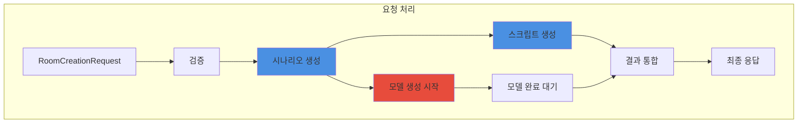
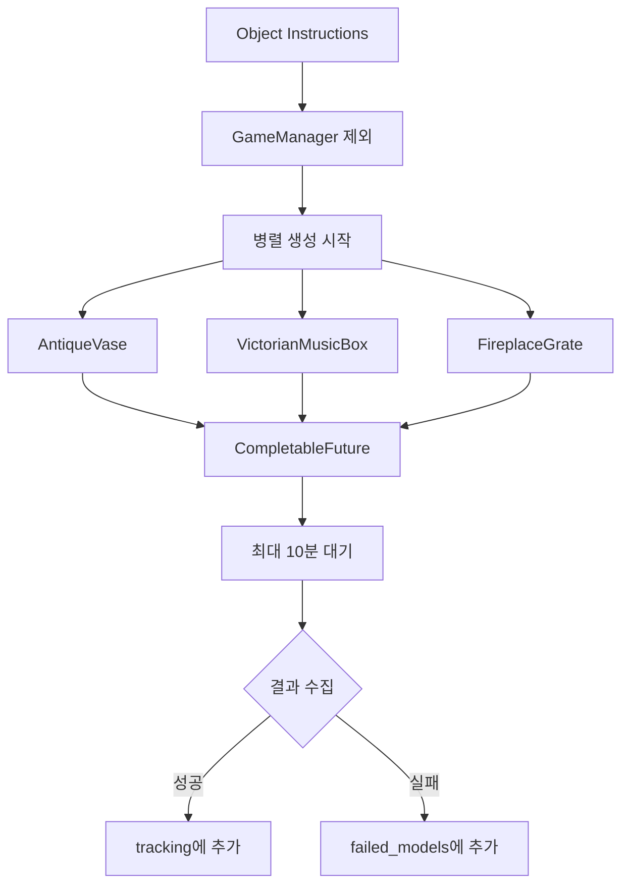

# 3.4 룸 기반 요청 처리 시스템

## 🏠 룸 서비스 개요



### **AI 기반 방탈출 생성의 핵심**

시나리오 생성부터 3D 모델링까지 전체 프로세스를 관리하는 중앙 서비스


---

## 🔄 전체 처리 플로우



---

## 📋 RoomServiceImpl 구조

### 주요 구성 요소



#### 🏗️ **서비스 아키텍처**

```java
public class RoomServiceImpl implements RoomService, AutoCloseable {
    private static final Logger log = LoggerFactory.getLogger(RoomServiceImpl.class);
    private static final int MODEL_TIMEOUT_MINUTES = 10;
    private static final int EXECUTOR_SHUTDOWN_TIMEOUT_SECONDS = 60;

    private final AiService aiService;           // AI 시나리오/스크립트
    private final MeshService meshService;       // 3D 모델 생성
    private final ConfigurationManager configManager;  // 설정 관리
    private final ExecutorService executorService;     // 병렬 처리
    private final RequestValidator requestValidator;   // 요청 검증
    private final ScenarioValidator scenarioValidator; // 시나리오 검증

    public RoomServiceImpl(AiService aiService, MeshService meshService,
                           ConfigurationManager configManager) {
        this.aiService = aiService;
        this.meshService = meshService;
        this.configManager = configManager;
        this.executorService = Executors.newFixedThreadPool(10);
        this.requestValidator = new RoomRequestValidator();
        this.scenarioValidator = new DefaultScenarioValidator();
    }
}
```

**특징:**

- ✅ 병렬 처리로 시간 단축 (10개 스레드)
- ✅ 타임아웃 관리 (10분)
- ✅ 리소스 자동 정리 (AutoCloseable)
- ✅ 에러 격리 및 복구
- ✅ 검증기 분리로 책임 명확화
  

---

## 🎯 핵심 처리 단계

### 1️⃣ **요청 검증 (Request Validation)**



#### ✅ **검증 규칙 (RoomRequestValidator)**

| 필드            | 검증 내용            | 실패 시 동작                  | 에러 메시지                                                    |
|---------------|------------------|--------------------------|-----------------------------------------------------------|
| `uuid`        | 비어있지 않음, 공백 제거   | IllegalArgumentException | "UUID가 비어있습니다"                                            |
| `theme`       | 비어있지 않음          | IllegalArgumentException | "테마가 비어있습니다"                                              |
| `keywords`    | 최소 1개, 각각 유효     | IllegalArgumentException | "키워드가 비어있습니다" / "빈 키워드가 포함되어 있습니다"                        |
| `difficulty`  | easy/normal/hard | 기본값 "normal"             | "유효하지 않은 난이도입니다. easy, normal, hard 중 하나를 선택하세요."         |
| `room_prefab` | https:// URL     | IllegalArgumentException | "roomPrefab URL이 비어있습니다" / "유효하지 않은 roomPrefab URL 형식입니다" |

```java
public class RoomRequestValidator implements RequestValidator {
    @Override
    public void validate(RoomCreationRequest request) throws IllegalArgumentException {
        validateUuid(request);
        validateTheme(request);
        validateKeywords(request);
        validateRoomPrefab(request);
        validateDifficulty(request);
    }

    private void validateRoomPrefab(RoomCreationRequest request) {
        if (request.getRoomPrefab() == null || request.getRoomPrefab().trim().isEmpty()) {
            throw new IllegalArgumentException("roomPrefab URL이 비어있습니다");
        }

        String url = request.getRoomPrefab().trim();
        if (!url.startsWith("https://")) {
            throw new IllegalArgumentException("유효하지 않은 roomPrefab URL 형식입니다");
        }
    }
}
```



### 2️⃣ **시나리오 생성 (Scenario Generation)**



#### 🎭 **AI 시나리오 생성 및 검증**

**시나리오 검증 (DefaultScenarioValidator):**

```java
public class DefaultScenarioValidator implements ScenarioValidator {
    @Override
    public void validate(JsonObject scenario) {
        validateStructure(scenario);      // scenario_data, object_instructions 필수
        validateScenarioData(scenario);   // theme, description, escape_condition, puzzle_flow
        validateObjectInstructions(scenario); // GameManager가 첫 번째 오브젝트인지 확인
    }

    private void validateObjectInstructions(JsonObject scenario) {
        JsonArray objectInstructions = scenario.getAsJsonArray("object_instructions");
        if (objectInstructions.isEmpty()) {
            throw new RuntimeException("오브젝트 설명이 없습니다");
        }

        JsonObject firstObject = objectInstructions.get(0).getAsJsonObject();
        if (!firstObject.has("name") || !firstObject.get("name").getAsString().equals("GameManager")) {
            throw new RuntimeException("첫 번째 오브젝트가 GameManager가 아닙니다");
        }
    }
}
```

**입력 데이터:**

```json
{
  "uuid": "user_12345",
  "ruid": "room_a1b2c3",
  "theme": "victoria",
  "keywords": [
    "vase",
    "music box",
    "fire place"
  ],
  "difficulty": "normal",
  "room_prefab_url": "https://..."
}
```

**처리 시간:** 45초 (Claude Sonnet 4 최적화)


### 3️⃣ **3D 모델 생성 (Model Generation)**



#### 🎨 **병렬 앤틱 모델 생성 및 실패 추적**



**모델 건너뛰기 조건:**

1. GameManager (type: "game_manager")
2. 필수 필드 누락 (name, visual_description)
3. 빈 이름 또는 설명

**결과 추적 형식:**

```json
{
  "AntiqueVase": "https://assets.meshy.ai/.../antique_vase.fbx",
  "VictorianMusicBox": "https://assets.meshy.ai/.../music_box.fbx",
  "failed_models": {
    "OrnateFrame": "timeout-preview-123",
    "error_3": "collection_error-1234567890"
  }
}
```

**실패 ID 패턴:**

- `error-preview-{UUID}`: 프리뷰 생성 실패
- `timeout-preview-{ID}`: 프리뷰 타임아웃
- `error-refine-{ID}`: 정제 실패
- `error-exception-{UUID}`: 예외 발생
- `error-general-{UUID}`: 일반 오류
- `no-tracking-{timestamp}`: 추적 ID 없음
- `timeout-{timestamp}`: 타임아웃
- `collection_error-{timestamp}`: 수집 오류
  

### 4️⃣ **스크립트 생성 (Script Generation)**



#### 💻 **Unity C# 빅토리아 스크립트 생성**

**통합 스크립트 요청:**

```java
private JsonObject buildScriptRequest(JsonObject scenario, String roomPrefabUrl) {
    JsonObject scriptRequest = new JsonObject();
    scriptRequest.add("scenario_data", scenario.getAsJsonObject("scenario_data"));
    scriptRequest.add("object_instructions", scenario.getAsJsonArray("object_instructions"));
    scriptRequest.addProperty("room_prefab_url", roomPrefabUrl);
    return scriptRequest;
}
```

**빅토리아 스크립트 특징:**

- Unity6 최신 API 사용 (Input System 필수)
- Raycast 기반 마우스 입력 (OnMouseDown 금지)
- GameManager 중앙 집중식 선택 관리
- 오브젝트 상호작용 로직
- 테마 분위기의 UI 메시지
- 에러 처리 포함
- 한국어 디버그 메시지
- Base64 인코딩으로 전송
- Temperature: 0.1 (낮은 창의성, 높은 정확성)

**처리 시간:** 15초 (Claude Sonnet 4 최적화)


---

## ⚡ 병렬 처리 최적화

### 동시 실행 구조

```java
// 시나리오 생성 (동기)
JsonObject scenario = createIntegratedScenario(request, ruid);

// 3D 모델 생성 시작 (비동기) - 최대 10개 동시
List<CompletableFuture<ModelGenerationResult>> modelFutures =
        startAntiqueModelGeneration(scenario);

// 스크립트 생성 (시나리오 완료 후 시작)
Map<String, String> allScripts =
        createVictorianUnifiedScripts(scenario, request.getRoomPrefab());

// 모델 생성 완료 대기 (최대 10분)
JsonObject modelTracking = waitForAntiqueModels(modelFutures);
```

### 시간 절약 효과



#### ⏱️ **처리 시간 비교**

| 방식        | 시나리오 | 스크립트     | 3D 모델     | 총 시간     |
|-----------|------|----------|-----------|----------|
| **순차 처리** | 45초  | 15초      | 5개×6분=30분 | 31분      |
| **병렬 처리** | 45초  | 15초 (동시) | 5-7분 (동시) | **4-5분** |

**85% 이상 시간 단축 효과**


---

## 🛡️ 에러 처리 전략

### 계층별 에러 처리



#### ⚠️ **에러 복구 메커니즘**

```java
public JsonObject createRoom(@NotNull RoomCreationRequest request, String ruid) {
    // 1. 요청 검증 - 사용자 오류
    try {
        requestValidator.validate(request);
    } catch (IllegalArgumentException e) {
        return createErrorResponse(request, ruid, e.getMessage());
    }

    try {
        // 2. 메인 로직 실행
        JsonObject scenario = createIntegratedScenario(request, ruid);
        List<CompletableFuture<ModelGenerationResult>> modelFutures =
                startModelGeneration(scenario);
        Map<String, String> allScripts =
                createUnifiedScripts(scenario, request.getRoomPrefab());
        JsonObject modelTracking = waitForModels(modelFutures);

        // 3. 성공 응답 생성
        return buildFinalResponse(request, ruid, scenario, allScripts, modelTracking);

    } catch (RuntimeException e) {
        // 비즈니스 로직 오류
        log.error("통합 방 생성 중 비즈니스 오류 발생: ruid={}", ruid, e);
        return createErrorResponse(request, ruid, e.getMessage());
    } catch (Exception e) {
        // 시스템 오류
        log.error("통합 방 생성 중 시스템 오류 발생: ruid={}", ruid, e);
        return createErrorResponse(request, ruid, "시스템 오류가 발생했습니다");
    }
}
```

**에러 응답 형식:**

```json
{
  "uuid": "user_12345",
  "ruid": "room_12345",
  "success": false,
  "error": "구체적인 에러 메시지",
  "timestamp": "1234567890"
}
```



---

## 📊 리소스 관리

### ExecutorService 관리

```java
@Override
public void close() {
    log.info("RoomService 종료 시작");
    executorService.shutdown();

    try {
        if (!executorService.awaitTermination(EXECUTOR_SHUTDOWN_TIMEOUT_SECONDS, TimeUnit.SECONDS)) {
            log.warn("ExecutorService가 정상적으로 종료되지 않아 강제 종료합니다");
            executorService.shutdownNow();

            if (!executorService.awaitTermination(30, TimeUnit.SECONDS)) {
                log.error("ExecutorService 강제 종료 실패");
            }
        }
    } catch (InterruptedException e) {
        log.error("ExecutorService 종료 중 인터럽트 발생");
        executorService.shutdownNow();
        Thread.currentThread().interrupt();
    }

    log.info("RoomService 종료 완료");
}
```

### 메모리 사용 패턴

| 단계       | 예상 메모리 | 지속 시간 |
|----------|--------|-------|
| 요청 수신    | ~5KB   | 순간    |
| 시나리오 생성  | ~50KB  | 45초   |
| 스크립트 생성  | ~100KB | 15초   |
| 3D 모델 추적 | ~10KB  | 5-7분  |
| 최종 응답    | ~200KB | 전송까지  |

---

## 🔍 모니터링 포인트

### 주요 로그 메시지



#### 📝 **로그 레벨별 기록**

```java
// INFO: 주요 단계 시작/완료
log.info("통합 방 생성 시작: ruid={}, user_uuid={}, theme={}, difficulty={}",
         ruid, request.getUuid(), request.getTheme(), request.getValidatedDifficulty());
log.info("통합 시나리오 생성 완료. ruid: {}, 오브젝트 설명 {}개",
         ruid, objectInstructions.size());
log.info("통합 스크립트 생성 완료: {} 개", allScripts.size());
log.info("통합 방 생성 완료: ruid={}, 스크립트 수={}", ruid, allScripts.size());

// DEBUG: 상세 진행 상황
log.debug("3D 모델 생성 요청 [{}]: name='{}', prompt='{}자'",
          index, name, prompt.length());
log.debug("모델 추적 ID 추가: {} -> {}", objectName, trackingId);
log.debug("스크립트 객체 생성 완료: {} 개의 스크립트", scripts.size());

// WARN: 부분 실패 (계속 진행)
log.warn("object_instructions[{}]에 필수 필드가 없습니다. 건너뜁니다.", i);
log.warn("모델 생성 타임아웃 발생, 현재까지 완료된 결과만 수집");
log.warn("GameManager 스크립트가 파싱되지 않았습니다");
log.warn("유효하지 않은 스크립트 엔트리: name={}, contentEmpty={}",
         scriptName, base64Content == null || base64Content.isEmpty());

// ERROR: 치명적 오류
log.error("통합 방 생성 중 시스템 오류 발생: ruid={}", ruid, e);
log.error("모델 생성 실패: {} - {}", name, e.getMessage());
log.error("모델 결과 수집 실패: index={}", i, e);
```



---

## 🚀 성능 특성

### 📊 **핵심 성능 지표**

<div style="display: grid; grid-template-columns: repeat(2, 2fr); gap: 20px; margin: 20px 0;">
  <div style="background: #e3f2fd; padding: 20px; border-radius: 10px; text-align: center;">
    <h4>⏱️ 평균 처리 시간</h4>
    <div style="font-size: 2em; font-weight: bold; color: #1976d2;">4-5분</div>
    <p>전체 방탈출 생성 완료</p>
  </div>
  <div style="background: #e8f5e9; padding: 20px; border-radius: 10px; text-align: center;">
    <h4>🔄 동시 처리</h4>
    <div style="font-size: 2em; font-weight: bold; color: #388e3c;">10개</div>
    <p>3D 모델 병렬 생성</p>
  </div>
  <div style="background: #f3e5f5; padding: 20px; border-radius: 10px; text-align: center;">
    <h4>✅ 성공률</h4>
    <div style="font-size: 2em; font-weight: bold; color: #7b1fa2;">99%+</div>
    <p>에러 복구 포함</p>
  </div>
  <div style="background: #fff3cd; padding: 20px; border-radius: 10px; text-align: center;">
    <h4>⏰ 타임아웃</h4>
    <div style="font-size: 2em; font-weight: bold; color: #f57c00;">10분</div>
    <p>모델 생성 최대 대기</p>
  </div>
</div>

---

## 🎨 추가 기능 상세

### 키워드 중복 제거

```java
private JsonArray createKeywordsArray(@NotNull String[] keywords) {
    JsonArray array = new JsonArray();
    Set<String> uniqueKeywords = new LinkedHashSet<>(); // 순서 유지

    for (String keyword : keywords) {
        if (keyword != null && !keyword.trim().isEmpty()) {
            uniqueKeywords.add(keyword.trim().toLowerCase());
        }
    }

    for (String keyword : uniqueKeywords) {
        array.add(keyword);
    }

    return array;
}
```

### 스크립트 파일명 처리

```java
private String ensureFileExtension(@NotNull String fileName) {
    return fileName.endsWith(".cs") ? fileName : fileName + ".cs";
}

private boolean isValidScriptEntry(String name, String content) {
    return name != null && !name.trim().isEmpty() &&
            content != null && !content.trim().isEmpty();
}
```

### 모델 추적 결과 처리

```java
private void addTrackingResult(JsonObject tracking, JsonObject failedModels, 
                               ModelGenerationResult result) {
    if (result == null) {
        log.warn("모델 결과가 null입니다");
        return;
    }

    String trackingId = result.getTrackingId();
    String objectName = result.getObjectName();

    if (objectName == null || objectName.trim().isEmpty()) {
        log.warn("오브젝트 이름이 없습니다: {}", result);
        return;
    }

    objectName = objectName.trim();

    if (trackingId != null && !trackingId.trim().isEmpty()) {
        if (trackingId.startsWith("error-") || trackingId.startsWith("timeout-")) {
            failedModels.addProperty(objectName, trackingId);
            log.warn("모델 생성 실패로 표시됨: {} -> {}", objectName, trackingId);
        } else {
            tracking.addProperty(objectName, trackingId.trim());
            log.debug("모델 추적 ID 추가: {} -> {}", objectName, trackingId);
        }
    } else {
        String fallbackId = "no-tracking-" + System.currentTimeMillis();
        failedModels.addProperty(objectName, fallbackId);
        log.warn("trackingId가 없어 실패로 표시: {} -> {}", objectName, fallbackId);
    }
}
```

---

## 📋 최종 응답 구조

### buildFinalResponse 구현

```java
@NotNull
private JsonObject buildFinalResponse(@NotNull RoomCreationRequest request, String ruid,
                                      JsonObject scenario, Map<String, String> allScripts,
                                      JsonObject tracking) {
    JsonObject response = new JsonObject();
    response.addProperty("uuid", request.getUuid());
    response.addProperty("ruid", ruid);
    response.addProperty("theme", request.getTheme());
    response.addProperty("difficulty", request.getValidatedDifficulty());
    response.add("keywords", createKeywordsArray(request.getKeywords()));
    response.addProperty("room_prefab", request.getRoomPrefab());
    response.add("scenario", scenario);
    response.add("scripts", buildScriptsObject(allScripts));
    response.add("model_tracking", tracking);
    response.addProperty("success", true);
    response.addProperty("timestamp", String.valueOf(System.currentTimeMillis()));

    return response;
}
```

### 빅토리아 성공 응답 예시

```json
{
  "uuid": "user_12345",
  "ruid": "room_a1b2c3d4e5f6",
  "theme": "victoria",
  "difficulty": "normal",
  "keywords": [
    "vase",
    "music box",
    "fire place"
  ],
  "room_prefab": "https://example.com/victoria_house.fbx",
  "scenario": {
    "scenario_data": {
      /* 시나리오 데이터 */
    },
    "object_instructions": [
      /* 오브젝트 설명들 */
    ]
  },
  "scripts": {
    "GameManager.cs": "base64_encoded_content",
    "ObjectController.cs": "base64_encoded_content",
    "InteractionSystem.cs": "base64_encoded_content"
  },
  "model_tracking": {
    "Object1": "https://assets.meshy.ai/.../model1.fbx",
    "Object2": "https://assets.meshy.ai/.../model2.fbx",
    "failed_models": {
      "FailedObject": "timeout-preview-123"
    }
  },
  "success": true,
  "timestamp": "1734567890123"
}
```

---

## 🔧 최적화 팁

### 처리 속도 향상

1. **모델 생성 병렬화 증가**
   ```java
   // ExecutorService 스레드 수 조정
   this.executorService = Executors.newFixedThreadPool(20); // 10 → 20
   ```

2. **타임아웃 최적화**
   ```java
   // 모델별 개별 타임아웃
   future.get(5, TimeUnit.MINUTES); // 전체 10분 대신 개별 5분
   ```

3. **캐싱 전략**
    - 유사한 프롬프트 결과 캐싱
    - 자주 사용되는 오브젝트 모델 재사용

### 메모리 최적화

1. **스트리밍 처리**
    - 대용량 스크립트 스트리밍 인코딩
    - 청크 단위 전송

2. **조기 정리**
   ```java
   // 사용 완료된 데이터 즉시 정리
   scenario = null; // GC 힌트
   ```

---

## 📈 모니터링 및 디버깅

### 성능 메트릭 수집

```java
private void logPerformanceMetrics(String ruid, long startTime, 
                                   int modelCount, int scriptCount) {
    long duration = System.currentTimeMillis() - startTime;
    
    log.info("성능 메트릭 - ruid: {}, 총 시간: {}ms, 모델 수: {}, 스크립트 수: {}", 
            ruid, duration, modelCount, scriptCount);
    
    // 평균 처리 시간 계산
    if (duration > 300000) { // 5분 초과
        log.warn("처리 시간 초과 - ruid: {}, 시간: {}분", ruid, duration / 60000);
    }
}
```

### 디버그 모드

```java
private static final boolean DEBUG_MODE =
        Boolean.parseBoolean(System.getProperty("eroom.debug", "false"));

if (DEBUG_MODE) {
        log.debug("시나리오 전체 내용: {}", scenario.toString());
        log.debug("스크립트 목록: {}", allScripts.keySet());
        }
```

---

## 🚨 트러블슈팅 가이드

### 일반적인 문제와 해결

| 문제         | 원인           | 해결 방법       |
|------------|--------------|-------------|
| 시나리오 생성 실패 | AI API 키 문제  | 환경변수 확인     |
| 모델 타임아웃    | Meshy 서버 과부하 | 재시도 또는 키 변경 |
| 스크립트 누락    | 파싱 오류        | 로그에서 경고 확인  |
| 메모리 부족     | 동시 요청 과다     | 큐 크기 제한     |
| 검증 실패      | 잘못된 입력       | 에러 메시지 확인   |

### 긴급 대응

```java
// 서비스 재시작 없이 설정 변경
public void updateConfiguration(ConfigurationManager newConfig) {
    this.configManager = newConfig;
    log.info("설정이 업데이트되었습니다");
}

// 진행 중인 앤틱 작업 확인
public int getActiveAntiqueTaskCount() {
    return ((ThreadPoolExecutor) executorService).getActiveCount();
}
```

---

<div style="text-align: center; margin-top: 30px; color: #666;">
  <p>💡 RoomService는 복잡한 AI 통합을 <strong>단순하고 안정적</strong>으로 만듭니다.</p>
</div>