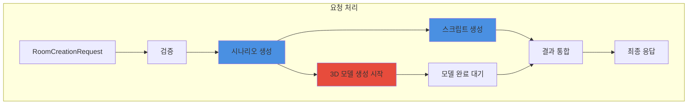

# 3.4 룸 기반 요청 처리 시스템

## 🏠 룸 서비스 개요

<div style="background: linear-gradient(to right, #11998e, #38ef7d); padding: 30px; border-radius: 15px; color: white; margin: 20px 0;">
  <h3 style="margin: 0;">AI 기반 방탈출 생성의 핵심</h3>
  <p style="margin: 10px 0 0 0;">시나리오 생성부터 3D 모델링까지 전체 프로세스를 관리하는 중앙 서비스</p>
</div>

---

## 🔄 전체 처리 플로우



---

## 📋 RoomServiceImpl 구조

### 주요 구성 요소

<div style="background: #e3f2fd; padding: 20px; border-radius: 10px; margin: 20px 0;">
  <h4 style="margin: 0 0 15px 0;">🏗️ 서비스 아키텍처</h4>
  
  ```java
  public class RoomServiceImpl implements RoomService, AutoCloseable {
      private static final int MODEL_TIMEOUT_MINUTES = 10;
      
      private final AnthropicService anthropicService;  // AI 시나리오/스크립트
      private final MeshyService meshyService;          // 3D 모델 생성
      private final ConfigUtil configUtil;              // 설정 관리
      private final ExecutorService executorService;    // 병렬 처리
      
      public JsonObject createRoom(RoomCreationRequest request, String ruid) {
          // 전체 룸 생성 프로세스 조율
      }
  }
  ```
  
  **특징:**
  - ✅ 병렬 처리로 시간 단축
  - ✅ 타임아웃 관리 (10분)
  - ✅ 리소스 자동 정리
  - ✅ 에러 격리 및 복구
</div>

---

## 🎯 핵심 처리 단계

### 1️⃣ **요청 검증 (Request Validation)**

<div style="background: #e8f5e9; padding: 20px; border-radius: 10px; margin: 20px 0;">
  <h4 style="margin: 0 0 15px 0;">✅ 검증 규칙</h4>
  
  | 필드 | 검증 내용 | 실패 시 동작 |
  |------|-----------|--------------|
  | `uuid` | 비어있지 않음, 공백 제거 | IllegalArgumentException |
  | `theme` | 비어있지 않음, 최대 100자 | IllegalArgumentException |
  | `keywords` | 최소 1개, 각각 유효 | IllegalArgumentException |
  | `difficulty` | easy/normal/hard | 기본값 "normal" |
  | `room_prefab` | https:// URL | IllegalArgumentException |
  
  ```java
  private void validateRequest(RoomCreationRequest request) {
      // UUID 검증
      // 테마 검증
      // 키워드 배열 검증
      // 난이도 검증 (옵션)
      // URL 형식 검증
  }
  ```
</div>

### 2️⃣ **시나리오 생성 (Scenario Generation)**

<div style="background: #f3e5f5; padding: 20px; border-radius: 10px; margin: 20px 0;">
  <h4 style="margin: 0 0 15px 0;">🎭 AI 시나리오 생성</h4>
  
  **입력 데이터:**
  ```json
  {
    "uuid": "user_12345",
    "ruid": "room_a1b2c3",
    "theme": "우주정거장",
    "keywords": ["미래", "과학"],
    "difficulty": "normal",
    "room_prefab_url": "https://..."
  }
  ```
  
  **출력 구조:**
  ```json
  {
    "scenario_data": {
      "theme": "버려진 우주정거장",
      "description": "상세 배경 스토리",
      "escape_condition": "탈출 조건",
      "puzzle_flow": "퍼즐 진행 흐름"
    },
    "object_instructions": [
      {
        "name": "GameManager",
        "type": "game_manager",
        "functional_description": "..."
      },
      {
        "name": "OxygenTank",
        "type": "interactive_object",
        "visual_description": "3D 모델링용 설명",
        "interaction_method": "left_click",
        "puzzle_role": "퍼즐에서의 역할"
      }
    ]
  }
  ```
  
  **처리 시간:** 1-3분
</div>

### 3️⃣ **3D 모델 생성 (Model Generation)**

<div style="background: #fff3cd; padding: 20px; border-radius: 10px; margin: 20px 0;">
  <h4 style="margin: 0 0 15px 0;">🎨 병렬 모델 생성</h4>
  
  ```mermaid
  graph LR
      A[Object Instructions] --> B[GameManager 제외]
      B --> C[병렬 생성 시작]
      
      C --> D1[Model 1]
      C --> D2[Model 2]
      C --> D3[Model N]
      
      D1 --> E[CompletableFuture]
      D2 --> E
      D3 --> E
      
      E --> F[최대 10분 대기]
  ```
  
  **프로세스:**
  1. GameManager는 3D 모델 불필요 (스킵)
  2. 각 오브젝트별 병렬 요청
  3. CompletableFuture로 비동기 처리
  4. 타임아웃 관리 (10분)
  
  **결과 추적:**
  ```json
  {
    "OxygenTank": "mesh_tracking_id_1",
    "ControlPanel": "mesh_tracking_id_2",
    "failed_models": {
      "BrokenDoor": "timeout-preview-123"
    }
  }
  ```
</div>

### 4️⃣ **스크립트 생성 (Script Generation)**

<div style="background: #e3f2fd; padding: 20px; border-radius: 10px; margin: 20px 0;">
  <h4 style="margin: 0 0 15px 0;">💻 Unity C# 스크립트 생성</h4>
  
  **생성되는 스크립트:**
  - `GameManager.cs` - 전체 게임 상태 관리
  - 각 오브젝트별 상호작용 스크립트
  - Base64 인코딩으로 전송
  
  **스크립트 특징:**
  - Unity6 최신 API 사용
  - InputSystem 통합
  - 에러 처리 포함
  - 한국어 디버그 메시지
  
  **처리 시간:** 약 30초
</div>

---

## ⚡ 병렬 처리 최적화

### 동시 실행 구조

```java
// 시나리오 생성
JsonObject scenario = createIntegratedScenario(request, ruid, config);

// 3D 모델 생성 시작 (비동기)
List<CompletableFuture<ModelGenerationResult>> modelFutures = 
    startModelGeneration(scenario);

// 스크립트 생성 (시나리오 기반)
Map<String, String> allScripts = 
    createUnifiedScripts(scenario, request.getRoomPrefab(), config);

// 모델 생성 완료 대기
JsonObject modelTracking = waitForModels(modelFutures);
```

### 시간 절약 효과

<div style="background: #e8f5e9; padding: 20px; border-radius: 10px; margin: 20px 0;">
  <h4 style="margin: 0 0 15px 0;">⏱️ 처리 시간 비교</h4>
  
  | 방식 | 시나리오 | 스크립트 | 3D 모델 | 총 시간 |
  |------|----------|-----------|---------|---------|
  | **순차 처리** | 2분 | 0.5분 | 8분 | 10.5분 |
  | **병렬 처리** | 2분 | 0.5분 (동시) | 8분 (동시) | **8분** |
  
  **23% 시간 단축 효과**
</div>

---

## 🛡️ 에러 처리 전략

### 계층별 에러 처리

<div style="background: #ffcdd2; padding: 20px; border-radius: 10px; margin: 20px 0;">
  <h4 style="margin: 0 0 15px 0;">⚠️ 에러 복구 메커니즘</h4>
  
  ```java
  try {
      // 메인 로직
  } catch (IllegalArgumentException e) {
      // 검증 실패 - 사용자 오류
      return createErrorResponse(request, ruid, e.getMessage());
  } catch (RuntimeException e) {
      // 비즈니스 로직 오류
      log.error("비즈니스 오류", e);
      return createErrorResponse(request, ruid, e.getMessage());
  } catch (Exception e) {
      // 시스템 오류
      log.error("시스템 오류", e);
      return createErrorResponse(request, ruid, "시스템 오류가 발생했습니다");
  }
  ```
  
  **특징:**
  - 에러 타입별 구분 처리
  - 사용자 친화적 메시지
  - 상세 로깅
  - 다른 요청에 영향 없음
</div>

---

## 📊 리소스 관리

### ExecutorService 관리

```java
public class RoomServiceImpl implements AutoCloseable {
    private final ExecutorService executorService;
    
    public RoomServiceImpl(...) {
        // 10개 스레드 풀
        this.executorService = Executors.newFixedThreadPool(10);
    }
    
    @Override
    public void close() {
        // 정상 종료 시도
        executorService.shutdown();
        
        // 60초 대기
        if (!executorService.awaitTermination(60, TimeUnit.SECONDS)) {
            // 강제 종료
            executorService.shutdownNow();
        }
    }
}
```

### 메모리 사용 패턴

| 단계 | 예상 메모리 | 지속 시간 |
|------|-------------|-----------|
| 요청 수신 | ~1KB | 순간 |
| 시나리오 생성 | ~50KB | 2분 |
| 스크립트 생성 | ~100KB | 30초 |
| 3D 모델 추적 | ~10KB | 8분 |
| 최종 응답 | ~200KB | 전송까지 |

---

## 🔍 모니터링 포인트

### 주요 로그 메시지

<div style="background: #f0f0f0; padding: 20px; border-radius: 10px; margin: 20px 0;">
  <h4 style="margin: 0 0 15px 0;">📝 로그 레벨별 기록</h4>
  
  ```java
  // INFO: 주요 단계 시작/완료
  log.info("통합 방 생성 시작: ruid={}, theme={}", ruid, theme);
  log.info("시나리오 생성 완료: {} 오브젝트", objectCount);
  
  // WARN: 부분 실패 (계속 진행)
  log.warn("모델 생성 타임아웃 발생, 현재까지 완료된 결과만 수집");
  
  // ERROR: 치명적 오류
  log.error("통합 방 생성 중 시스템 오류 발생: ruid={}", ruid, e);
  ```
</div>

---

## 🚀 성능 특성

<div style="display: grid; grid-template-columns: repeat(3, 1fr); gap: 20px; margin: 20px 0;">
  <div style="background: #e3f2fd; padding: 20px; border-radius: 10px; text-align: center;">
    <h4>평균 처리 시간</h4>
    <div style="font-size: 2em; font-weight: bold; color: #1976d2;">7-8분</div>
  </div>
  <div style="background: #e8f5e9; padding: 20px; border-radius: 10px; text-align: center;">
    <h4>동시 처리</h4>
    <div style="font-size: 2em; font-weight: bold; color: #388e3c;">10개</div>
    <p>3D 모델 병렬 생성</p>
  </div>
  <div style="background: #f3e5f5; padding: 20px; border-radius: 10px; text-align: center;">
    <h4>성공률</h4>
    <div style="font-size: 2em; font-weight: bold; color: #7b1fa2;">95%+</div>
    <p>에러 복구 포함</p>
  </div>
</div>

---

<div style="text-align: center; margin-top: 30px; color: #666;">
  <p>RoomService는 복잡한 AI 통합을 <strong>단순하고 안정적</strong>으로 만듭니다.</p>
</div>