# 3.4 룸 기반 요청 처리 시스템

## 🏠 룸 서비스 개요


### **AI 기반 방탈출 생성의 핵심**
시나리오 생성부터 3D 모델링까지 전체 프로세스를 관리하는 중앙 서비스


---

## 🔄 전체 처리 플로우

```mermaid
flowchart TB
    subgraph "요청 처리"
        A[RoomCreationRequest] --> B[검증]
        B --> C[시나리오 생성]
        C --> D[3D 모델 생성 시작]
        C --> E[스크립트 생성]
        D --> F[모델 완료 대기]
        E --> G[결과 통합]
        F --> G
        G --> H[최종 응답]
    end
    
    style C fill:#4a90e2
    style D fill:#e74c3c
    style E fill:#4a90e2
```



---

## 📋 RoomServiceImpl 구조

### 주요 구성 요소


#### 🏗️ **서비스 아키텍처**

```java
public class RoomServiceImpl implements RoomService, AutoCloseable {
    private static final int MODEL_TIMEOUT_MINUTES = 10;
    
    private final AnthropicService anthropicService;  // AI 시나리오/스크립트
    private final MeshyService meshyService;          // 3D 모델 생성
    private final ConfigUtil configUtil;              // 설정 관리
    private final ExecutorService executorService;    // 병렬 처리
    
    public JsonObject createRoom(RoomCreationRequest request, String ruid) {
        // 전체 룸 생성 프로세스 조율
    }
}
```

**특징:**
- ✅ 병렬 처리로 시간 단축
- ✅ 타임아웃 관리 (10분)
- ✅ 리소스 자동 정리
- ✅ 에러 격리 및 복구
  

---

## 🎯 핵심 처리 단계

### 1️⃣ **요청 검증 (Request Validation)**


#### ✅ **검증 규칙**

| 필드 | 검증 내용 | 실패 시 동작 |
|------|-----------|--------------|
| `uuid` | 비어있지 않음, 공백 제거 | IllegalArgumentException |
| `theme` | 비어있지 않음, 최대 100자 | IllegalArgumentException |
| `keywords` | 최소 1개, 각각 유효 | IllegalArgumentException |
| `difficulty` | easy/normal/hard | 기본값 "normal" |
| `room_prefab` | https:// URL | IllegalArgumentException |

```java
private void validateRequest(RoomCreationRequest request) {
    // UUID 검증
    // 테마 검증
    // 키워드 배열 검증
    // 난이도 검증 (옵션)
    // URL 형식 검증
}
```


### 2️⃣ **시나리오 생성 (Scenario Generation)**


#### 🎭 **AI 시나리오 생성**

**입력 데이터:**
```json
{
  "uuid": "user_12345",
  "ruid": "room_a1b2c3",
  "theme": "우주정거장",
  "keywords": ["미래", "과학"],
  "difficulty": "normal",
  "room_prefab_url": "https://..."
}
```

**출력 구조:**
```json
{
  "scenario_data": {
    "theme": "버려진 우주정거장",
    "description": "상세 배경 스토리",
    "escape_condition": "탈출 조건",
    "puzzle_flow": "퍼즐 진행 흐름"
  },
  "object_instructions": [
    {
      "name": "GameManager",
      "type": "game_manager",
      "functional_description": "..."
    },
    {
      "name": "OxygenTank",
      "type": "interactive_object",
      "visual_description": "3D 모델링용 설명",
      "interaction_method": "left_click",
      "puzzle_role": "퍼즐에서의 역할"
    }
  ]
}
```

**처리 시간:** 1-2분


### 3️⃣ **3D 모델 생성 (Model Generation)**


#### 🎨 **병렬 모델 생성**

```mermaid
graph LR
    A[Object Instructions] --> B[GameManager 제외]
    B --> C[병렬 생성 시작]
    
    C --> D1[Model 1]
    C --> D2[Model 2]
    C --> D3[Model N]
    
    D1 --> E[CompletableFuture]
    D2 --> E
    D3 --> E
    
    E --> F[최대 10분 대기]
```



**프로세스:**
1. GameManager는 3D 모델 불필요 (스킵)
2. 각 오브젝트별 병렬 요청
3. CompletableFuture로 비동기 처리
4. 타임아웃 관리 (10분)
5. **각 모델 2-5분 소요** (병렬 처리로 전체 시간은 가장 오래 걸리는 모델 기준)

**결과 추적:**
```json
{
  "OxygenTank": "mesh_tracking_id_1",
  "ControlPanel": "mesh_tracking_id_2",
  "failed_models": {
    "BrokenDoor": "timeout-preview-123"
  }
}
```


### 4️⃣ **스크립트 생성 (Script Generation)**


#### 💻 **Unity C# 스크립트 생성**

**생성되는 스크립트:**
- `GameManager.cs` - 전체 게임 상태 관리
- 각 오브젝트별 상호작용 스크립트
- Base64 인코딩으로 전송

**스크립트 특징:**
- Unity6 최신 API 사용
- InputSystem 통합
- 에러 처리 포함
- 한국어 디버그 메시지

**처리 시간:** 2-4분


---

## ⚡ 병렬 처리 최적화

### 동시 실행 구조

```java
// 시나리오 생성
JsonObject scenario = createIntegratedScenario(request, ruid, config);

// 3D 모델 생성 시작 (비동기)
List<CompletableFuture<ModelGenerationResult>> modelFutures = 
    startModelGeneration(scenario);

// 스크립트 생성 (시나리오 기반)
Map<String, String> allScripts = 
    createUnifiedScripts(scenario, request.getRoomPrefab(), config);

// 모델 생성 완료 대기
JsonObject modelTracking = waitForModels(modelFutures);
```

### 시간 절약 효과


#### ⏱️ **처리 시간 비교**

| 방식 | 시나리오 | 스크립트 | 3D 모델 | 총 시간 |
|------|----------|-----------|---------|---------|
| **순차 처리** | 1-2분 | 2-4분 | 5개×3분=15분 | 18-21분 |
| **병렬 처리** | 1-2분 | 2-4분 (동시) | 2-5분 (동시) | **5-7분** |

**60-70% 시간 단축 효과**


---

## 🛡️ 에러 처리 전략

### 계층별 에러 처리


#### ⚠️ **에러 복구 메커니즘**

```java
try {
    // 메인 로직
} catch (IllegalArgumentException e) {
    // 검증 실패 - 사용자 오류
    return createErrorResponse(request, ruid, e.getMessage());
} catch (RuntimeException e) {
    // 비즈니스 로직 오류
    log.error("비즈니스 오류", e);
    return createErrorResponse(request, ruid, e.getMessage());
} catch (Exception e) {
    // 시스템 오류
    log.error("시스템 오류", e);
    return createErrorResponse(request, ruid, "시스템 오류가 발생했습니다");
}
```

**특징:**
- 에러 타입별 구분 처리
- 사용자 친화적 메시지
- 상세 로깅
- 다른 요청에 영향 없음
  

---

## 📊 리소스 관리

### ExecutorService 관리

```java
public class RoomServiceImpl implements AutoCloseable {
    private final ExecutorService executorService;
    
    public RoomServiceImpl(...) {
        // 10개 스레드 풀
        this.executorService = Executors.newFixedThreadPool(10);
    }
    
    @Override
    public void close() {
        // 정상 종료 시도
        executorService.shutdown();
        
        // 60초 대기
        if (!executorService.awaitTermination(60, TimeUnit.SECONDS)) {
            // 강제 종료
            executorService.shutdownNow();
        }
    }
}
```

### 메모리 사용 패턴

| 단계 | 예상 메모리 | 지속 시간 |
|------|-------------|-----------|
| 요청 수신 | ~1KB | 순간 |
| 시나리오 생성 | ~50KB | 1-2분 |
| 스크립트 생성 | ~100KB | 2-4분 |
| 3D 모델 추적 | ~10KB | 2-5분 |
| 최종 응답 | ~200KB | 전송까지 |

---

## 🔍 모니터링 포인트

### 주요 로그 메시지


#### 📝 **로그 레벨별 기록**

```java
// INFO: 주요 단계 시작/완료
log.info("통합 방 생성 시작: ruid={}, theme={}", ruid, theme);
log.info("시나리오 생성 완료: {} 오브젝트", objectCount);

// WARN: 부분 실패 (계속 진행)
log.warn("모델 생성 타임아웃 발생, 현재까지 완료된 결과만 수집");

// ERROR: 치명적 오류
log.error("통합 방 생성 중 시스템 오류 발생: ruid={}", ruid, e);
```


---

## 🚀 성능 특성

### 📊 **핵심 성능 지표**

#### ⏱️ **평균 처리 시간**
> **5-7분**
>
> 전체 방탈출 생성 완료

#### 🔄 **동시 처리**
> **10개**
>
> 3D 모델 병렬 생성

#### ✅ **성공률**
> **95%+**
>
> 에러 복구 포함

---

> 💡 RoomService는 복잡한 AI 통합을 **단순하고 안정적**으로 만듭니다.