# 5.2 배포 환경 구성

## 🚀 배포 환경 개요

<div style="background: linear-gradient(to right, #f093fb 0%, #f5576c 100%); padding: 30px; border-radius: 15px; color: white; margin: 20px 0;">
  <h3 style="margin: 0;">로컬 Java 서버 + Firebase Firestore</h3>
  <p style="margin: 10px 0 0 0;">간단하면서도 확장 가능한 하이브리드 아키텍처</p>
</div>

---

## 🏗️ 아키텍처 구성

### 시스템 구성도


graph TB
    subgraph "Client Side"
        U[Unity Client]
        W[Web Dashboard]
    end
    
    subgraph "Server Side (로컬)"
        S[Java Server :8080]
        C[Config Files]
        L[Log Files]
    end
    
    subgraph "Cloud Services"
        F[(Firebase Firestore)]
        A[Anthropic API]
        M[Meshy API]
    end
    
    U --> S
    W --> S
    S --> A
    S --> M
    U -.-> F
    W -.-> F
    
    style S fill:#4a90e2
    style F fill:#f39c12
```

---

## 💾 Firebase Firestore 선택 이유

<div style="background: #e3f2fd; padding: 20px; border-radius: 10px; margin: 20px 0;">
  <h4 style="margin: 0 0 15px 0;">🔥 Firestore의 장점</h4>
  
  | 특징 | 설명 | ERoom에서의 활용 |
  |------|------|------------------|
  | **실시간 동기화** | 자동 데이터 동기화 | 클라이언트 간 즉시 업데이트 |
  | **오프라인 지원** | 로컬 캐시 자동 관리 | 네트워크 없이도 게임 가능 |
  | **자동 확장** | 무제한 확장성 | 사용자 증가 대응 |
  | **NoSQL 구조** | 유연한 스키마 | 다양한 게임 데이터 저장 |
  | **보안 규칙** | 세밀한 권한 제어 | 사용자별 데이터 보호 |
  | **무료 티어** | 충분한 무료 사용량 | 초기 비용 절감 |
</div>

### Firestore 데이터 구조

```javascript
// Firestore 컬렉션 구조
firestore/
├── users/
│   └── {uuid}/
│       ├── profile: {
│       │   name: "사용자명",
│       │   createdAt: timestamp,
│       │   totalRooms: 15
│       │   }
│       └── rooms/
│           └── {ruid}/
│               ├── metadata: {
│               │   theme: "우주정거장",
│               │   difficulty: "normal",
│               │   createdAt: timestamp,
│               │   completedAt: timestamp
│               │   }
│               ├── scenario: { ... }
│               ├── scripts: { ... }
│               └── models: { ... }
└── statistics/
    ├── daily/
    │   └── {date}/
    │       └── { totalRooms, totalUsers, ... }
    └── global/
        └── { totalRooms, popularThemes, ... }
```

---

## 🖥️ 로컬 서버 환경 설정

### 시스템 요구사항

<div style="background: #e8f5e9; padding: 20px; border-radius: 10px; margin: 20px 0;">
  <h4 style="margin: 0 0 15px 0;">💻 하드웨어 요구사항</h4>
  
  | 구성 | 최소 사양 | 권장 사양 |
  |------|-----------|-----------|
  | **CPU** | 2 Core | 4 Core 이상 |
  | **RAM** | 4GB | 8GB 이상 |
  | **저장공간** | 10GB | 50GB SSD |
  | **네트워크** | 10Mbps | 100Mbps 이상 |
  | **OS** | Windows 10 / Ubuntu 20.04 | 최신 버전 |
</div>

### Java 환경 구성

```bash
# Java 17 설치 확인
java -version
# 출력: openjdk version "17.0.x"

# 환경 변수 설정 (Linux/Mac)
export JAVA_HOME=/usr/lib/jvm/java-17-openjdk
export PATH=$JAVA_HOME/bin:$PATH

# 환경 변수 설정 (Windows)
setx JAVA_HOME "C:\Program Files\Java\jdk-17"
setx PATH "%JAVA_HOME%\bin;%PATH%"
```

---

## 🔧 서버 설정 파일

### 환경별 설정 관리

<div style="background: #f3e5f5; padding: 20px; border-radius: 10px; margin: 20px 0;">
  <h4 style="margin: 0 0 15px 0;">⚙️ 설정 파일 구조</h4>
  
  ```
  eroom-server/
  ├── config/
  │   ├── config.json          # 기본 설정
  │   ├── config.dev.json      # 개발 환경
  │   └── config.prod.json     # 운영 환경
  ├── logs/
  │   ├── server.log           # 일반 로그
  │   └── error.log            # 에러 로그
  └── scripts/
      ├── start.sh             # 서버 시작
      └── stop.sh              # 서버 종료
  ```
</div>

### 시작 스크립트 (start.sh)

```bash
#!/bin/bash

# 환경 변수 로드
source .env

# JVM 옵션 설정
JVM_OPTS="-Xms512m -Xmx2g -XX:+UseG1GC"

# 로그 디렉토리 생성
mkdir -p logs

# 서버 시작
java $JVM_OPTS -jar eroom-server.jar \
  --config=config/config.prod.json \
  >> logs/server.log 2>&1 &

# PID 저장
echo $! > server.pid

echo "Server started with PID: $(cat server.pid)"
```

---

## 🌐 네트워크 구성

### 포트 설정

<div style="background: #fff3cd; padding: 20px; border-radius: 10px; margin: 20px 0;">
  <h4 style="margin: 0 0 15px 0;">🔌 포트 구성</h4>
  
  | 포트 | 용도 | 설정 |
  |------|------|------|
  | **8080** | HTTP API | 기본 서버 포트 |
  | **8443** | HTTPS API | SSL 적용 시 |
  | **9090** | 모니터링 | Metrics 엔드포인트 |
  
  **방화벽 설정:**
  ```bash
  # Ubuntu/Debian
  sudo ufw allow 8080/tcp
  sudo ufw allow 8443/tcp
  
  # CentOS/RHEL
  sudo firewall-cmd --add-port=8080/tcp --permanent
  sudo firewall-cmd --reload
  
  # Windows
  netsh advfirewall firewall add rule name="ERoom Server" \
    dir=in action=allow protocol=TCP localport=8080
  ```
</div>

---

## 📊 로깅 및 모니터링

### 로그 설정

```xml
<!-- logback.xml -->
<configuration>
    <appender name="FILE" class="ch.qos.logback.core.rolling.RollingFileAppender">
        <file>logs/server.log</file>
        <rollingPolicy class="ch.qos.logback.core.rolling.TimeBasedRollingPolicy">
            <fileNamePattern>logs/server.%d{yyyy-MM-dd}.log</fileNamePattern>
            <maxHistory>30</maxHistory>
        </rollingPolicy>
        <encoder>
            <pattern>%d{HH:mm:ss.SSS} [%thread] %-5level %logger{36} - %msg%n</pattern>
        </encoder>
    </appender>
    
    <root level="INFO">
        <appender-ref ref="FILE" />
    </root>
</configuration>


### 모니터링 대시보드

<div style="display: grid; grid-template-columns: repeat(3, 1fr); gap: 20px; margin: 20px 0;">
  <div style="background: #e3f2fd; padding: 20px; border-radius: 10px; text-align: center;">
    <h4>시스템 리소스</h4>
    <p>CPU, 메모리 사용률</p>
    <code>htop / Task Manager</code>
  </div>
  <div style="background: #e8f5e9; padding: 20px; border-radius: 10px; text-align: center;">
    <h4>API 메트릭</h4>
    <p>요청 수, 응답 시간</p>
    <code>/health 엔드포인트</code>
  </div>
  <div style="background: #f3e5f5; padding: 20px; border-radius: 10px; text-align: center;">
    <h4>로그 분석</h4>
    <p>에러율, 경고 추적</p>
    <code>tail -f logs/*.log</code>
  </div>
</div>

---

## 🔒 보안 설정

### 프로덕션 보안 체크리스트

<div style="background: #ffcdd2; padding: 20px; border-radius: 10px; margin: 20px 0;">
  <h4 style="margin: 0 0 15px 0;">🛡️ 필수 보안 설정</h4>
  
  - [ ] **환경 변수 보호**
    ```bash
    # .env 파일 권한 설정
    chmod 600 .env
    ```
  
  - [ ] **API 키 로테이션**
    - 주기적 키 변경
    - 이전 키 만료 처리
  
  - [ ] **접근 제어**
    - IP 화이트리스트
    - Rate Limiting
  
  - [ ] **로그 보안**
    - 민감 정보 마스킹
    - 로그 파일 권한 제한
</div>

---

## 🚦 배포 프로세스

### 배포 단계

```mermaid
flowchart LR
    A[코드 준비] --> B[환경 설정]
    B --> C[빌드]
    C --> D[테스트]
    D --> E[배포]
    E --> F[검증]
    F --> G[모니터링]
    
    style E fill:#4caf50
    style F fill:#ff9800
```



### 배포 스크립트

```bash
#!/bin/bash
# deploy.sh

echo "🚀 ERoom Server 배포 시작..."

# 1. 기존 서버 종료
./scripts/stop.sh

# 2. 백업
cp eroom-server.jar backup/eroom-server-$(date +%Y%m%d).jar

# 3. 새 버전 배포
cp target/eroom-server.jar .

# 4. 설정 검증
java -jar eroom-server.jar --validate-config

# 5. 서버 시작
./scripts/start.sh

# 6. 헬스체크
sleep 10
curl -f http://localhost:8080/health || exit 1

echo "✅ 배포 완료!"
```

---

## 📈 확장 계획

<div style="background: #e8f5e9; padding: 20px; border-radius: 10px; margin: 20px 0;">
  <h4 style="margin: 0 0 15px 0;">🔮 향후 확장 옵션</h4>
  
  1. **수직 확장**
     - 서버 스펙 업그레이드
     - JVM 힙 크기 증가
  
  2. **수평 확장**
     - 다중 서버 인스턴스
     - 로드 밸런서 추가
  
  3. **클라우드 이전**
     - AWS/GCP 마이그레이션
     - Kubernetes 오케스트레이션
</div>

---

<div style="text-align: center; margin-top: 30px; color: #666;">
  <p>로컬 서버와 클라우드 서비스의 조합은 <strong>유연성</strong>과 <strong>비용 효율성</strong>을 제공합니다.</p>
</div>