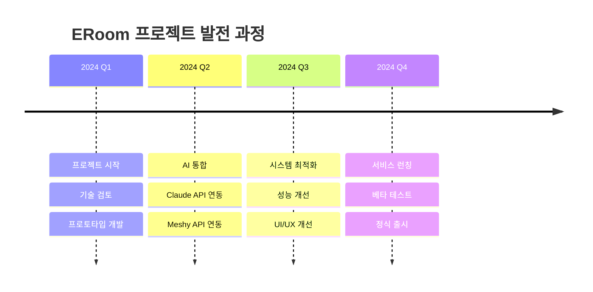

# 1.1 프로젝트 소개

## 🎯 프로젝트 비전

  <h2 style="margin: 0;">"AI가 만드는 무한한 방탈출 세계"</h2>
  
게임 개발의 민주화를 통해 누구나 창의적인 콘텐츠를 만들 수 있는 미래

ERoom 프로젝트는 인공지능 기술을 활용하여 방탈출 게임 제작 과정을 혁신적으로 자동화하는 시스템입니다. 기존에 몇 개월이 걸리던 게임 개발 과정을 **단 5-10분**으로 단축시키며, 프로그래밍 지식이 없는 사용자도 쉽게 창의적인 방탈출 게임을 만들 수 있도록 지원합니다.

---

## 🔍 프로젝트 배경

### 기존 방탈출 게임 개발의 문제점

  

    <h4 style="margin: 0 0 10px 0;">⏰ 긴 개발 기간</h4>
    <ul style="margin: 0;">
      <li>기획: 2-4주</li>
      <li>3D 모델링: 4-8주</li>
      <li>프로그래밍: 6-12주</li>
      <li>테스트: 2-4주</li>
    </ul>
  

  

    <h4 style="margin: 0 0 10px 0;">💰 높은 개발 비용</h4>
    <ul style="margin: 0;">
      <li>전문 개발자 인건비</li>
      <li>3D 디자이너 비용</li>
      <li>기획자 비용</li>
      <li>QA 테스터 비용</li>
    </ul>
  

### ERoom의 혁신적 해결책

| 기존 방식 | ERoom 솔루션 | 개선 효과 |
|-----------|--------------|-----------|
| 수동 시나리오 작성 (2-4주) | AI 자동 생성 (1-3분) | **99% 시간 단축** |
| 3D 모델 수작업 (4-8주) | AI 자동 생성 (4-8분) | **99.5% 시간 단축** |
| 스크립트 직접 코딩 (6-12주) | AI 자동 생성 (30초) | **99.9% 시간 단축** |
| 전문 인력 필요 | 누구나 사용 가능 | **진입 장벽 제거** |

---

## 🎨 프로젝트 특징

### 1️⃣ **완전 자동화된 게임 생성**
- 사용자는 테마와 키워드만 입력
- AI가 시나리오, 퍼즐, 3D 모델, 게임 로직까지 모두 생성
- Unity에서 바로 실행 가능한 완성된 게임 제공

### 2️⃣ **높은 창의성과 다양성**
- Claude AI의 창의적 시나리오 생성 능력
- 매번 다른 퍼즐과 스토리 생성
- 난이도별 맞춤형 콘텐츠 제공

### 3️⃣ **실시간 처리와 안정성**
- 비동기 큐 시스템으로 안정적인 처리
- 여러 요청 동시 처리 가능
- 실시간 진행 상황 확인

### 4️⃣ **확장 가능한 아키텍처**
- 마이크로서비스 기반 설계
- 수평적 확장 가능
- 다양한 AI 서비스 통합 가능

---

## 🎯 목표 사용자

  

    <h4>🎮 게임 개발자</h4>
    
프로토타입을 빠르게 제작하고 아이디어를 테스트하려는 개발자

  

  

    <h4>🏫 교육 기관</h4>
    
학습용 방탈출 게임을 제작하려는 교사와 교육 콘텐츠 제작자

  

  

    <h4>🎨 크리에이터</h4>
    
기술적 지식 없이 창의적인 게임을 만들고 싶은 일반 사용자

  

---

## 📊 프로젝트 임팩트

### 시장 혁신
- **게임 개발 시간 99% 단축**: 3개월 → 10분
- **개발 비용 95% 절감**: 전문 인력 불필요
- **진입 장벽 제거**: 누구나 게임 개발 가능

### 기술적 성과
- **최신 AI 기술 통합**: Claude 4, Meshy AI
- **실시간 처리 시스템**: 고성능 비동기 아키텍처
- **Unity6 최적화**: 최신 게임 엔진 활용

### 미래 가능성
- **교육 분야**: 맞춤형 학습 게임 제작
- **엔터테인먼트**: 개인화된 게임 경험
- **기업 교육**: 팀빌딩, 문제해결 훈련

---

## 🚀 프로젝트 로드맵

---

  

    ERoom은 단순한 도구가 아닌, <strong>게임 개발의 미래</strong>를 제시합니다.
  

