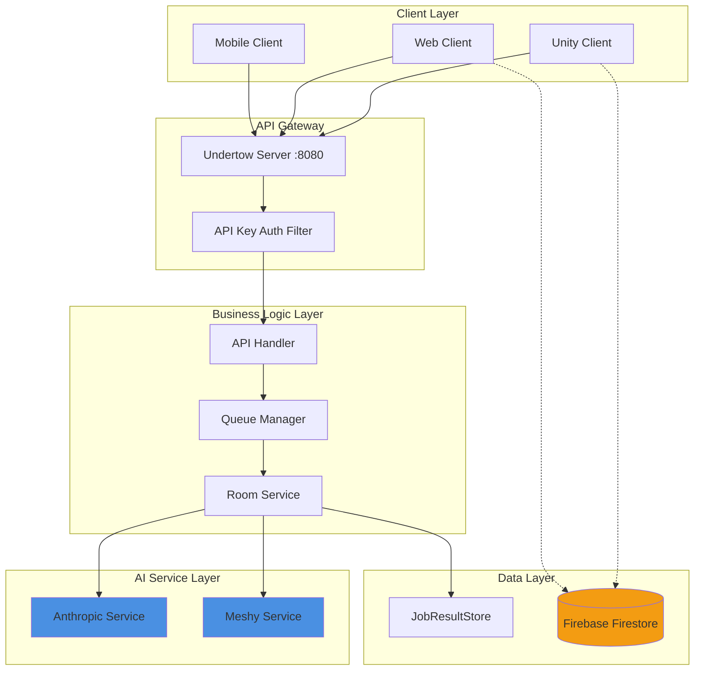
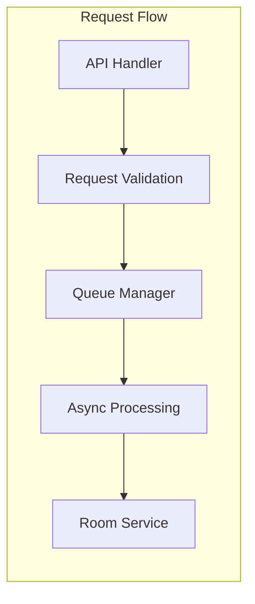
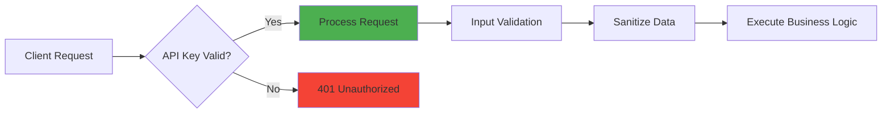

# 1.2 전체 시스템 아키텍처

## 🏗️ 시스템 개요

<div style="background: linear-gradient(135deg, #667eea 0%, #764ba2 100%); padding: 30px; border-radius: 15px; color: white; margin: 20px 0;">
  <h3 style="margin: 0;">마이크로서비스 기반 AI 통합 아키텍처</h3>
  <p style="margin: 10px 0 0 0;">비동기 처리와 AI 서비스를 결합한 확장 가능한 시스템 설계</p>
</div>

ERoom 시스템은 **레이어드 아키텍처**와 **이벤트 기반 비동기 처리**를 결합하여 안정적이고 확장 가능한 서비스를 제공합니다.

---

## 🔄 전체 시스템 플로우



---

## 📋 레이어별 상세 구조

### 1️⃣ **Client Layer (클라이언트 계층)**

| 클라이언트 | 역할 | 기술 스택 |
|------------|------|-----------|
| Unity Client | 메인 게임 클라이언트 | Unity6, C# |
| Web Client | 웹 기반 대시보드 | React, TypeScript |
| Mobile Client | 모바일 컨트롤러 | React Native |

### 2️⃣ **API Gateway (게이트웨이 계층)**

<div style="background: #e8f5e9; padding: 20px; border-radius: 10px; margin: 20px 0;">
  <h4 style="margin: 0 0 10px 0;">🔐 보안과 라우팅</h4>
  <ul style="margin: 0;">
    <li><strong>Undertow Server</strong>: 고성능 NIO 기반 웹 서버</li>
    <li><strong>API Key Filter</strong>: 모든 요청에 대한 인증 처리</li>
    <li><strong>Request Routing</strong>: RESTful 엔드포인트 관리</li>
  </ul>
</div>

### 3️⃣ **Business Logic Layer (비즈니스 로직 계층)**



**핵심 컴포넌트:**
- **API Handler**: 요청/응답 처리 및 JSON 변환
- **Queue Manager**: 비동기 작업 큐 관리 (최대 동시 처리: 1개)
- **Room Service**: 방탈출 생성 로직 총괄

### 4️⃣ **AI Service Layer (AI 서비스 계층)**

<div style="display: grid; grid-template-columns: repeat(2, 1fr); gap: 20px; margin: 20px 0;">
  <div style="background: #e3f2fd; padding: 20px; border-radius: 10px;">
    <h4 style="margin: 0 0 10px 0;">🤖 Anthropic Service</h4>
    <ul style="margin: 0;">
      <li>시나리오 생성 (1-3분)</li>
      <li>스크립트 생성 (30초)</li>
      <li>Claude Sonnet 4 모델 사용</li>
    </ul>
  </div>
  <div style="background: #f3e5f5; padding: 20px; border-radius: 10px;">
    <h4 style="margin: 0 0 10px 0;">🎨 Meshy Service</h4>
    <ul style="margin: 0;">
      <li>3D 모델 프리뷰 (1-3분)</li>
      <li>모델 정제 (3-5분)</li>
      <li>FBX 포맷 출력</li>
    </ul>
  </div>
</div>

### 5️⃣ **Data Layer (데이터 계층)**

| 저장소 | 용도 | 특징 |
|--------|------|------|
| JobResultStore | 임시 작업 결과 저장 | In-Memory, 빠른 접근 |
| Firebase Firestore | 영구 데이터 저장 | NoSQL, 실시간 동기화 |

---

## 🔧 핵심 설계 원칙

### ✅ **비동기 처리 (Asynchronous Processing)**
```java
// 요청 즉시 반환
POST /room/create → { "ruid": "room_12345", "status": "Queued" }

// 백그라운드 처리
Queue → Room Service → AI Services → Result Store

// 결과 폴링
GET /room/result?ruid=room_12345 → { "status": "COMPLETED", ... }
```

### ✅ **확장성 (Scalability)**
- 수평적 확장: 서버 인스턴스 추가
- AI 서비스 로드 밸런싱: 다중 API 키 사용
- 큐 시스템: 처리량 동적 조절

### ✅ **안정성 (Reliability)**
- 에러 격리: 각 요청 독립적 처리
- 재시도 메커니즘: AI 서비스 실패 시 재시도
- 상태 추적: 모든 작업 상태 실시간 모니터링

---

## 🚀 성능 최적화 전략

<div style="background: #fff3cd; padding: 20px; border-radius: 10px; margin: 20px 0;">
  <h4 style="margin: 0 0 10px 0;">⚡ 최적화 포인트</h4>
  <table style="width: 100%; margin-top: 10px;">
    <tr>
      <td><strong>병렬 처리</strong></td>
      <td>AI 서비스 호출 병렬화로 전체 처리 시간 단축</td>
    </tr>
    <tr>
      <td><strong>캐싱 전략</strong></td>
      <td>자주 사용되는 프롬프트와 설정 메모리 캐싱</td>
    </tr>
    <tr>
      <td><strong>연결 풀링</strong></td>
      <td>HTTP 클라이언트 연결 재사용으로 오버헤드 감소</td>
    </tr>
    <tr>
      <td><strong>비동기 I/O</strong></td>
      <td>Undertow의 NIO 활용으로 동시 연결 처리 향상</td>
    </tr>
  </table>
</div>

---

## 🔒 보안 아키텍처



**보안 계층:**
1. **API Key 인증**: 모든 요청에 필수
2. **입력 검증**: SQL Injection, XSS 방지
3. **환경 변수**: 민감 정보 보호
4. **HTTPS**: 전송 구간 암호화 (프로덕션)

---

## 📊 시스템 모니터링

<div style="background: #f0f0f0; padding: 20px; border-radius: 10px; margin: 20px 0;">
  <h4 style="margin: 0 0 10px 0;">📈 모니터링 지표</h4>
  <ul style="margin: 0;">
    <li><strong>큐 상태</strong>: 대기/처리중/완료 작업 수</li>
    <li><strong>응답 시간</strong>: API별 평균 응답 시간</li>
    <li><strong>에러율</strong>: AI 서비스별 실패율</li>
    <li><strong>리소스 사용량</strong>: CPU, 메모리, 네트워크</li>
  </ul>
</div>

---

<div style="text-align: center; margin-top: 30px;">
  <p style="color: #666;">
    이 아키텍처는 <strong>안정성</strong>, <strong>확장성</strong>, <strong>성능</strong>을 모두 고려한 설계입니다.
  </p>
</div>