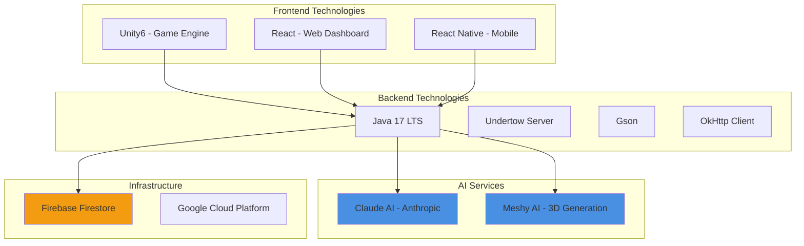
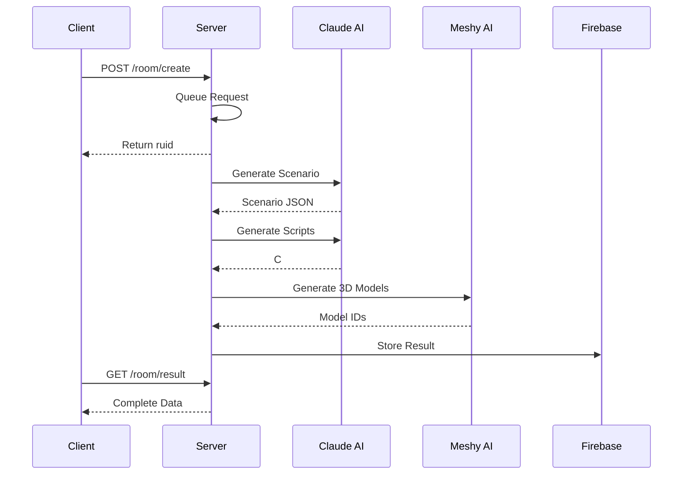

# 1.3 기술 스택 요약

## 🛠️ 기술 스택 개요

  <h3 style="margin: 0;">최신 기술의 완벽한 조합</h3>
  
성능, 안정성, 확장성을 모두 고려한 기술 선택

---

## 📊 기술 스택 전체 구조

---

## 🔧 백엔드 기술 상세

### ☕ **Java 17 LTS**

  <h4 style="margin: 0 0 10px 0;">선택 이유</h4>
  <ul style="margin: 0;">
    <li><strong>장기 지원(LTS)</strong>: 2029년까지 보안 업데이트 보장</li>
    <li><strong>최신 기능</strong>: Records, Pattern Matching, Text Blocks</li>
    <li><strong>성능 향상</strong>: G1GC 개선, JIT 컴파일러 최적화</li>
    <li><strong>생태계</strong>: 풍부한 라이브러리와 도구</li>
  </ul>

### 🚀 **Undertow**

| 특징 | 설명 |
|------|------|
| **Non-blocking I/O** | XNIO 기반 고성능 처리 |
| **낮은 메모리 사용** | 경량 설계로 효율적 리소스 활용 |
| **임베디드 가능** | 별도 서버 설치 불필요 |
| **HTTP/2 지원** | 최신 프로토콜 완벽 지원 |

### 📦 **주요 라이브러리**

  

    <h4 style="margin: 0 0 10px 0;">Gson</h4>
    <ul style="margin: 0;">
      <li>Google의 JSON 처리 라이브러리</li>
      <li>간단한 API와 높은 성능</li>
      <li>커스텀 직렬화 지원</li>
    </ul>
  

  

    <h4 style="margin: 0 0 10px 0;">OkHttp</h4>
    <ul style="margin: 0;">
      <li>Square의 HTTP 클라이언트</li>
      <li>연결 풀링과 캐싱</li>
      <li>자동 재시도 메커니즘</li>
    </ul>
  

---

## 🤖 AI 서비스 통합

### **Anthropic Claude AI**

  

    

      <h4 style="margin: 0 0 10px 0;">Claude Sonnet 4 (claude-sonnet-4-20250514)</h4>
      
최신 대형 언어 모델로 창의적이고 정확한 콘텐츠 생성

    

    

      
16K

      
Max Tokens

    

  

**활용 분야:**
- 🎭 **시나리오 생성**: 창의적인 방탈출 스토리와 퍼즐 설계
- 💻 **스크립트 생성**: Unity C# 게임 로직 자동 생성
- 🎯 **난이도 조절**: Easy/Normal/Hard별 맞춤 콘텐츠

### **Meshy AI**

  <h4 style="margin: 0 0 10px 0;">Text-to-3D Generation API</h4>
  

    

      
Preview

      
1-3분

    

    

      
Refine

      
3-5분

    

    

      
FBX

      
출력 포맷

    

  

---

## 🎮 프론트엔드 기술

### **Unity6**

| 기능 | 활용 |
|------|------|
| **최신 렌더링** | URP/HDRP로 고품질 그래픽 |
| **새로운 Input System** | 다양한 입력 장치 지원 |
| **UI Toolkit** | 현대적인 UI 구현 |
| **C# 9.0** | 최신 언어 기능 활용 |

---

## 💾 데이터 저장소

### **Firebase Firestore**

  <h4 style="margin: 0 0 10px 0;">선택 이유</h4>
  <table style="width: 100%; margin-top: 10px;">
    <tr>
      <td><strong>실시간 동기화</strong></td>
      <td>클라이언트 간 즉각적인 데이터 동기화</td>
    </tr>
    <tr>
      <td><strong>오프라인 지원</strong></td>
      <td>네트워크 없이도 작동, 재연결 시 자동 동기화</td>
    </tr>
    <tr>
      <td><strong>확장성</strong></td>
      <td>자동 샤딩으로 무제한 확장 가능</td>
    </tr>
    <tr>
      <td><strong>보안 규칙</strong></td>
      <td>세밀한 접근 권한 제어</td>
    </tr>
  </table>

---

## 📈 기술 스택 비교

### **서버 프레임워크 선택 근거**

| 프레임워크 | 장점 | 단점 | 선택 여부 |
|------------|------|------|-----------|
| **Undertow** | 초경량, 고성능, 임베디드 | 커뮤니티 작음 | ✅ 선택 |
| Spring Boot | 풍부한 생태계 | 무겁고 복잡 | ❌ |
| Vert.x | 리액티브, 폴리글랏 | 학습 곡선 높음 | ❌ |
| Netty | 최고 성능 | 저수준 API | ❌ |

### **AI 서비스 선택 근거**

  

    <h4 style="margin: 0 0 10px 0;">✅ Claude vs GPT-4</h4>
    <ul style="margin: 0;">
      <li>더 나은 코드 생성 능력</li>
      <li>한국어 이해도 우수</li>
      <li>일관된 출력 형식</li>
      <li>비용 효율적</li>
    </ul>
  

  

    <h4 style="margin: 0 0 10px 0;">✅ Meshy vs 기타 3D AI</h4>
    <ul style="margin: 0;">
      <li>빠른 생성 속도</li>
      <li>높은 품질의 모델</li>
      <li>Unity 호환 포맷</li>
      <li>합리적인 가격</li>
    </ul>
  

---

## 🔗 기술 통합 다이어그램

---

  

    각 기술은 <strong>최고의 성능</strong>과 <strong>개발 효율성</strong>을 위해 신중히 선택되었습니다.
  

